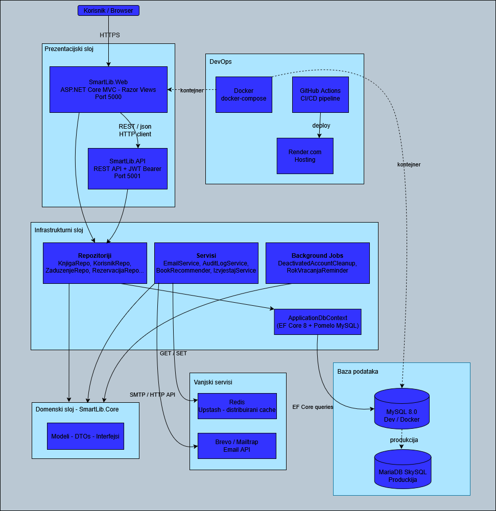

# SmartLib — Arhitektura i tehnički pregled

## Sadržaj

1. [Pregled sistema](#1-pregled-sistema)
2. [Tehnološki stack](#2-tehnološki-stack)
3. [Dijagram arhitekture](#3-dijagram-arhitekture)
4. [Komponente sistema](#4-komponente-sistema)
   - 4.1 [Frontend — SmartLib.Web](#41-frontend--smartlibweb)
   - 4.2 [Backend API — SmartLib.API](#42-backend-api--smartlibapi)
   - 4.3 [Domenski sloj — SmartLib.Core](#43-domenski-sloj--smartlibcore)
   - 4.4 [Infrastrukturni sloj — SmartLib.Infrastructure](#44-infrastrukturni-sloj--smartlibinfrastructure)
5. [Baza podataka](#5-baza-podataka)
6. [Vanjski servisi](#6-vanjski-servisi)
7. [Komunikacija između komponenti](#7-komunikacija-između-komponenti)
8. [Ključne lokacije koda](#8-ključne-lokacije-koda)
9. [Najvažnije sigurnosne odluke](#9-najvažnije-sigurnosne-odluke)

---

## 1. Pregled sistema

SmartLib je web aplikacija za upravljanje bibliotekom namijenjena bibliotekama s više vrsta korisnika: članovima, bibliotekarima i administratorima. Sistem pokriva kompletan životni ciklus bibliotečkog poslovanja — od upravljanja katalogom knjiga i primjeraka, pozajmica i rezervacija, do foruma, recenzija, članarina i administrativnih izvještaja.

Aplikacija je izgrađena kao **N-tier slojevita arhitektura** podijeljena u četiri projekta: prezentacijski sloj (`SmartLib.Web` i `SmartLib.API`), domenski sloj (`SmartLib.Core`) i infrastrukturni sloj (`SmartLib.Infrastructure`). Ovakva podjela osigurava jasno razdvajanje odgovornosti — svaki sloj ima točno definisanu ulogu i ne zalazi u domenu drugog.

Korisnici pristupaju sistemu putem web browsera kroz MVC aplikaciju koja renderuje stranice na serveru. Iza nje stoji REST API koji izlaže JSON endpoint-e za sve operacije nad podacima, zaštićene JWT autentikacijom. Podaci se čuvaju u MySQL bazi podataka putem Entity Framework Core ORM-a, a za poboljšanje performansi koristi se Redis distribuirani cache. Slanje emailova (reset lozinke, obavještenja) obavlja se putem Brevo API-ja. Cijela aplikacija je kontejnerizovana Docker-om i hostovana na Render.com platformi.

---

## 2. Tehnološki stack

| Sloj | Tehnologija | Verzija |
|------|-------------|---------|
| Programski jezik | C# | 12 |
| Runtime | .NET | 8.0 |
| Web framework | ASP.NET Core MVC | 8.0 |
| REST API | ASP.NET Core Web API | 8.0 |
| ORM | Entity Framework Core (Pomelo MySQL) | 8.0 |
| Baza podataka (lokalno) | MySQL | 8.0 |
| Baza podataka (produkcija) | MariaDB SkySQL (serverless) | — |
| Cache | Redis (Upstash) / In-Memory fallback | — |
| Autentikacija (API) | JWT Bearer tokens | HS256 |
| Autentikacija (Web) | ASP.NET Core Cookie Auth | — |
| Email | Brevo API + Mailtrap SMTP (fallback) | — |
| Kontejnerizacija | Docker + docker-compose | — |
| Hosting | Render.com | — |
| Testiranje | xUnit, Moq, Playwright | — |
| CI/CD | GitHub Actions | — |

---

## 3. Dijagram arhitekture

<p align="center">
  
</p>

### Struktura foldera

```
SI_grupa5/
└── Projekat/
    ├── src/
    │   ├── SmartLib.API/            # REST API projekat
    │   ├── SmartLib.Web/            # MVC Web projekat
    │   ├── SmartLib.Core/           # Domenska logika, modeli, interfejsi
    │   └── SmartLib.Infrastructure/ # EF Core, repozitoriji, servisi
    ├── tests/
    │   └── SmartLib.Tests/
    │       ├── Unit/                # Unit testovi (Moq)
    │       ├── Integration/         # Integracijski testovi (EF InMemory)
    │       ├── UI/                  # End-to-end testovi (Playwright)
    │       └── Security/            # Sigurnosni testovi
    ├── docker-compose.yml
    ├── .env                         # Produkcijske konekcije (nije u git-u)
    └── .github/
        └── workflows/               # CI/CD pipeline (GitHub Actions)
```

---

## 4. Komponente sistema

### 4.1 Frontend — SmartLib.Web

**Lokacija:** `Projekat/src/SmartLib.Web/`

ASP.NET Core MVC aplikacija koja renderuje Razor stranice na serveru i komunicira s API-jem ili direktno s bazom putem infrastrukturnog sloja.

**Ključni kontroleri:**

| Kontroler | Funkcija |
|-----------|----------|
| `HomeController` | Početna stranica, preporuke knjiga |
| `AuthController` | Prijava, registracija, reset lozinke |
| `KnjigaController` | Katalog knjiga, pretraga, detalji |
| `KorisnikController` | Profili korisnika, upravljanje |
| `ZaduzenjeController` | Pozajmice (kreiranje, vraćanje) |
| `RezervacijaController` | Rezervacije knjiga |
| `ClanarinaController` | Članarine |
| `ForumController` | Forum objave i komentari |
| `RecenzijaController` | Recenzije i ocjene |
| `AdminController` | Admin panel, audit logovi |
| `IzvjestajController` | Statistika i izvještaji |
| `NotifikacijaController` | Obavještenja korisnika |
| `ListaZeljaController` | Liste želja |
| `ListaKolekcijaController` | Kolekcije knjiga |
| `NabavkaController` | Zahtjevi za nabavku |

**Ključne karakteristike:**
- Sesija korisnika: HttpOnly kolačići, 1 sat timeout, sliding expiration
- Redis cache za katalog i početnu stranicu (fallback na in-memory)
- PDF generiranje (QuestPDF)
- Markdown podrška (Markdig)

**Entry point:** `SmartLib.Web/Program.cs`

---

### 4.2 Backend API — SmartLib.API

**Lokacija:** `Projekat/src/SmartLib.API/`

Čisti REST API koji izlaže JSON endpoint-e. Koristi JWT za autentikaciju. 

**API Kontroleri:**

| Kontroler | Endpoint prefiks | Funkcija |
|-----------|-----------------|----------|
| `AuthController` | `/api/auth` | Login, logout, JWT izdavanje |
| `KnjigaController` | `/api/knjiga` | CRUD knjiga |
| `KorisnikController` | `/api/korisnik` | CRUD korisnika |
| `PrimjerakController` | `/api/primjerak` | Primjerci knjiga |
| `ZaduzenjeController` | `/api/zaduzenje` | Pozajmice |
| `RezervacijaController` | `/api/rezervacija` | Rezervacije |
| `ClanarinaController` | `/api/clanarina` | Članarine |
| `KategorijaController` | `/api/kategorija` | Kategorije |
| `AuditLogController` | `/api/auditlog` | Audit trail |

**Health check endpoint:** `GET /api/health/redis` — provjera Redis konekcije

**Entry point:** `SmartLib.API/Program.cs`

---

### 4.3 Domenski sloj — SmartLib.Core

**Lokacija:** `Projekat/src/SmartLib.Core/`

Sadrži definicije entiteta i interfejse koji su neovisni o infrastrukturi. Svi ostali slojevi ovise o Core-u, ali Core ne ovisi ni o kome - to ga čini stabilnim centrom sistema.

```
SmartLib.Core/
├── Models/        # Domenske klase (Korisnik, Knjiga, Zaduzenje, ...)
├── DTOs/          # Data Transfer Objects za API/Web komunikaciju
└── Interfaces/    # Interfejsi repozitorija i servisa
```

---

### 4.4 Infrastrukturni sloj — SmartLib.Infrastructure

**Lokacija:** `Projekat/src/SmartLib.Infrastructure/`

Implementacija domenskih interfejsa - pristup bazi, email servis, cache, pozadinski procesi.

```
SmartLib.Infrastructure/
├── Data/
│   └── ApplicationDbContext.cs           # EF Core DbContext (27+ DbSet-ova)
├── Migrations/                           # EF Core migracije
├── Repositories/                         # Implementacija repozitorija
├── Services/
│   ├── EmailService                      # Brevo/Mailtrap
│   ├── BookRecommender                   # Algoritam preporuka
│   ├── IzvjestajService                  # Generiranje izvještaja
│   ├── AuditLogService                   # Audit trail
│   ├── DeactivatedAccountCleanupService  # Pozadinski job (12h)
│   ├── RokVracanjaReminderService        # Podsjetnici (rok vraćanja)
│   ├── BibliotekariNotifikacijaService   # Notifikacije bibliotekarima
│   ├── CacheKeyBuilder                   # Upravljanje cache ključevima
│   └── CacheVersionStore                 # Verzioniranje cache-a
└── Security/
    └── PasswordHasher.cs                 # PBKDF2 hashiranje lozinki
```

---

## 5. Baza podataka

**Tip:** MySQL 8.0 (lokalno) / MariaDB SkySQL serverless (produkcija)

**ORM:** Entity Framework Core 8 s Pomelo MySQL providerom

**Pristup:** Code-First, `db.Database.EnsureCreated()` za inicijalizaciju

**DbContext:** `SmartLib.Infrastructure/Data/ApplicationDbContext.cs`

### Ključne tabele

#### Korisnici i upravljanje pristupom

| Tabela | Ključna polja | Napomena |
|--------|---------------|----------|
| `Korisnici` | id, ime, prezime, email, lozinka_hash, uloga_id, status | Soft delete via `DatumDeaktivacije` |
| `Uloge` | id, naziv | Član, Bibliotekar, Administrator |

#### Bibliotečki katalog

| Tabela | Ključna polja | Napomena |
|--------|---------------|----------|
| `Knjige` | id, naslov, autor, isbn, godinarIzdanja, opis | Unique index na ISBN |
| `Kategorije` | id, naziv, opis | |
| `Primjerci` | id, knjiga_id, inventarni_broj, status | Unique index na InventarniBroj |

#### Pozajmice i rezervacije

| Tabela | Ključna polja  |
|--------|---------------|
| `Zaduzenja` | id, korisnik_id, primjerak_id, datum_zaduzivanja, datum_vracao, status | 
| `Rezervacije` | id, korisnik_id, knjiga_id, datum_rezervacije, status | 
| `Clanarine` | id, korisnik_id, datum_pocetka, datum_isteka, status | 
| `ZahtjeviProduzenja` | id, korisnik_id, trajanje, status | 

#### Zajednica i sadržaj

| Tabela | Ključna polja |
|--------|---------------|
| `Recenzije` | id, knjiga_id, korisnik_id, ocjena, komentar | 
| `ForumObjave` | id, naslov, sadrzaj, kategorija, korisnik_id |
| `ForumKomentari` | id, sadrzaj, objava_id, korisnik_id | 
| `ForumReakcije` | id, tip, objava_id, korisnik_id | 
| `Vijesti` | id, naslov, sadrzaj, kategorija, autor_id  |
| `Dogadjaji` | id, naslov, opis, datum, lokacija, autor_id | 

#### Sistem

| Tabela | Ključna polja | Napomena |
|--------|---------------|----------|
| `AuditLogs` | id, akcija, entitet_tip, vrijednosti_prije, vrijednosti_nakon, korisnik_id | Svaka izmjena podataka |
| `Notifikacije` | id, naslov, poruka, tip, procitano, korisnik_id | |
| `AppPostavke` | key, value | Key-value store za postavke aplikacije |
| `NabavkaZahtjevi` | id, naslov, autor, korisnik_id, status | |

---

## 6. Vanjski servisi

### Redis (Upstash)

- **Svrha:** Distribuirani cache za katalog knjiga i početnu stranicu
- **Konfiguracija:** `UPSTASH_REDIS_CONNECTION_STRING` environment varijabla
- **Fallback:** In-memory distribuirani cache ako Redis nije dostupan
- **TTL:** 1–3 minute za većinu podataka
- **Cache ključevi:** Verzionisani — `catalog:list:v{version}`, `home:random:v{version}`
- **Invalidacija:** Bumping verzije u `CacheVersionStore`

### Brevo / Mailtrap (Email)

- **Brevo API:** Primarni email provajder (transakcijski emailovi)
- **Mailtrap SMTP:** Fallback za razvoj (`sandbox.smtp.mailtrap.io:2525`)
- **Pošiljač:** `noreply@smartlib.ba`
- **Koristi se za:** Reset lozinke, obavještenja, distributer emailovi

### MariaDB SkySQL (Produkcijska baza)

- **Tip:** Serverless MySQL-kompatibilna baza
- **Host:** `serverless-northeurope.sysp0000.db3.skysql.com:4019`
- **Konfiguracija:** Isključivo putem `.env` fajla (nije u git-u)

### Docker

- **`smartlib-db`** — MySQL 8.0 kontejner (port 3306)
- **`smartlib-web`** — Web aplikacija (port 5000→8080)
- **Health check:** `mysqladmin ping` svake 10 sekundi
- **Volume:** MySQL podaci perzistiraju između restartova

### Render.com (Hosting)

- **URL:** `https://smartlib-web.onrender.com/`
- **Tip:** Container-based deployment

---

## 7. Komunikacija između komponenti

### Web ↔ API

```
[ Browser ]
    │  HTTP(S) request
    ▼
[ SmartLib.Web Controller ]
    │  HttpClient → REST/JSON
    ▼
[ SmartLib.API Controller ]
    │  JWT validacija
    ▼
[ Repository / Service ]
    │  EF Core query
    ▼
[ MySQL ]
```

- **Protokol:** REST over HTTPS
- **Format:** JSON (`application/json`)
- **Autentikacija:** JWT Bearer token u `Authorization` headeru
- **Serijalizacija:** Newtonsoft.Json + System.Text.Json

### Dependency Injection

Sve zavisnosti se registruju u `Program.cs` putem DI kontejnera:

```csharp
// Scoped lifetime (per request)
builder.Services.AddScoped<IKorisnikRepository, KorisnikRepository>();
builder.Services.AddScoped<IKnjigaRepository, KnjigaRepository>();
builder.Services.AddScoped<IAuditLogService, AuditLogService>();

// Hosted background services
builder.Services.AddHostedService<DeactivatedAccountCleanupService>();
builder.Services.AddHostedService<RokVracanjaReminderService>();
```

### Cache protokol

```
Request → GetOrCreateRecordAsync(key, ttl)
              │
              ├── Cache HIT → vrati odmah
              │
              └── Cache MISS → upit na bazu → spremi u cache → vrati
```

Invalidacija cache-a: bumping verzije u `CacheVersionStore` (bez eksplicitnog brisanja ključeva).

---

## 8. Ključne lokacije koda

### Entry points

| Fajl | Opis |
|------|------|
| `src/SmartLib.API/Program.cs` | Registracija servisa, middleware, JWT, Redis za API |
| `src/SmartLib.Web/Program.cs` | Registracija servisa, session, kolačići za Web |

### Domenska logika

| Lokacija | Opis |
|----------|------|
| `src/SmartLib.Core/Models/` | Svi domanski entiteti (Korisnik, Knjiga, Zaduzenje, ...) |
| `src/SmartLib.Core/DTOs/` | DTO klase za API i Web komunikaciju |
| `src/SmartLib.Core/Interfaces/` | Interfejsi repozitorija i servisa |

### Pristup podacima

| Lokacija | Opis |
|----------|------|
| `src/SmartLib.Infrastructure/Data/ApplicationDbContext.cs` | EF Core DbContext sa svim DbSet-ovima |
| `src/SmartLib.Infrastructure/Migrations/` | EF Core migracije baze |
| `src/SmartLib.Infrastructure/Repositories/` | Implementacije repozitorija |

### Servisi

| Lokacija | Opis |
|----------|------|
| `src/SmartLib.Infrastructure/Services/EmailService.cs` | Slanje emailova |
| `src/SmartLib.Infrastructure/Services/AuditLogService.cs` | Logovanje promjena |
| `src/SmartLib.Infrastructure/Services/BookRecommender.cs` | Preporuke knjiga |
| `src/SmartLib.Infrastructure/Services/IzvjestajService.cs` | Generiranje izvještaja |
| `src/SmartLib.Infrastructure/Security/PasswordHasher.cs` | PBKDF2 hashiranje |

### Kontroleri i pogledi

| Lokacija | Opis |
|----------|------|
| `src/SmartLib.API/Controllers/` | REST API kontroleri |
| `src/SmartLib.Web/Controllers/` | MVC Web kontroleri |
| `src/SmartLib.Web/Views/` | Razor .cshtml šabloni (55+) |

### Konfiguracija

| Fajl | Opis |
|------|------|
| `src/SmartLib.API/appsettings.json` | JWT, konekcija, email |
| `src/SmartLib.Web/appsettings.json` | Email, distributer, konekcija |
| `Projekat/.env` | Produkcione konekcije (nije u git-u) |
| `Projekat/docker-compose.yml` | Orkestracija Docker servisa |
| `.github/workflows/` | CI/CD pipeline |

### Testovi

| Lokacija | Opis |
|----------|------|
| `tests/SmartLib.Tests/Unit/` | Unit testovi (xUnit, Moq) |
| `tests/SmartLib.Tests/Integration/` | Integracijski testovi (EF InMemory) |
| `tests/SmartLib.Tests/UI/` | E2E testovi (Playwright) |
| `tests/SmartLib.Tests/Security/` | Sigurnosni testovi |

---

## 9. Najvažnije sigurnosne odluke

### Autentikacija i autorizacija

**API sloj — JWT Bearer tokeni:**
- Algoritam potpisivanja: HS256 (simetrični ključ)
- Claims u tokenu: `NameIdentifier` (korisnički ID), `Name`, `Email`, `Role`
- Expiracija: 30 minuta (podešivo u konfiguraciji)
- Ključ se čita iz konfiguracije, ne iz koda

**Web sloj — Cookie autentikacija:**
- `HttpOnly` flag: kolačić nije dostupan JavaScript-u (zaštita od XSS)
- `Sliding expiration`: 1 sat aktivnosti
- Session management na serveru

**Autorizacija:**
- Role-Based Access Control (RBAC): `Član`, `Bibliotekar`, `Administrator`
- `[Authorize(Roles = "Administrator")]` atributi na kontrolerima
- Zaštita ruta i akcija po ulozi korisnika

### Hashiranje lozinki

- **Algoritam:** PBKDF2 s nasumičnim saltom
- **Implementacija:** `PasswordHasher.cs` u Security sloju
- **Storage:** Isključivo hash u bazi, nikad čista lozinka
- **Reset:** Token-based reset s vremenskim ograničenjem (`ResetToken`, `ResetTokenExpiry`)

### Transport i HTTPS

- HTTPS redirekcija primijenjena u produkciji
- HSTS (HTTP Strict Transport Security) aktiviran
- Svi cookiji prenose se isključivo putem HTTPS-a

### Audit logging

Svaka kreacija, izmjena ili brisanje podataka se loguje:

```
AuditLogs tabela:
  - akcija (CREATE / UPDATE / DELETE)
  - entitet_tip (ime tabele)
  - vrijednosti_prije (JSON stanje prije)
  - vrijednosti_nakon (JSON stanje poslije)
  - korisnik_id (ko je napravio promjenu)
  - timestamp
```

**Implementacija:** `AuditLogService` se injektuje u sve repozitorije koji mijenjaju podatke.

### Upravljanje sadržajem i moderacija

- Sistem prijava za recenzije, forum objave i komentare
- Softverski delete (status polje) umjesto fizičkog brisanja korisničkih naloga
- Suspenzija korisnika putem `DatumZabraneDo` polja
- Praćenje uklonjenijeg sadržaja (`BrojUklonjenihSadrzaja`)
- Svaki razriješeni slučaj prijave ima zapis ko je razriješio (`RazrijesioKorisnikId`)

### Zaštita podataka i konfiguracija

- Produkcione konekcije isključivo u `.env` fajlu (nije commitovan u git)
- Tajni ključevi (JWT secret, email lozinke) nisu hardcoded u kodu
- Validacija korisničkog unosa na svim HTTP endpoint-ima (`ModelState`)
- HTTP 401 za nevalidan/nepostojeći JWT token
- HTTP 400 za nevalidne zahtjeve s porukom greške

### Sigurnost API-ja

- Middleware za JWT validaciju na svakom zahtjevu
- Health check endpoint ograničen na internu provjeru (`/api/health/redis`)
- CORS nije eksplicitno konfigurisan (same-origin policy po defaultu)

---
