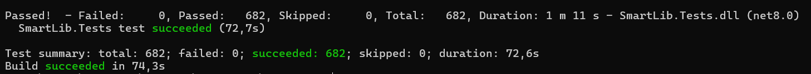
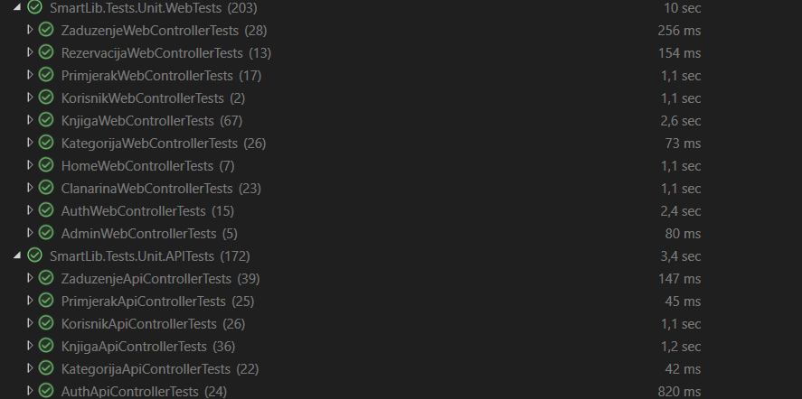
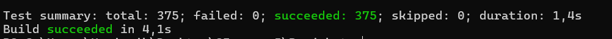
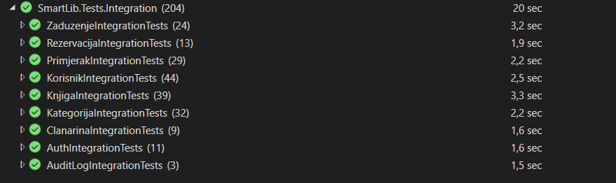
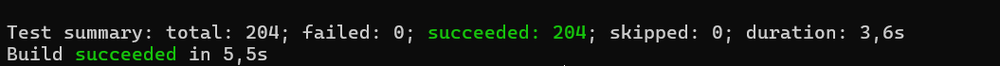
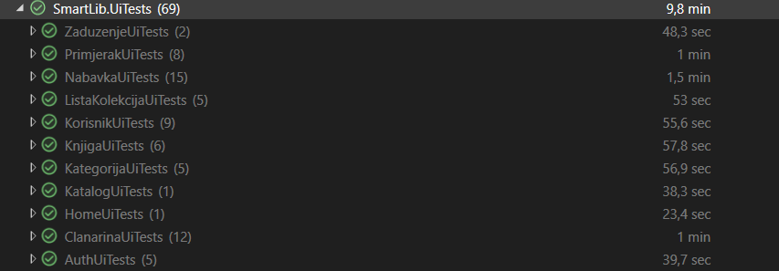
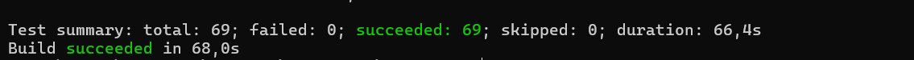
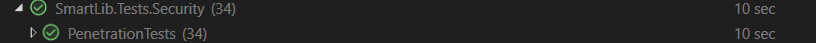
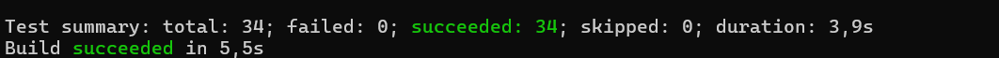

# 7. Test Summary / QA izvještaj
 
Cilj QA/Test Summary izvještaja za projekat SmartLib je dokumentovati proces testiranja aplikacije kroz prikaz korištenih testova, ostvarenih rezultata, provjerenih korisničkih scenarija, identificiranih problema te priloženih dokaza o uspješnosti testiranja.


## Okruženje i korištene tehnologije

Za razvoj i izvršavanje testova korišteno je sljedeće razvojno i testno okruženje:

* **.NET SDK / Target Framework:** `net8.0` (definisano u datoteci `tests/SmartLib.Tests/SmartLib.Tests.csproj`)
* **Testni okvir:** xUnit
* **Testni adapteri i alati:** NUnit3 Test Adapter
* **UI testiranje:** Microsoft Playwright
* **Integracijsko testiranje:** `Microsoft.AspNetCore.Mvc.Testing`
* **Testna baza podataka:** `Microsoft.EntityFrameworkCore.InMemory`


## 1. Vrste testova 
- Unit testovi
  - Lokacija: `tests/SmartLib.Tests/Unit`
  - Opis: izolovani testovi kontrolera, servisa i API sloja koristeći mock-ove ili testne instance.
- Integracijski testovi
  - Lokacija: `tests/SmartLib.Tests/Integration`
  - Opis: testiraju stvarno ponašanje API endpointa sa EF Core InMemory bazom, pokrivaju scenarije CRUD i poslovne procese.
- UI (end-to-end) testovi
  - Lokacija: `tests/SmartLib.Tests/UI`
  - Alat: Playwright; testovi provjeravaju ključne tokove kroz web interfejs.
- Security / Penetration testovi
  - Lokacija: `tests/SmartLib.Tests/Security`
  - Opis: SQL injection, XSS, manipulacija JWT tokenom, autorizacija/401/403 provjere.


## 2. Pokretanje testova

U nastavku su navedene komande za izvršavanje različitih kategorija testova u okviru SmartLib projekta. Preporučuje se pokretanje komandi iz root direktorija projekta kako bi sve putanje bile ispravno prepoznate.

### 2.1. Pokretanje kompletnog testnog skupa

Za izvršavanje svih dostupnih testova koristi se sljedeća komanda:

```powershell
dotnet test tests\SmartLib.Tests\SmartLib.Tests.csproj --logger "console;verbosity=minimal"
```

Ova komanda pokreće unit, integracijske, UI i sigurnosne testove te prikazuje sažeti pregled rezultata izvršavanja.

### 2.2. Pokretanje testova po kategorijama

Pojedine grupe testova mogu se izvršavati zasebno korištenjem odgovarajućih namespace filtera:


**Unit testovi**

```powershell
dotnet test tests\SmartLib.Tests\SmartLib.Tests.csproj --filter "FullyQualifiedName~SmartLib.Tests.Unit"
```

**Integracijski testovi**

```powershell
dotnet test tests\SmartLib.Tests\SmartLib.Tests.csproj --filter "FullyQualifiedName~SmartLib.Tests.Integration"
```

**Sigurnosni testovi**

```powershell
dotnet test tests\SmartLib.Tests\SmartLib.Tests.csproj --filter "FullyQualifiedName~SmartLib.Tests.Security"
```

**UI (End-to-End) testovi**

Prije prvog pokretanja UI testova potrebno je instalirati Playwright alate i preglednike izvršavanjem sljedećih komandi:

```powershell
dotnet tool restore
playwright install
```

Ovaj korak se izvršava samo jednom prilikom inicijalnog postavljanja razvojnog okruženja, a nakon toga UI testove pokrećemo komandom:

```powershell
dotnet test tests/SmartLib.Tests/SmartLib.Tests.csproj --filter "FullyQualifiedName~UiTests"
```

Ovakav način izvršavanja omogućava fokusirano testiranje pojedinih slojeva sistema tokom razvoja i održavanja aplikacije.

### 2.3. Pokretanje pojedinačnog testa

U slučajevima kada je potrebno analizirati ili ponovo izvršiti određeni test, moguće je pokrenuti pojedinačnu testnu metodu navođenjem njenog punog naziva:

```powershell
dotnet test --filter "FullyQualifiedName=SmartLib.Tests.Integration.KnjigaIntegrationTests.GetAll_FilterNaslov_VracaSamoOdgovarajuceKnjige"
```

Ovaj pristup je posebno koristan prilikom otklanjanja grešaka i verifikacije specifičnih funkcionalnosti.


## 3. Rezultati testiranja 
- Ukupan broj testova: **682**
- Uspješno izvršenih: **682**
- Neuspješnih: **0**
- Procenat prolaznosti: **100%**



### 3.1. Unit testovi

Broj testnih slučajeva u okviru Unit testova: **375**



Dokaz izvršavanja testova:



---

### 3.2. Integracijski testovi

Broj testnih slučajeva u okviru Integracijskih testova: **204**



Dokaz izvršavanja testova:



---

### 3.3. UI (End-to-End) testovi

Broj testnih slučajeva u okviru UI testova: **69**



Dokaz izvršavanja testova:



---


### 3.4. Sigurnosni testovi

Broj testnih slučajeva u okviru sigurnosnih testova: **34**



Dokaz izvršavanja testova:



---
## 4. Testirane funkcionalnosti

Tokom procesa testiranja izvršena je provjera svih ključnih funkcionalnosti sistema. Testni slučajevi obuhvatili su validaciju poslovne logike, sigurnosnih mehanizama, autorizacije korisnika te ispravnost rada osnovnih procesa bibliotečkog sistema.

### 4.1. Autentikacija i autorizacija

Provjereno je ispravno funkcionisanje procesa prijave korisnika i zaštite resursa kojima pristupaju samo ovlašteni korisnici.

Obuhvaćeni scenariji uključuju:

* uspješnu prijavu korisnika korištenjem validnih korisničkih kredencijala i generisanje JWT autentifikacijskog tokena;
* pokušaje prijave sa neispravnim korisničkim podacima, pri čemu sistem vraća odgovor **401 Unauthorized**;
* validaciju mehanizama zaštite JWT tokena kroz scenarije manipulacije sadržajem tokena i izmjene digitalnog potpisa;
* provjeru pristupa zaštićenim resursima uz korištenje nevažećih ili izmijenjenih tokena.

---

### 4.2. Upravljanje korisnicima

Testirani su procesi kreiranja, izmjene i upravljanja korisničkim računima, uključujući validaciju unesenih podataka i zaštitu od potencijalno malicioznog sadržaja.

Obuhvaćeni scenariji uključuju:

* kreiranje novih korisničkih računa;
* validaciju obaveznih polja i poslovnih pravila;
* provjeru zaštite od XSS napada i neispravnih korisničkih unosa;
* deaktivaciju korisničkih računa i provjeru odgovarajućih sistemskih reakcija.

---

### 4.3. Upravljanje knjigama i kategorijama

Izvršena je provjera funkcionalnosti vezanih za upravljanje bibliotečkim fondom i organizaciju knjiga po kategorijama.

Obuhvaćeni scenariji uključuju:

* kreiranje, pregled, izmjenu i brisanje knjiga;
* kreiranje i upravljanje kategorijama;
* validaciju ISBN identifikatora;
* provjeru autorizacije korisnika za izvođenje administrativnih operacija;
* zaštitu od malicioznih korisničkih unosa, uključujući XSS i pokušaje path traversal napada.


---

### 4.4. Rezervacije i zaduženja

Testirani su poslovni procesi rezervacije knjiga i evidentiranja zaduženja korisnika.

Obuhvaćeni scenariji uključuju:

* kreiranje i otkazivanje rezervacija;
* provjeru dozvola i autorizacije korisnika;
* kreiranje zaduženja od strane bibliotekara;
* provjeru zabrane kreiranja zaduženja za korisnike koji nemaju odgovarajuće privilegije, pri čemu sistem vraća odgovor **403 Forbidden**.


---

## 5. Poznata ograničenja i identifikovani rizici

Tokom testiranja nisu pronađeni kritični problemi koji bi onemogućili rad sistema. Ipak, identifikovana su određena ograničenja i potencijalni rizici koje bi bilo preporučljivo obraditi u narednim verzijama sistema.


### Ograničenja testnog pokrića

Iako testni skup pokriva glavne funkcionalne i sigurnosne zahtjeve sistema, određene kategorije testiranja trenutno nisu implementirane:

* performansno testiranje;
* stres testiranje pri velikom broju simultanih korisnika;
* detaljno testiranje pristupačnosti (accessibility);
* automatizovano testiranje responzivnosti korisničkog interfejsa na različitim uređajima.

### Tehnička ograničenja UI testova

Za uspješno izvršavanje Playwright UI testova potrebno je prethodno instalirati odgovarajuće preglednike korištenjem komande:

```powershell
playwright install
```

Bez instaliranih preglednika UI testovi neće biti izvršeni uspješno.

---

## 6. Preporuke za budući razvoj

Na osnovu rezultata testiranja preporučuju se sljedeća unapređenja sistema:

* dodavanje performansnih i stres testova za kritične poslovne procese;
* automatizacija generisanja screenshotova i testnih izvještaja tokom CI/CD procesa;
* proširenje testnog pokrića dodatnim rubnim i konkurentnim scenarijima;
* unapređenje testiranja pristupačnosti i responzivnosti korisničkog interfejsa.

Predložena unapređenja doprinijela bi dodatnom povećanju sigurnosti, pouzdanosti i održivosti SmartLib sistema.


---
