# SmartLib - Korisnički priručnik

> Moderna bibliotečka platforma za svakog čitaoca
> Verzija 1.0 | Juni 2026 | SI Grupa 5, ETF Sarajevo

---

## Sadržaj

1. [O sistemu SmartLib](#1-o-sistemu-smartlib)
2. [Korisničke uloge](#2-korisničke-uloge)
3. [Prijava u sistem](#3-prijava-u-sistem)
4. [Demo kredencijali](#4-demo-kredencijali)
5. [Pregled ekrana po ulogama](#5-pregled-ekrana-po-ulogama)
6. [Korak-po-korak upute](#6-korak-po-korak-upute)
7. [Notifikacije](#7-notifikacije)
8. [Ograničenja sistema](#8-ograničenja-sistema)
9. [Česta pitanja](#9-cesta-pitanja)

---

## 1. O sistemu SmartLib

SmartLib je moderna digitalna platforma napravljena s jednim ciljem: da upravljanje bibliotekom učini jednostavnim, transparentnim i ugodnim za sve koji je koriste.

Sistem je namijenjen:

- **Čitaocima (članovima biblioteke)** koji žele imati pregled nad katalogom, posuditi knjige, pratiti zaduženja i učestvovati u zajednici
- **Bibliotekarima** koji svakodnevno upravljaju zaduženjima, rezervacijama, članovima i katalogom knjiga
- **Administratorima** koji nadziru cijeli sistem i upravljaju osobljem

Ključne funkcije sistema:

- Katalog s više od stotinu naslova i naprednom pretragom
- Evidencija posudbi u realnom vremenu
- Rezervacija nedostupnih knjiga s automatskim obavijestima
- Forum za diskusiju i recenzije knjiga
- Tematske kolekcije knjiga
- PDF izvještaji za uprave
- Kompletni audit log za administratore

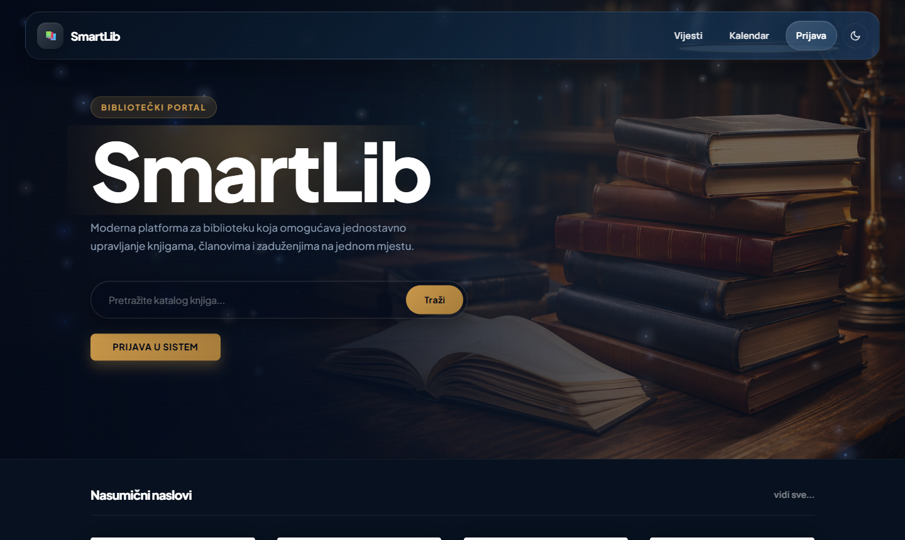
*Slika 1.1 - Početna stranica SmartLib portala*

---

## 2. Korisničke uloge

SmartLib razlikuje tri korisničke uloge. Svaka uloga ima drugačiji prikaz sistema i drugaciji set mogućnosti.

### Član (Čitalac biblioteke)

Registrovani čitalac koji koristi biblioteku. Posudba se fizički obavlja u biblioteci, a evidenciju vodi bibliotekar.

**Može:**
- Pretraživati i pregledati katalog knjiga
- Pratiti aktivna zaduženja i rokove vraćanja
- Rezervisati nedostupne knjige
- Pisati recenzije (samo za vraćene knjige)
- Kreirati i dijeliti privatne ili javne kolekcije
- Sudjelovati u forumu zajednice
- Tražiti produženje članarine

### Bibliotekar (Zaposlenik biblioteke)

Zaposlenik s pristupom upravljačkim funkcijama. Ima sve što može član, plus:

- Registrovanje i praćenje svih zaduženja
- Upravljanje svim rezervacijama
- Dodavanje, uređivanje i brisanje knjiga u katalogu
- Registracija i upravljanje članovima
- Generisanje izvještaja u PDF formatu
- Moderacija recenzija i forumskog sadržaja
- Odobravanje zahtjeva za produženje članarine
- Slanje zahtjeva za nabavku novih knjiga

### Administrator (Sistemski administrator)

Pun pristup cijelom sistemu. Uz sve što može bibliotekar:

- Kreiranje i upravljanje bibliotekarskim nalozima
- Pristup kompletnom audit logu s filterima
- Praćenje svih aktivnosti u sistemu

> **Napomena:** Gosti (neprijavljeni korisnici) mogu pregledavati vijesti i kalendar događaja, ali ne mogu pristupiti katalogu niti koristiti ostale funkcije sistema.

---

## 3. Prijava u sistem

### Koraci za prijavu

1. Otvorite stranicu **https://smartlib-web.onrender.com** u svom pregledacu
2. Kliknite dugme **"Prijava"** u gornjem desnom uglu ili **"Prijavi se u sistem"** na početnoj stranici
3. Unesite svoju **e-mail adresu** i **lozinku**
4. Kliknite dugme **"Prijavi se"**

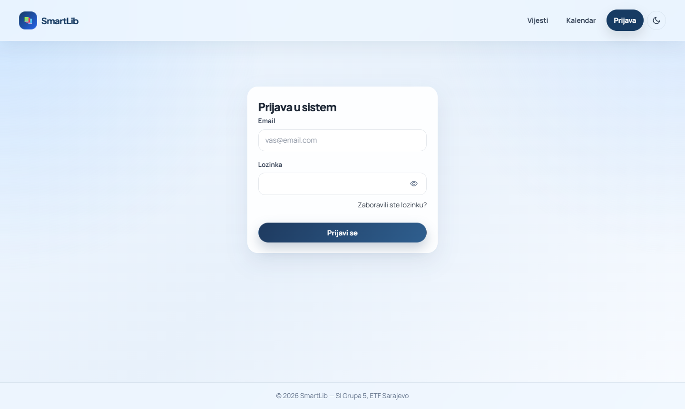
*Slika 3.1 - Forma za prijavu u sistem*

Nakon uspješne prijave sistem vas preusmjerava prema ulozi:
- **Član:** personalizirana početna stranica s preporukama knjiga
- **Bibliotekar:** upravljačka ploča s pregledom aktivnosti
- **Administrator:** upravljačka ploča s punim pristupom

### Zaboravili ste lozinku?

Ispod forme za prijavu nalazi se link **"Zaboravili ste lozinku?"**. Kliknite ga, unesite e-mail adresu i sistem će vam poslati link za resetovanje lozinke.

> **Napomena:** Lozinka je osjetljiva na velika i mala slova. Mora sadrzavati minimalno jedno veliko slovo, jedno malo slovo, jedan broj i jedan specijalni karakter.

### Promjena lozinke

Idite na **"Moj profil"**, kliknite **"Promijeni lozinku"**. Unesite trenutnu i dva puta novu lozinku, pa kliknite "Sačuvaj".

### Odjava

Kliknite **"Odjava"** u gornjoj navigaciji (krajnje desno).

---

## 4. Demo kredencijali

Za potrebe testiranja i demonstracije sistema dostupni su sljedeći testni nalozi. Svaki nalog odgovara jednoj od korisničkih uloga opisanih u sekciji 2.

> **Napomena:** Ovi nalozi namijenjeni su isključivo testiranju i demonstraciji. Ne unosite lične podatke putem testnih naloga.

| Uloga | E-mail adresa | Lozinka |
|---|---|---|
| Bibliotekar | bibliotekar@smartlib.ba | Password123! |
| Član | clan@smartlib.ba | Password123! |

Za prijavu otvorite **https://smartlib-web.onrender.com**, kliknite dugme **"Prijava"** i unesite odgovarajući e-mail i lozinku.

---

## 5. Pregled ekrana po ulogama

### 5.1 Javne stranice (bez prijave)

#### Vijesti

Sve aktuelne objave biblioteke: nova nabavka knjiga, promjene radnog vremena, posebni događaji.

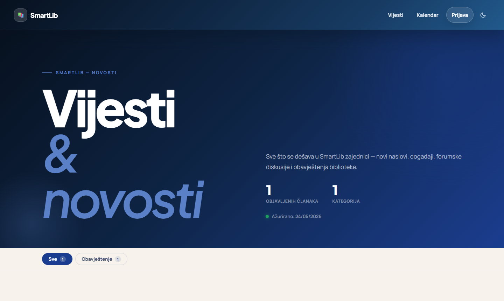
*Slika 5.1 - Stranica vijesti*

#### Kalendar događaja

Interaktivni kalendar s radionicama, predavanjima, susretima s autorima i dječijim programima. Filtrirajte po kategorijama: Zajednica, Edukacija, Djeca, Predavanja.

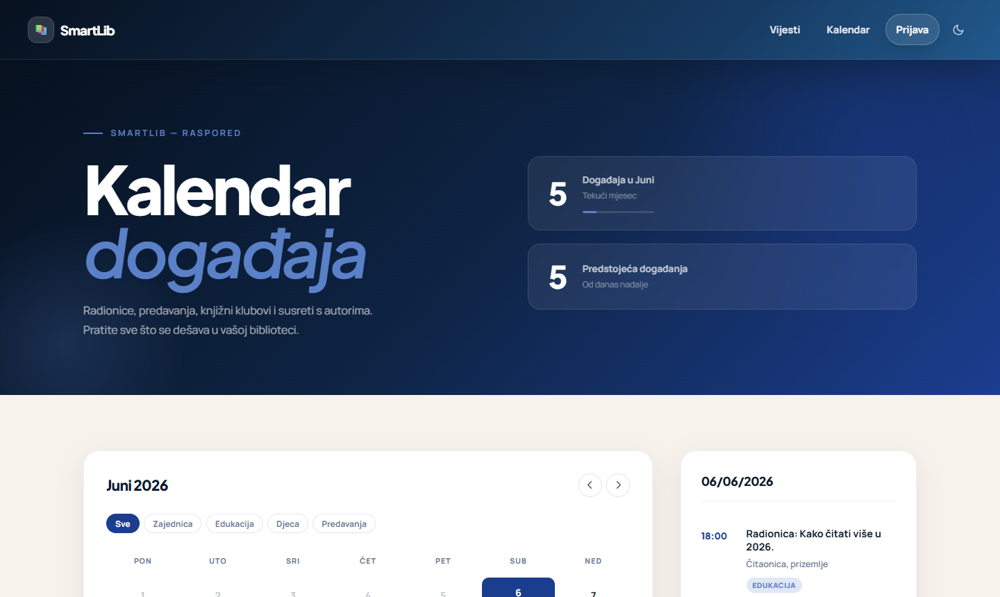
*Slika 5.2 - Interaktivni kalendar događaja*

### 5.2 Ekrani za člana

#### Početna stranica (član)

Personalizirana početna s preporučenim knjigama na osnovu historije čitanja, vijestima i nadolazečim događajima.

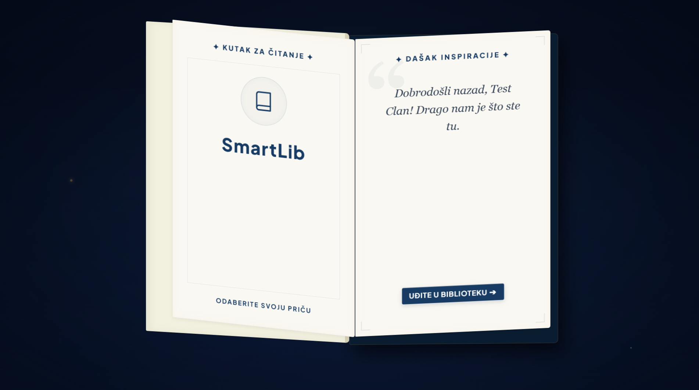
*Slika 5.3 - Personalizirana početna stranica člana*

#### Katalog knjiga

Napredna pretraga po naslovu, autoru, ISBN-u, kategoriji i godini. Prikazana dostupnost primjeraka i prosječna ocjena.

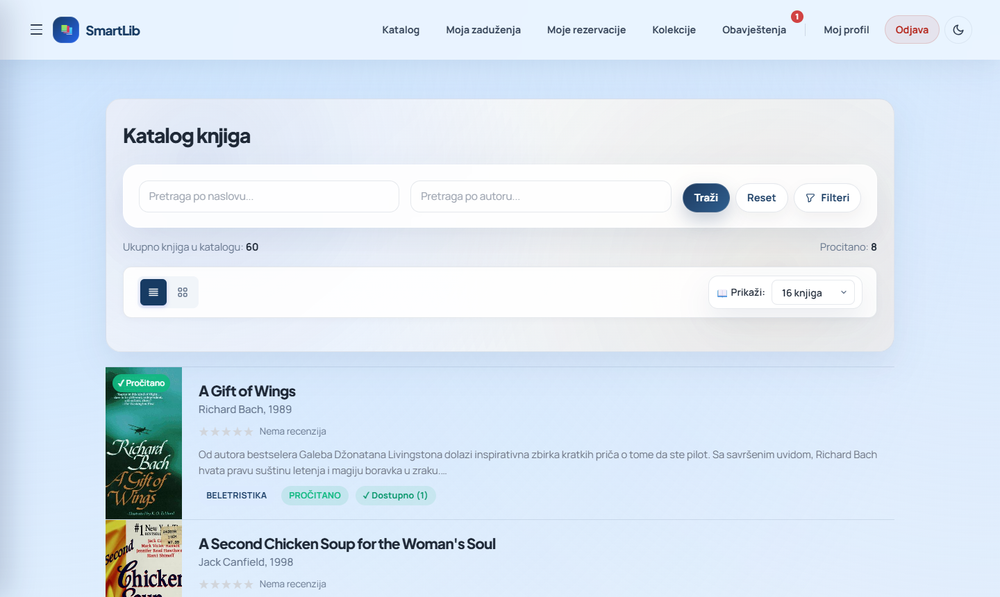
*Slika 5.4 - Katalog knjiga s filterima*

#### Detalji knjige

Opis, ISBN, kategorija, dostupni primjerci i recenzije čitalaca. Mogućnost rezervacije i dodavanja u kolekciju.

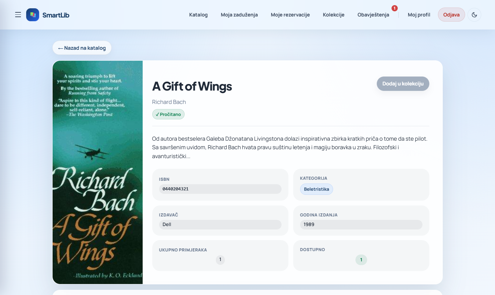
*Slika 5.5 - Stranica s detaljima knjige*

#### Moja zaduženja

Lišta posuđenih knjiga s datumima posudbe i rokovima vraćanja. Zakašnjena zaduženja su istaknuta.

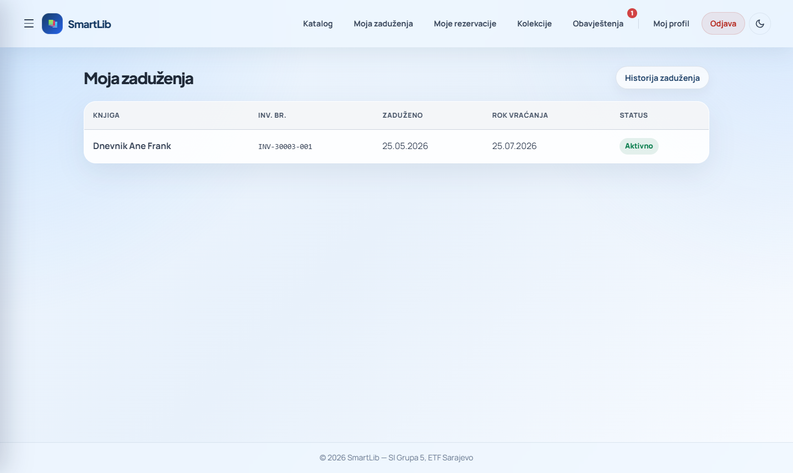
*Slika 5.6 - Pregled aktivnih zaduženja*

#### Moje rezervacije

Aktivne rezervacije. Kad knjiga postane dostupna, sistem šalje automatsku obavijest.

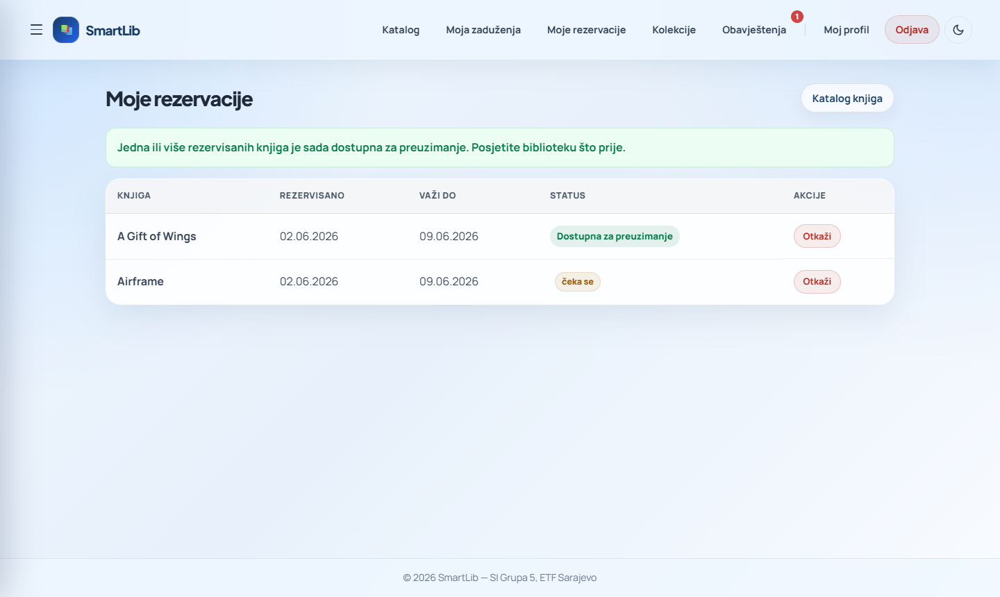
*Slika 5.7 - Pregled rezervacija*

#### Kolekcije

Tematske kolekcije knjiga (privatne ili javne). Javne kolekcije mogu vidjeti drugi članovi na profilu.

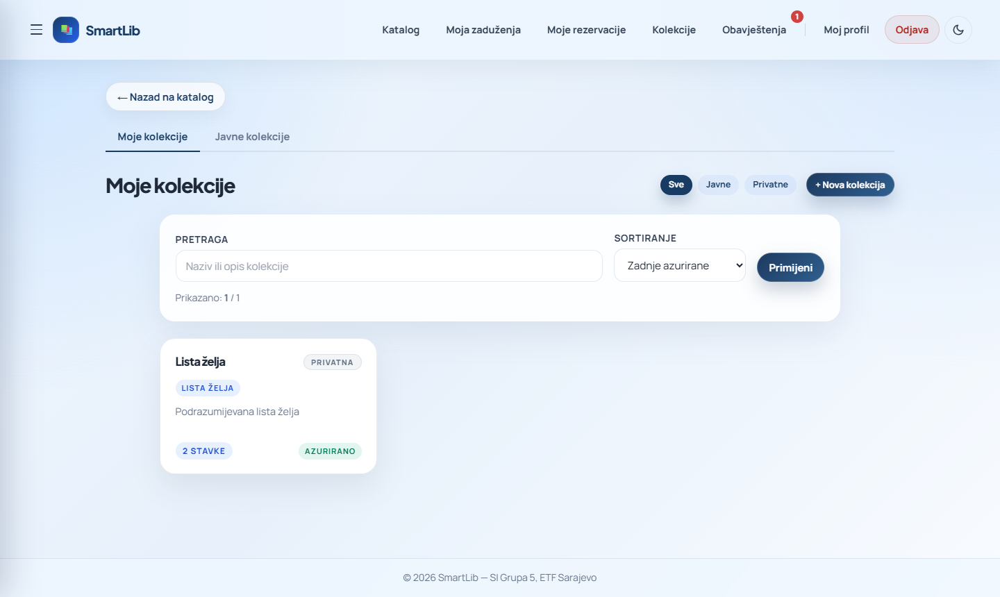
*Slika 5.8 - Tematske kolekcije knjiga*

#### Forum zajednice

Diskusije po kategorijama. Pisanje objava, komentarisanje i reagovanje na postove.

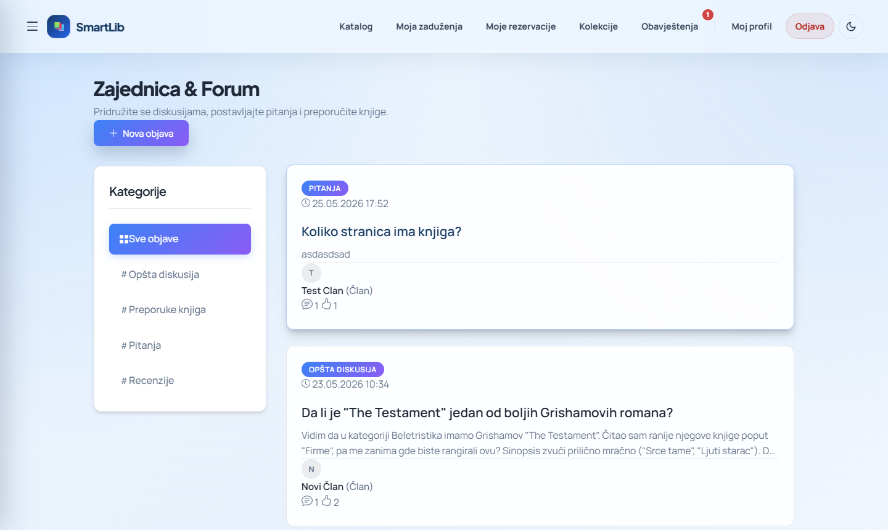
*Slika 5.9 - Forum zajednice*

#### Notifikacije

Sve obavijesti sistema s mogćnošću označavanja kao pročitano.

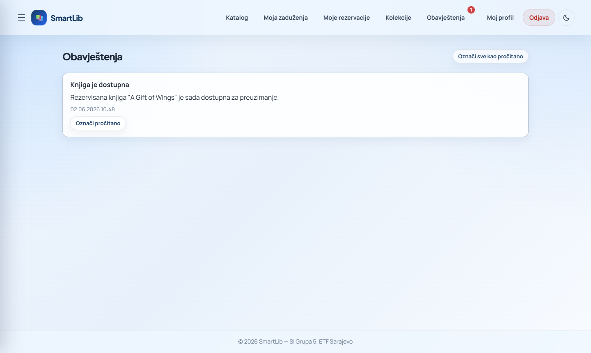
*Slika 5.10 - Centar notifikacija*

#### Moj profil

Lični podaci, status članarine, historija čitanja i postignute značajke.

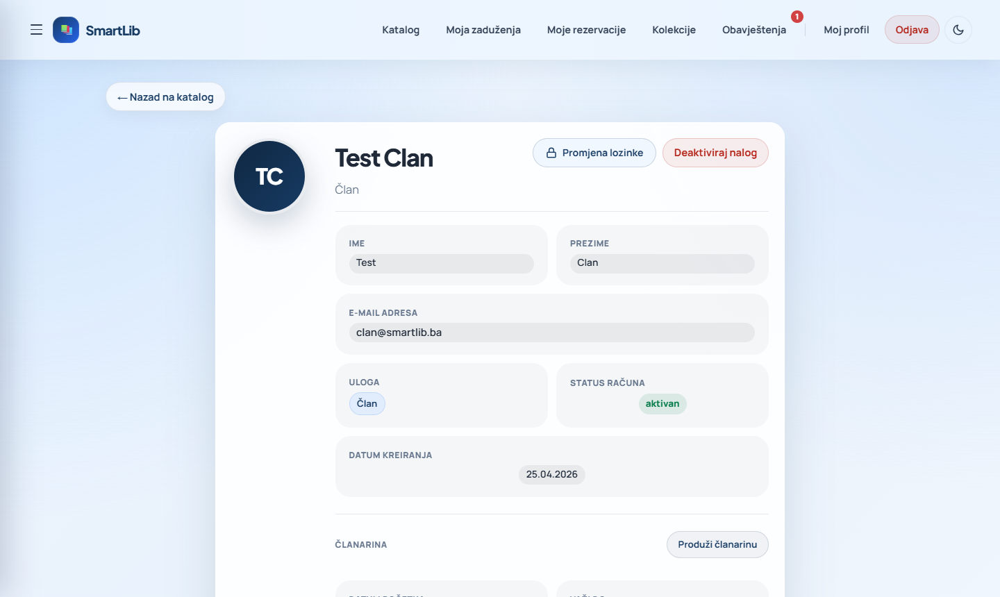
*Slika 5.11 - Korisnički profil člana*

### 5.3 Ekrani za bibliotekara

#### Aktivna zaduženja

Sva tekuća zaduženja s filtriranjem po članovima. Zakašnjena su istaknuta crvenom bojom.

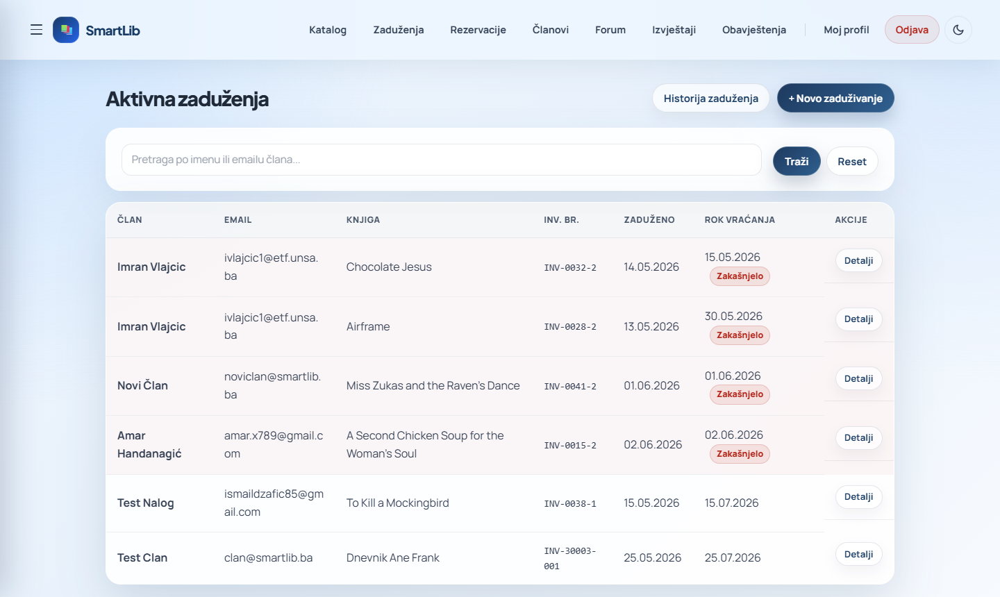
*Slika 5.12 - Aktivna zaduženja (bibliotekar)*

#### Lišta članova

Svi registrovani članovi s pretragom i opcijama upravljanja.

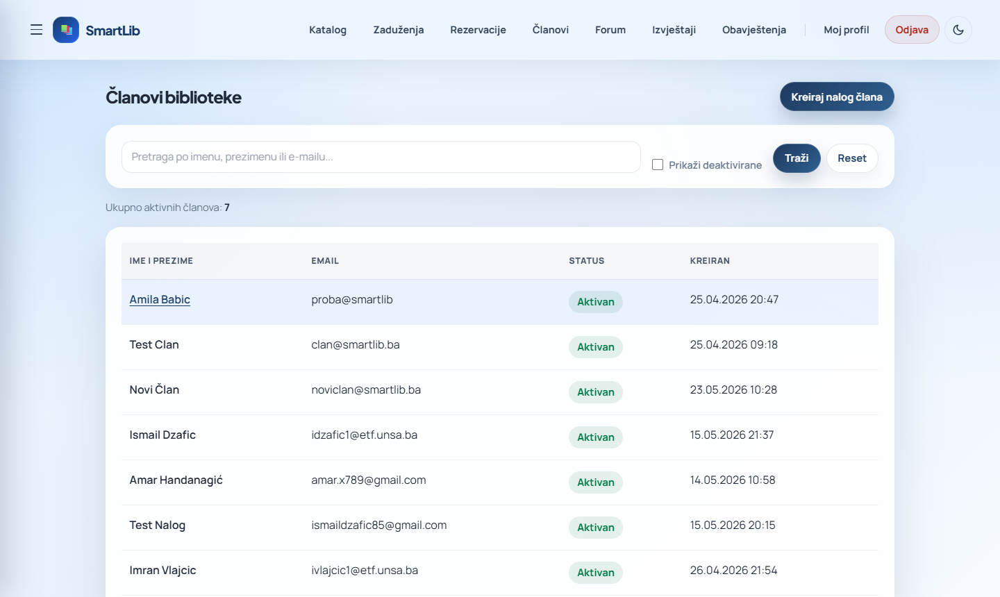
*Slika 5.13 - Lišta članova biblioteke*

#### Zahtjevi za produženje

Pregled zahtjeva za produženje članarine s opcijama odobravanja ili odbijanja.

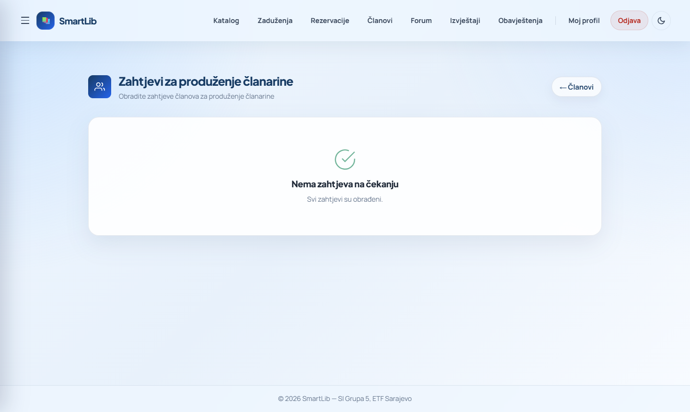
*Slika 5.14 - Zahtjevi za produženje članarine*

#### Izvještaji

PDF izvještaji o zaduženjima, rezervacijama i članovima za odabrani period.

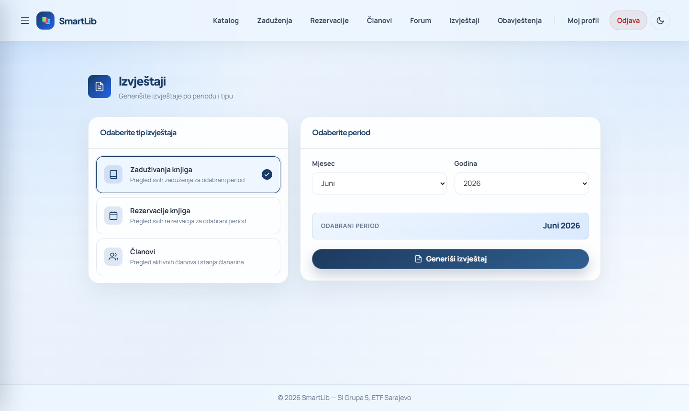
*Slika 5.15 - Generisanje izvještaja*

### 5.4 Ekrani za administratora

#### Lišta bibliotekara

Upravljanje svim bibliotekarskim nalozima u sistemu.

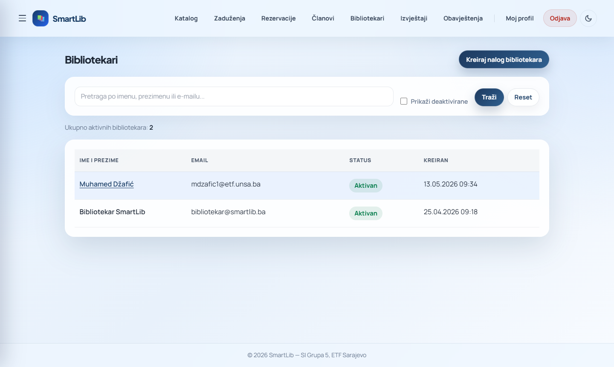
*Slika 5.16 - Lišta bibliotekarskih naloga*

#### Audit log

Kompletna historija svih akcija u sistemu s naprednim filterima.

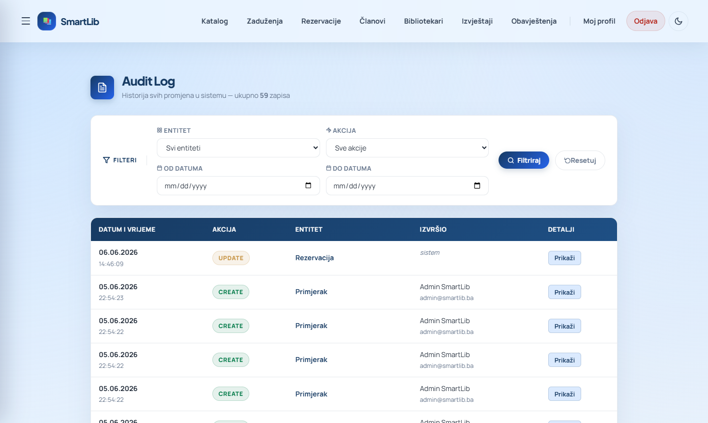
*Slika 5.17 - Audit log (samo za administratore)*

---

## 6. Korak-po-korak upute

### 6.1 Pretraga i posudba knjige (Član)

> Posudba se fizički obavlja u biblioteci. Bibliotekar registruje zaduženje u sistemu.

1. Prijavite se u sistem kao član
2. Kliknite **"Katalog"** u gornjoj navigaciji
3. Unesite naslov, autora ili ISBN u polje za pretragu
4. Po potrebi koristite filtere: kategorija, izdavač, godina
5. Kliknite **"Traži"** ili pritisnite Enter
6. Otvorite stranicu knjige klikom na naslov
7. Provjerite da knjiga ima dostupnih primjeraka
8. Dođite fizički u biblioteku i zatražite zaduženje od bibliotekara

**Očekivani rezultat:** Knjiga se pojavljuje u sekciji "Moja zaduženja" s datumom posudbe i rokom vraćanja (standardno automatski 14 dana).

---

### 6.2 Rezervacija nedostupne knjige (Član)

1. Otvorite stranicu željene knjige u katalogu
2. Ako su svi primjerci zauzeti, vidjet ćete dugme **"Rezervisi"**
3. Kliknite **"Rezervisi"** i potvrdite akciju

**Očekivani rezultat:** Rezervacija je aktivna. Čim netko vrati primjerak, dobit ćete notifikaciju. Rezervacija vrijedi 7 dana od trenutka kad knjiga postane dostupna.

**Otkazivanje:** Idite na "Moje rezervacije" i kliknite "Otkaži" pored željene rezervacije.

---

### 6.3 Pisanje recenzije (Član)

1. Otvorite stranicu knjige koju ste već vratili
2. Scrollajte do sekcije recenzija na dnu stranice
3. Kliknite **"Dodaj recenziju"**
4. Odaberite ocjenu od 1 do 5 zvjezdica
5. Napišite komentar (opcionalno)
6. Kliknite **"Pošalji"**

**Očekivani rezultat:** Recenzija se odmah pojavljuje na stranici knjige i utječe na prosječnu ocjenu.

---

### 6.4 Kreiranje kolekcije knjiga (Član)

1. Kliknite **"Kolekcije"** u navigaciji
2. Kliknite **"Nova kolekcija"**
3. Unesite naziv kolekcije (npr. "Klasici koje moram pročitati")
4. Opciono dodajte opis
5. Odaberite vidljivost: **Privatna** ili **Javna**
6. Kliknite **"Sačuvaj"**

**Dodavanje knjige u kolekciju:** Otvorite stranicu knjige, kliknite "Dodaj u kolekciju" i odaberite kolekciju.

**Očekivani rezultat:** Knjiga je dodana u kolekciju. Javne kolekcije mogu vidjeti drugi članovi na vašem profilu.

---

### 6.5 Sudjelovanje u forumu (Član i Bibliotekar)

1. Kliknite **"Forum"** u navigaciji
2. Kliknite dugme **"Nova objava"**
3. Unesite naslov i sadržaj objave
4. Odaberite kategoriju (Preporuka, Pitanje, Diskusija...)
5. Kliknite **"Objavi"**

**Očekivani rezultat:** Objava se odmah pojavljuje u forumu i vidljiva je svim prijavljenim korisnicima.

---

### 6.6 Zaduživanje knjige (Bibliotekar)

Registracija posudbe kada član fizički dodje u biblioteku.

1. U navigaciji kliknite **"Zaduženja"**, pa dugme **"+ Nova zaduženja"**
2. U polje **"Član"** unesite ime, prezime ili e-mail. Sistem automatski predlaze
3. U polje **"Knjiga / primjerak"** unesite naslov ili inventarski broj
4. Provjerite da je primjerak oznacen kao **dostupan**
5. Kliknite **"Zaduzi"**

**Očekivani rezultat:** Zaduženje je registrovano s automatski izracunatim rokom vraćanja. Primjerak mijenja status u "zadužen". Član vidi zaduženje u sekciji "Moja zaduženja".

> Sistem blokira zaduzivanje ako član ima aktivna zakašnjena zaduženja, ako nema dostupnih primjeraka, ili ako član već ima tu istu knjigu.

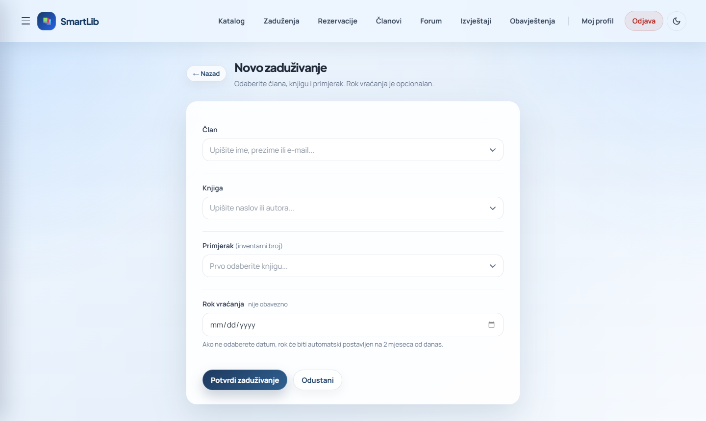
*Slika 6.1 - Forma za registraciju novog zaduženja*

---

### 6.7 Vraćanje knjige (Bibliotekar)

1. Idite na **"Zaduženja"** > **"Aktivna zaduženja"**
2. Pronađite zaduženje pretragom po imenu člana ili naslovu knjige
3. Kliknite **"Detalji"** pored odgovarajuceg zaduženja
4. Kliknite dugme **"Vrati"** i potvrdite akciju

**Očekivani rezultat:** Zaduženje se zatvara i premješta u historiju. Primjerak postaje dostupan. Ako postoji aktivna rezervacija, sistem automatski obavjestava člana koji čeka.

---

### 6.8 Registracija novog člana (Bibliotekar)

1. U navigaciji kliknite **"Članovi"**
2. Kliknite **"Kreiraj novog člana"** (gornji desni ugao)
3. Popunite formu: ime, prezime, e-mail, privremena lozinka
4. Kliknite **"Sačuvaj"**
5. Opciono: na profilu novog člana kliknite **"Uredi članarinu"** za postavljanje datuma

**Očekivani rezultat:** Nalog je odmah aktivan. Član se može prijaviti s dodijeljenim kredencijalima.

*Slika 6.2 - Forma za registraciju novog člana*

---

### 6.9 Dodavanje knjige u katalog (Bibliotekar)

1. Idite na **"Katalog"** i kliknite **"+ Nova knjiga"** u gornjem desnom uglu
2. Popunite: naslov, autor, ISBN (10 ili 13 cifara), kategorija, izdavac, godina
3. Unesite **broj primjeraka** koji se dodaju
4. Kliknite **"Sačuvaj"**

**Očekivani rezultat:** Knjiga se odmah pojavljuje u katalogu. Sistem automatski generise inventarske brojeve. Naslovna slika se automatski preuzima iz Open Library i Google Books baza.

---

### 6.10 Odobravanje produženja članarine (Bibliotekar)

1. U navigaciji odaberite **"Produženja članarine"**
2. Vidite listu zahtjeva s trenutnim i predlozenim datumom isteka
3. Kliknite **"Odobri"** ili **"Odbij"** (s opcionalnim razlogom)

**Očekivani rezultat:** Član dobija notifikaciju. Ako je odobreno, novi datum isteka se odmah primjenjuje.

---

### 6.11 Generisanje izvještaja (Bibliotekar)

1. Kliknite **"Izvještaji"** u navigaciji
2. Odaberite vrstu: **Zaduženja**, **Rezervacije** ili **Članovi**
3. Unesite vremenski period (od / do)
4. Kliknite **"Prikaži"** za pregled, ili **"Preuzmi PDF"** za preuzimanje

**Očekivani rezultat:** Izvještaj prikazuje sve relevantne podatke za odabrani period, formatiran i spreman za stampu.

*Slika 6.3 - Stranica za generisanje izvještaja*

---

### 6.12 Upravljanje bibliotekarima (Administrator)

**Dodavanje:**
1. U navigaciji kliknite **"Bibliotekari"**
2. Kliknite **"Kreiraj bibliotekara"**
3. Popunite: ime, e-mail, lozinka
4. Kliknite **"Sačuvaj"**

**Očekivani rezultat:** Novi bibliotekar može se odmah prijaviti.

**Deaktivacija:**
1. Pronađite bibliotekara u listi i otvorite profil
2. Kliknite **"Deaktiviraj nalog"**

**Očekivani rezultat:** Nalog deaktiviran. Bibliotekar se vise ne može prijaviti, ali historija aktivnosti ostaje sacuvana.

---

### 6.13 Pregled audit loga (Administrator)

1. U navigaciji kliknite **"Audit Log"**
2. Koristite filtere: tip entiteta, akcija, korisnik, period
3. Kliknite **"Filtriraj"**

**Očekivani rezultat:** Paginirana lišta svih akcija s datumom, tipom i korisnikom koji je akciju izvrsio.

*Slika 6.4 - Audit log s filterima*

---

## 7. Notifikacije

SmartLib automatski šalje notifikacije za sljedeće događaje:

| Događaj | Ko dobija notifikaciju |
|---|---|
| Rezervisana knjiga postala dostupna | Član koji je rezervisao |
| Rok vraćanja se blizi (3 dana unaprijed) | Član s aktivnim zaduženjem |
| Zaduženje je zakašnjeno | Član i Bibliotekar |
| Zahtjev za produženje primljen | Bibliotekar |
| Zahtjev za produženje odobren ili odbijen | Član koji je tražio |
| Nova rezervacija u sistemu | Bibliotekar |
| Recenzija prijavljena na moderaciju | Bibliotekar |

**Pristup notifikacijama:** Kliknite ikonu zvona u gornjoj navigaciji. Crveni broj pokazuje koliko nepročitanih imate. Kliknite notifikaciju da odete na relevantnu stranicu, ili koristite "Označi sve kao pročitane".

---

## 8. Ograničenja sistema

Sljedeća ograničenja su namjerna i predstavljaju dio poslovnih pravila.

### Za člana

| Ograničenje | Razlog |
|---|---|
| Samo 1 rezervacija iste knjige | Sprečava višestruke rezervacije od jednog člana |
| Rezervacija samo kad nema dostupnih | Nema smisla rezervisati dostupnu knjigu |
| Blokada pri zakasnjenim zaduženjima | Ne može posuditi niti rezervisati dok ne vrati zakašnjelu |
| Recenzija samo za vraćene knjige | Sprečava lažne recenzije bez čitanja |
| Jedna recenzija po knjizi | Sprečava višestruko ocjenjivanje |
| Ne može sam kreirati zaduženje | Posudbu uvijek bilježi bibliotekar |

### Za bibliotekara

| Ograničenje | Razlog |
|---|---|
| Ne može brisati knjige s aktivnim zaduženjima | Zaštita integriteta podataka |
| Ne može upravljati bibliotekarima | Isključivo pravo administratora |
| Ne može vidjeti audit log | Rezervisano za administratore |

### Tehnicke napomene

- **Naslovna slika knjige** se automatski preuzima iz Open Library i Google Books. Ako knjiga nije prepoznata, prikazuje se generički prikaz.
- **Preporuke** (sekcija "Istraži") personalizirane su na osnovu historije čitanja i osvježavaju se svakih nekoliko minuta.
- **Katalog** se učitava iz kesa koji se osvježava svakih 10 minuta. Novododana knjiga može biti vidljiva s kratkim kašnenjem.
- **Sistem radi isključivo online.** Nema offline načina rada.

---

## 9. Česta pitanja

**Ne mogu se prijaviti u sistem. Šta da radim?**
Provjerite ispravnost e-maila i lozinke. Lozinka je osjetljiva na velika i mala slova. Koristite opciju "Zaboravili ste lozinku?" ako je potrebno.

**Ne vidim dugme "Rezerviši" na stranici knjige.**
Rezervacija je dostupna samo kada su svi primjerci zauzeti. Ako postoji dostupan primjerak, dođite u biblioteku po njega.

**Imam zakašnjelo zaduženje i ne mogu posuditi novu knjigu.**
Morate fizički vratiti zakašnjenu knjigu. Bibliotekar će registrovati vraćanje i nalog će biti odmah odblokiran.

**Napisao/la sam recenziju, ali se nije pojavila.**
Recenzije prolaze automatsku provjeru sadržaja. Pokušajte preformulisati tekst.

**Kako zatražiti produženje članarine?**
Idite na "Moj profil" i kliknite "Produzi članarinu". Zahtjev će biti poslan bibliotekaru koji će ga odobriti ili odbiti.

**Knjiga nije u katalogu. Mogu li je tražiti?**
Da. Obratite se bibliotekaru koji može poslati zahtjev distributeru putem funkcije "Nabavka knjiga".

**Mogu li vidjeti tuđe kolekcije i liste želja?**
Samo ako je korisnik postavio kolekciju ili listu kao **javnu**. Privatne su vidljive isključivo vlasniku.

**Koliko dugo vrijedi rezervacija?**
Rezervacija čeka dok knjiga nije dostupna. Kad postane dostupna, imate **7 dana** da dođete po nju, nakon cega automatski ističe.

**Mogu li promijeniti lozinku svog naloga?**
Da. "Moj profil" > "Promijeni lozinku" > unesite trenutnu i dva puta novu lozinku > "Sačuvaj".

---

*SmartLib | SI Grupa 5 | ETF Sarajevo | Juni 2026*
*https://smartlib-web.onrender.com*
