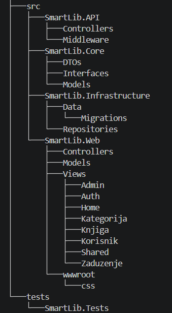
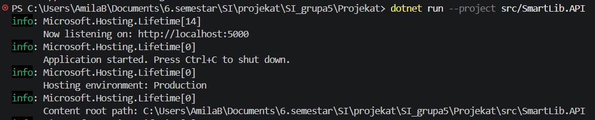
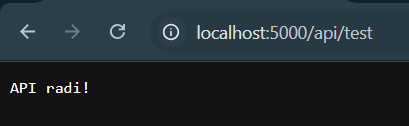

# Osnovni skeleton sistema — SmartLib

## 1. Uvod

Ovaj dokument definiše osnovni tehnički skeleton sistema SmartLib. Dokument nadopunjuje prethodno definisani **Tehnički Setup** i fokusira se na konkretnu implementaciju strukture projekta i minimalnog funkcionalnog okruženja.

Cilj skeletona je uspostavljanje stabilne osnove koja omogućava dalji razvoj kroz naredne sprintove.

---

## 2. Arhitektura sistema

Sistem je organizovan kao višeslojna (layered) arhitektura sa jasnim razdvajanjem odgovornosti između slojeva:

- **SmartLib.Core**  
  Sadrži domenske modele i interfejse. Predstavlja centralni dio poslovne logike sistema.

- **SmartLib.Infrastructure**  
  Implementira pristup podacima i sadrži konfiguraciju baze putem `ApplicationDbContext`.

- **SmartLib.API**  
  Predstavlja ulaznu tačku aplikacije i odgovoran je za izlaganje funkcionalnosti putem HTTP endpointa.

- **SmartLib.Web**  
  Predstavlja korisnički interfejs baziran na ASP.NET Core MVC.

- **SmartLib.Tests**  
  Predviđen za testiranje sistema.

Ovakva arhitektura omogućava modularnost, lakše održavanje i jasnu podjelu odgovornosti između komponenti sistema.

---

## 3. Struktura repozitorija

Projekt koristi modularnu organizaciju unutar `src/` direktorija, gdje je svaki sloj implementiran kao zaseban projekat.

U nastavku je prikazana struktura projekta:

Struktura prati principe razdvajanja slojeva i omogućava nezavisni razvoj, testiranje i proširenje sistema.

---

## 4. Implementacija baze podataka (skeleton nivo)

Detaljan izbor tehnologije i obrazloženje nalaze se u dokumentu *Tehnički Setup*.  

U okviru skeletona implementirano je:

- osnovna verzija `ApplicationDbContext` klase
- povezivanje DbContext-a sa aplikacijom putem Dependency Injection-a
- definisanje početnog entiteta (`Knjiga`) kroz `DbSet`

Za potrebe inicijalnog pokretanja koristi se **InMemory baza podataka**, čime se omogućava jednostavan razvoj bez potrebe za konfiguracijom stvarne baze.

Ovaj pristup je privremen i služi za validaciju tehničke strukture sistema.

---

## 5. Konfiguracija aplikacije

U `Program.cs` fajlu izvršena je osnovna konfiguracija aplikacije:

- registracija `ApplicationDbContext`
- uključivanje kontrolera (`AddControllers`)
- definisanje HTTP request pipeline-a (`MapControllers`)

Napredne konfiguracije su planirane, ali nisu dio inicijalnog skeletona.

---

## 6. Validacija skeletona

Ispravnost skeletona potvrđena je uspješnim pokretanjem aplikacije.

Prilikom pokretanja dobija se sljedeći rezultat:

Dodatno, implementiran je testni API endpoint kojim se potvrđuje funkcionalnost sistema:

Na osnovu toga može se zaključiti da:

- aplikacija se uspješno pokreće
- backend je pravilno konfigurisan

---

## 7. Trenutno stanje sistema

U ovoj fazi razvoja implementirano je:

- osnovna struktura projekata (Core, Infrastructure, API, Web, Tests)
- domenski model sa početnim entitetima
- inicijalni DbContext
- konfiguracija aplikacije za pokretanje
- testni API endpoint

Sistem je spreman za implementaciju funkcionalnosti definisanih u narednim sprintovima.

---

## 8. Zaključak

Tehnički skeleton sistema SmartLib predstavlja osnovu za dalji razvoj aplikacije. Uspostavljena arhitektura i minimalna implementacija omogućavaju timu da nastavi razvoj bez tehničkih prepreka. 
Kroz validaciju pokretanja aplikacije potvrđeno je da je sistem spreman za implementaciju funkcionalnosti prema definisanom backlogu i release planu.

