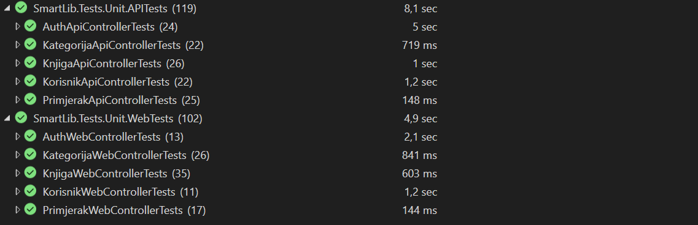

# SmartLib — Bibliotečki informacioni sistem
## Izvještaj o testiranju — Sprint 5 & 6

**Datum kreiranja izvještaja:** 06.05.2026.  
**Okruženje:** Development / Test (In-Memory DB), Chrome (za UI testove)  
**Alati:** xUnit, WebApplicationFactory, Browser DevTools, Playwright, Fine Code Coverage 

---

## 1. Pregled testiranja
Ovaj dokument predstavlja formalni izvještaj o testiranju provedenom u okviru Sprinta 5 i 6 projekta SmartLib. Testiranje je provedeno u skladu sa definiranom Test strategijom (Sprint 3) i obuhvata sve implementirane funkcionalnosti (Knjige, Kategorije, Primjerci, Korisnici, Autentifikacija).

| Ukupno testova | Prošlo | Preskočeno (Skip) | Greška |
| :--- | :--- | :--- | :--- |
| **371** | **371** | **0** | **0** |

---

## 2. Nivoi testiranja — pregled aktivnosti

### 2.1 Unit testiranje

**Alat:** xUnit + Moq (.NET)  
**Pristup:** Izolirani testovi sa mock repozitorijima — bez baze podataka. Svaki test provjerava jednu konkretnu poslovnu logiku ili HTTP odgovor kontrolera.

**Podjela:** Testovi su podijeljeni u dvije grupe:
- **API kontroleri** — testiraju JSON odgovore i HTTP status kodove (`200`, `201`, `400`, `404`, `409`)
- **Web kontroleri** — testiraju View rezultate, redirect logiku i TempData poruke (`SuccessMessage`, `ErrorMessage`)

**Analiza pokrivenosti:** Za mjerenje pokrivenosti testova korišten je alat **Fine Code Coverage**. Postignuti su sljedeći rezultati:
* **Line Coverage:** 100% (svaka linija koda u testiranim komponentama je izvršena).
* **Branch Coverage:** ~97% (gotovo svi logički putevi su validirani).

**Rezultati testiranja:**
Svi planirani unit testovi (ukupno 221) su uspješno izvršeni. 

[**Prikaži detaljan izvještaj svih unit testnih slučajeva**](#detaljni-izvjestaj-unit)

> **Napomena:**  
>Svi unit testovi su implementirani prateći dvije ključne prakse za osiguranje čitljivosti i održivosti:
>
> **AAA (Arrange-Act-Assert) obrazac:** Testovi su logički podijeljeni u tri prepoznatljiva dijela:
> * **Arrange:** Priprema okruženja, inicijalizacija objekata i konfiguracija mock-ova.
> * **Act:** Izvršavanje konkretne metode koja se testira.
> * **Assert:** Provjera da li je rezultat (povratna vrijednost ili stanje) u skladu sa očekivanjima.
>
> **Osherova konvencija imenovanja:** Testovi su imenovani prema metodologiji koju zagovara **Roy Osherove**, u formatu:
> `[NazivMetode]_[Scenario]_[OcekivanoPonasanje]`

---

### 2.2 Penetracijsko / Sigurnosno testiranje
 
**Alat:** xUnit + WebApplicationFactory (.NET)  
**Pristup:** Simuliran je puni HTTP pipeline sa in-memory bazom podataka i stvarnim JWT middleware-om. Testovi šalju prave HTTP zahtjeve prema API endpointima i validiraju odgovore na nivou status kodova i sadržaja tijela odgovora — bez mockovanja.  
**Podjela:** Testovi su podijeljeni u četiri grupe:
 
- **Autentifikacija i SQL Injection** — testiraju otpornost login endpointa na zlonamjerne unose i valjanost JWT mehanizma
- **XSS zaštita** — testiraju da li sistem odbija ili neutralizira skripte u korisničkim unosima
- **Granične vrijednosti** — testiraju ponašanje sistema na rubnim i nevažećim ulazima
> **Napomena:** Provjere 401 bez tokena i 403 za eskalaciju privilegija (RBAC) namjerno su izostavljene iz sigurnosnih testova jer su u potpunosti pokrivene integracijskim testovima (Auth, Korisnik, Kategorija, Knjiga, Primjerak).
 
**Rezultati testiranja:**  
Svi planirani sigurnosni testovi su uspješno izvršeni.
 

 
[**Prikaži detaljan izvještaj svih penetracijskih / sigurnosnih testnih slučajeva**](#detaljni-izvjestaj-security)
 
> **Pokriveni vektori napada:**
> * **PT-01 / PT-02:** SQL Injection u email i lozinka polju (US-04, US-05)
> * **PT-03:** Brute Force napad na login (US-04)
> * **PT-04 / PT-05:** Lažni i modificirani JWT token (US-08)
> * **PT-06:** Arhitekturalni rizik — stari JWT deaktiviranog korisnika (US-09)
> * **PT-07 / PT-08:** XSS u registracijskom obrascu i nazivu kategorije (US-01, US-02, US-30)
> * **PT-09:** Path Traversal / Injection u ISBN polju (US-25)

---

### 2.3 Regresiono testiranje

**Cilj:** Potvrda stabilnosti implementiranog rješenja osiguravanjem da nove izmjene u kodu ne narušavaju rad postojećih, prethodno validiranih funkcionalnosti unutar tekuće razvojne faze.

**Proces:** Regresiono testiranje se provodilo periodično, nakon svake značajne promjene u kodu ili ispravke defekata. Proces je obuhvatao:
- Ručno pokretanje kompletnog seta unit i integracijskih testova unutar Test Explorer-a, kako bi se osiguralo da su svi testovi uspješno izvršeni (status *Passed*).
- Ponovni prolazak kroz kritične UAT scenarije, s ciljem potvrde da korisnički interfejs i osnovne funkcionalnosti sistema ostaju stabilne.

**Rezultati:** Izvršavanjem regresionih testova potvrđeno je, uz manje probleme da sistem zadržava stabilnost nakon uvedenih izmjena.

#### Značajnije stavke obuhvaćene regresionim testiranjem:

* **Integritet brisanja i zavisnosti:**
    Nakon implementacije pravila da se kategorija ne može obrisati ako sadrži knjige (Sprint 6), izvršena je regresija nad modulom Knjiga. Potvrđeno je da brisanje same knjige i dalje ispravno funkcioniše i da ne narušava stabilnost preostalih podataka u bazi niti integritet relacija.

* **Normalizacija ISBN unosa:**
    Nakon što je dodata logika koja automatski uklanja crtice iz ISBN-a, regresijom je potvrđeno da sistem ispravno pohranjuje očišćene podatke i da se oni konzistentno prikazuju u detaljima knjige. 

* **Konzistentnost UI poruka (TempData):**
    Regresiono je verificirano da sigurnosni filteri ne blokiraju standardne sistemske poruke (npr. *"Korisnik uspješno kreiran"*), čime je osiguran kontinuitet vizuelnog feedbacka prema korisniku.

* **Paginacija i filtriranje:**
    Nakon značajnog povećanja broja testnih podataka u bazi tokom Sprinta 6, ponovo je testirana paginacija u katalogu. Potvrđeno je da sistem ispravno raspoređuje knjige po stranicama i da navigacija funkcioniše bez gubitka sinhronizacije podataka u prikazu.

---

### 2.4 UAT (User Acceptance Testing) 

Sprovedeno je manuelno prihvatno testiranje (UAT) od strane svih članova tima, u skladu sa definisanim Acceptance Criteria iz Sprint Backloga.

Testiranje je obuhvatilo ključne funkcionalnosti:
- autentifikaciju i autorizaciju korisnika
- upravljanje knjigama
- upravljanje primjercima
- upravljanje kategorijama
- pregled kataloga

[**Prikaži detaljan izvještaj svih UAT scenarija**](#detaljni-izvjestaj-uat)

**Rezultati testiranja:**
Svi scenariji su testirani kroz UI (browser) i validirani očekivani ishodi.
Manuelnim UAT testiranjem potvrđeno je da implementirane funkcionalnosti ispunjavaju sve definisane Acceptance Criteria iz Sprint Backloga. 

---

## 3. Evidencija pronađenih grešaka

### **BG-01: Konfiguracija In-Memory baze (SecurityTests.cs)**
* **Opis:** Korištenje `Guid.NewGuid()` u imenu baze unutar `CreateClient()` uzrokovalo je da svaki request dobije novu, praznu bazu. Login testovi su padali jer "seeder" nije bio u istoj bazi.
* **Rješenje:** Ime baze fiksirano pomoću statičkog polja: `private static readonly string _dbName = "TestDb_" + Guid.NewGuid();`.
* **Status:** Riješeno

### **BG-02: XSS ranjivost u Controllerima**
* **Opis:** `KategorijaController` i `KorisnikController` su dozvoljavali pohranu `` | 400 ili odgovor bez taga | Prošao |
| **2** | `KorisnikCreate_XssPayloadUImenuIliPrezimenu_OdbijenIliEscapovan` | Inline event handler u Prezime polju biva odbijen | `` | 400 ili odgovor bez atributa | Prošao |
| **3** | `KategorijaCreate_XssPayloadUNazivu_OdbijenIliEscapovan` | Script tag u nazivu kategorije ne prolazi validaciju | `` | 400 ili odgovor bez taga | Prošao |
| **4** | `KategorijaCreate_XssPayloadUNazivu_OdbijenIliEscapovan` | Inline event handler u opisu kategorije biva odbijen | `` | 400 ili odgovor bez atributa | Prošao |
 
---
 
#### 4.2.3 Path Traversal i Injection u ISBN polju
 
Ovi testovi osiguravaju da ISBN polje ne može biti iskorišteno kao vektor napada — nevažeći, ekstremni i zlonamjerni unosi moraju biti odbijeni validacijom bez curenja internih grešaka.
 
| # | Naziv testa | Šta se provjerava | Payload / Input | Očekivano | Status |
|:-:|:---|:---|:---|:-:|:-:|
| **1** | `KnjigaCreate_InjectionUIsbnPolju_VracaBadRequest` | SQL injection u ISBN polju se odbija validacijom | `' OR '1'='1` | 400 | Prošao |
| **2** | `KnjigaCreate_InjectionUIsbnPolju_VracaBadRequest` | XSS payload u ISBN polju ne prolazi format validaciju | `` | 400 | Prošao |
| **3** | `KnjigaCreate_InjectionUIsbnPolju_VracaBadRequest` | Path traversal napad u ISBN polju biva odbijen | `../../../../etc/passwd` | 400 | Prošao |

> **Napomena:** Provjere `401` bez tokena i `403` za eskalaciju privilegija testiraju ispravnost implementacije (poslovnu logiku), a ne napadačke vektore — u potpunosti su pokrivene integracijskim testovima i namjerno su izostavljene u ovom nivou testiranja.

---

### 4.3 User acceptance testovi (UAT) - Detaljna lista scenarija

| ID | Scenarij | Koraci izvršavanja | Očekivani rezultat |
|----|---------|-------------------|-------------------|
| UAT-01 | Kreiranje naloga (uspješan tok) | 1. Prijava kao bibliotekar/admin   2. Otvoriti formu za kreiranje člana   3. Unijeti sve podatke   4. Kliknuti na dugme 'Kreiraj člana' | Nalog kreiran, vidljiv u listi članova |
| UAT-02 | Kreiranje naloga (prazna polja) | 1. Prijava kao bibliotekar/admin   2. Otvoriti formu za kreiranje člana   3. Unijeti sve osim emaila   4. Kliknuti na dugme 'Kreiraj člana' | Ispis poruka: Email adresa je obavezna. |
| UAT-03 | Duplikat email | 1. Unijeti postojeći email   2. Kliknuti na dugme 'Kreiraj člana' | Ispis poruke: Ta email adresa je već registrovana. |
| UAT-04 | Kratka lozinka | 1. Unijeti lozinku < 8 znakova   2. Kliknuti na dugme 'Kreiraj člana' | Ispis poruke: Lozinka mora imati najmanje 8 znakova. |
| UAT-05 | Prijava korisnika (validni podaci) | 1. Login sa validnim podacima | Redirect na Home page |
| UAT-06 | Prijava osoblja (validni podaci) | 1. Login kao bibliotekar | Redirect na listu korisnika |
| UAT-07 | Prijava sa pogrešnom lozinkom | 1. Unijeti pogrešnu lozinku za već registorvanog člana | Generička poruka: Prijava nije uspjela. |
| UAT-08 | Prijava sa neispravnim emailom | 1. Unijeti nevalidan email za već registrovanog člana | Generička poruka: Prijava nije uspjela. |
| UAT-09 | Odjava | 1. Kliknuti na dugme 'Logout'   2. Pokušaj pristupa zaštićenoj stranici (npr. Katalog stranici) | Redirect na login stranicu |
| UAT-10 | Dodavanje knjige | 1. Otvoriti formu klikom na dugme 'Nova knjiga'   2. Unijeti obavezne podatke   3. Sačuvati klikom na dugme 'Dodaj u katalog' | Knjiga se prikazuje u katalogu |
| UAT-11 | ISBN validacija | 1. Otvoriti formu klikom na dugme 'Nova knjiga'   2. Unijeti obavezne podatke - za polje ISBN unijeti već postojeći   3. Sačuvati klikom na dugme 'Dodaj u katalog' | Ispis poruke: Knjiga sa ovim ISBN-om već postoji u katalogu. |
| UAT-12 | Broj primjeraka | 1. Unijeti broj (1 ili više) | Primjerci kreirani i prikazani u detaljima knjige |
| UAT-13 | Uređivanje knjige | 1. Ući na detaljne jedne knjige iz kataloga   2. Kliknuti na dugme 'Uredi'   3. Unijeti izmjene   4. Kliknuti na dugme 'Sačuvaj izmjene' | Promjene vidljive |
| UAT-14 | Brisanje knjige | 1. Ući na detaljne jedne knjige iz kataloga   2. Kliknuti na dugme 'Obriši'   3. Potvrditi brisanje | Knjiga uklonjena |
| UAT-15 | Dodavanje primjeraka | 1. Otvoriti detaljne jedne knjige   2. Kliknuti na dugme 'Dodaj primjerak'   3. Unijeti željeni broj   4. Kliknuti na dugme 'Dodaj' | Kreirani novi primjerci |
| UAT-16 | Dodavanje kategorije | 1. Kliknuti na dugme 'Dodaj kategoriiju' u sekciji Kategorija   2. Unijeti naziv i opis (opcionalno)   3. Kliknuti na dugme 'Sačuvaj' | Nova kategorija se pojavljuje u listi kategorija |
| UAT-17 | Duplikat kategorije | 1. Unijeti postojeći naziv | Greška: Kategorija "X" već postoji u sistemu. |
| UAT-18 | Pregled kategorija | 1. Otvoriti sekciju 'Kategorije' | Prikaz postojećih kategorija |
| UAT-19 | Uređivanje kategorije | 1. Kliknuti na dugme 'Uredi' u listi kategorija   2. Izmijeniti naziv | Promjene su prikazane u listi postojećih kategorija |
| UAT-20 | Brisanje kategorije | 1. Kliknuti na dugme 'Obriši' u listi kategorija   2. Kliknuti na dugme 'Potvrdi' | Kategorija uklonjena iz spiska postojećih kategorija |
| UAT-21 | Brisanje u upotrebi | 1. Kliknuti na dugme 'Obriši' za slučaj kad ima knjiga sa tom kategorijom | Greška: Kategorija 'X' ima Y knjiga i ne može biti obrisana. |
| UAT-22 | Prikaz kataloga | 1. Otvoriti katalog klikom na dugme 'Katalog' | Prikazuje se lista dostupnih knjiga |