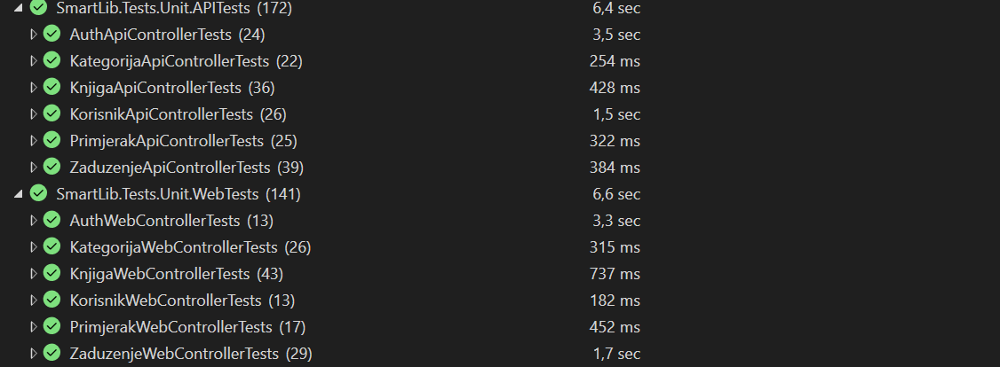
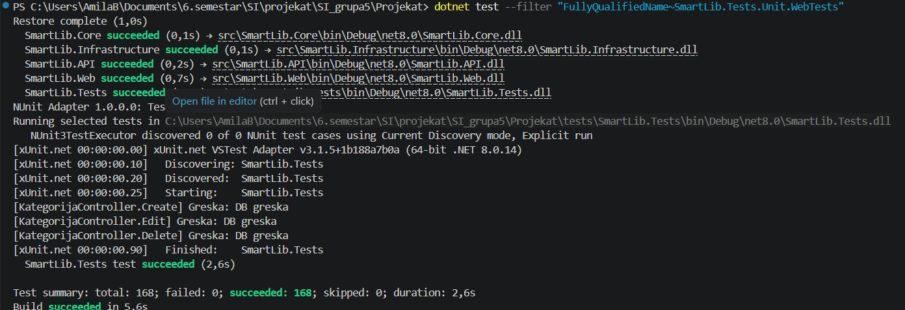
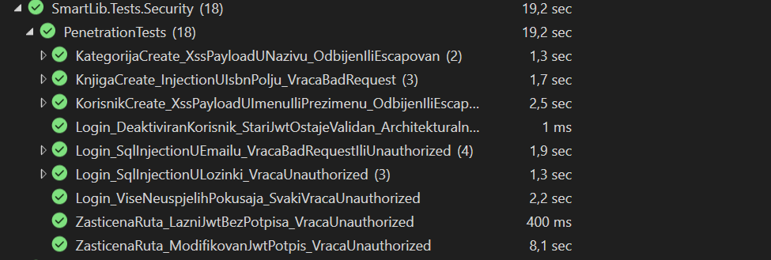
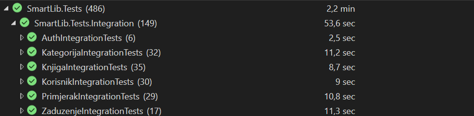
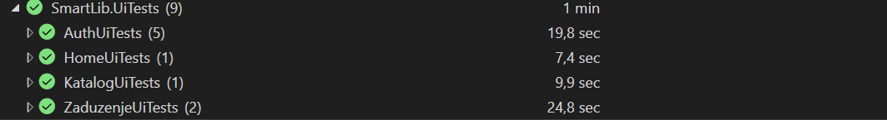

# SmartLib — Bibliotečki informacioni sistem
## Izvještaj o testiranju

**Datum kreiranja izvještaja:** 12.05.2026.  
**Okruženje:** Development / Test (In-Memory DB), Chrome (za UI testove)  
**Alati:** xUnit, WebApplicationFactory, Browser DevTools, Playwright, Fine Code Coverage 

---

> ## NAPOMENA: Sprint 7 — Pregled novododanih testnih aktivnosti
>
> U okviru Sprinta 7 provedeno je testiranje novih funkcionalnosti u skladu sa definiranom test strategijom. Svi prethodno implementirani testovi uspješno su zadržali status *Prošao* kroz kontinuirano regresiono testiranje. Pregled svih testnih slučajeva dodanih u okviru Sprinta 7 dat je u nastavku.
>
> ---
>
> ### Zaduživanje i vraćanje knjiga
>
> - **Unit testovi — API kontroler** (`ZaduzenjeApiControllerTests`, 39 testova): pokrivaju kreiranje zaduženja, evidenciju vraćanja, pregled aktivnih i vlastitih zaduženja, filtriranje, computed polja (kašnjenje, blizina roka) te granične slučajeve poput duplikata i nedostupnih primjeraka.
> - **Unit testovi — Web kontroler** (`ZaduzenjeWebControllerTests`, 29 testova): validiraju iste tokove kroz MVC layer, uključujući redirect logiku, TempData poruke i ispravnost ViewBag dropdownova.
> - **Integracijski testovi** (`ZaduzenjeIntegrationTests`, 17 testova): kroz realni HTTP pipeline i in-memory bazu validiraju autorizaciju, kreiranje zaduženja, filtriranje, historiju te proces vraćanja knjige.
> - **UI testovi** (2 testa): Playwright scenariji koji pokrivaju kompletan E2E tok kreiranja novog zaduženja i evidentiranja vraćanja knjige kroz browser.
>
> ---
>
> ### Pretraga i prikaz knjiga
>
> Implementirane i testirane su sljedeće funkcionalnosti:
> - pretraga knjiga po naslovu i autoru uz mogućnost reseta pretrage,
> - prikaz stranice sa detaljnim informacijama o knjizi (uključujući obradu slučaja kada knjiga ne postoji),
> - prikaz dostupnosti i broja slobodnih primjeraka u realnom vremenu.
>
> Za sve navedene funkcionalnosti dodani su **unit testovi** (API i Web kontroleri), **integracijski testovi**, **sigurnosni / penetracijski testovi** te **UI testovi** — čime je pokrivenost ovih funkcionalnosti usklađena s ostalim modulima sistema.
>
> ---
>
> ### Dopuna Web unit testova za preostale kontrolere
>
> U okviru ovog sprinta dodatno je proširena pokrivenost Web/MVC unit testovima. U folderu `tests/SmartLib.Tests/Unit/WebTests` dodani su testovi za kontrolere koji prethodno nisu bili pokriveni:
>
> - `AdminController`
> - `ClanarinaController`
> - `HomeController`
> - `RezervacijaController`
>
> Dodani testovi validiraju osnovno MVC ponašanje kontrolera: vraćanje odgovarajućih `ViewResult` rezultata, ispravnu redirect logiku, rad sa `TempData` porukama, mapiranje podataka u ViewModel/DTO objekte i pozivanje odgovarajućih mock repozitorija/servisa gdje je primjenjivo.
>
> Također je ažuriran postojeći `KorisnikWebControllerTests.cs`, jer trenutni `KorisnikController` koristi dodatni dependency `IZaduzenjeRepository`. Produkcijski kod kontrolera nije mijenjan; ažuriran je samo test kako bi odgovarao stvarnom konstruktoru kontrolera.
> 
> ---
>
> ### UAT testiranje
>
> Manuelno prihvatno testiranje provedeno je od strane svih članova tima. Dodani su novi UAT scenariji koji pokrivaju:
> - zaduživanje knjige — uspješan tok (UAT-23) i slučaj nedostupnog primjerka (UAT-24),
> - vraćanje knjige (UAT-25),
> - pregled vlastitih zaduženja od strane člana (UAT-26).
>
> ---
>
> ### Regresiono testiranje
>
> Nakon implementacije svih novih funkcionalnosti izvršeno je regresiono testiranje kompletnog test seta. Posebna pažnja posvećena je modulu zaduživanja i vraćanja knjiga — verificirano je da nove operacije ne narušavaju postojeću logiku upravljanja knjigama, primjercima i korisnicima, te da se statusi primjeraka i svi povezani zapisi konzistentno ažuriraju bez uticaja na ostatak sistema.

---

## 1. Pregled testiranja
Ovaj dokument predstavlja formalni izvještaj o testiranju provedenom tokom svih razvojnih faza zaključno sa Sprintom 7. Testiranje je provedeno u skladu sa definiranom Test strategijom (Sprint 3) i obuhvata sve funkcionalnosti implementirane u okviru Sprintova 5, 6 i 7 projekta SmartLib.

| Ukupno testova | Prošlo  | Preskočeno (Skip) | Greška |
| :------------- | :------ | :---------------- | :----- |
| **486**        | **486** | **0**             | **0**  |

---

## 2. Nivoi testiranja — pregled aktivnosti

### 2.1 Unit testiranje

**Alat:** xUnit + Moq (.NET)  
**Pristup:** Izolirani testovi sa mock repozitorijima — bez baze podataka. Svaki test provjerava jednu konkretnu poslovnu logiku ili HTTP odgovor kontrolera.

**Podjela:** Testovi su podijeljeni u dvije grupe:
- **API kontroleri** — testiraju JSON odgovore i HTTP status kodove (`200`, `201`, `400`, `404`, `409`)
- **Web kontroleri** — testiraju View rezultate, redirect logiku i TempData poruke (`SuccessMessage`, `ErrorMessage`)

**Analiza pokrivenosti:** Za mjerenje pokrivenosti testova korišten je alat **Fine Code Coverage**. Postignuti su sljedeći rezultati:
* **Line Coverage:** 100% (svaka linija koda u testiranim komponentama je izvršena).
* **Branch Coverage:** ~97% (gotovo svi logički putevi su validirani).

**Rezultati testiranja:**
Svi planirani unit testovi (ukupno 313) su uspješno izvršeni. 



[**Prikaži detaljan izvještaj svih unit testnih slučajeva**](#detaljni-izvjestaj-unit)

U okviru dopune Web unit testova pokrenut je kompletan set testova iz namespace-a `SmartLib.Tests.Unit.WebTests` komandom:

```powershell
dotnet test --filter "FullyQualifiedName~SmartLib.Tests.Unit.WebTests"
```

**Rezultati testiranja:**
Terminalski izlaz potvrđuje da su svi Web unit testovi uspješno prošli:



| Ukupno Web unit testova | Prošlo  | Preskočeno | Greška |
| :---------------------- | :------ | :--------- | :----- |
| **168**                 | **168** | **0**      | **0**  |

> **Napomena:**  
>Svi unit testovi su implementirani prateći dvije ključne prakse za osiguranje čitljivosti i održivosti:
>
> **AAA (Arrange-Act-Assert) obrazac:** Testovi su logički podijeljeni u tri prepoznatljiva dijela:
> * **Arrange:** Priprema okruženja, inicijalizacija objekata i konfiguracija mock-ova.
> * **Act:** Izvršavanje konkretne metode koja se testira.
> * **Assert:** Provjera da li je rezultat (povratna vrijednost ili stanje) u skladu sa očekivanjima.
>
> **Osherova konvencija imenovanja:** Testovi su imenovani prema metodologiji koju zagovara **Roy Osherove**, u formatu:
> `[NazivMetode]_[Scenario]_[OcekivanoPonasanje]`

---

### 2.2 Penetracijsko / Sigurnosno testiranje
 
**Alat:** xUnit + WebApplicationFactory (.NET)  
**Pristup:** Simuliran je puni HTTP pipeline sa in-memory bazom podataka i stvarnim JWT middleware-om. Testovi šalju prave HTTP zahtjeve prema API endpointima i validiraju odgovore na nivou status kodova i sadržaja tijela odgovora — bez mockovanja.  
**Podjela:** Testovi su podijeljeni u četiri grupe:
 
- **Autentifikacija i SQL Injection** — testiraju otpornost login endpointa na zlonamjerne unose i valjanost JWT mehanizma
- **XSS zaštita** — testiraju da li sistem odbija ili neutralizira skripte u korisničkim unosima
- **Granične vrijednosti** — testiraju ponašanje sistema na rubnim i nevažećim ulazima
> **Napomena:** Provjere 401 bez tokena i 403 za eskalaciju privilegija (RBAC) namjerno su izostavljene iz sigurnosnih testova jer su u potpunosti pokrivene integracijskim testovima.
 
**Rezultati testiranja:**  
Svi planirani sigurnosni testovi su uspješno izvršeni.
 

 
[**Prikaži detaljan izvještaj svih penetracijskih / sigurnosnih testnih slučajeva**](#detaljni-izvjestaj-security)
 
> **Pokriveni vektori napada:**
> * **PT-01 / PT-02:** SQL Injection u email i lozinka polju (US-04, US-05)
> * **PT-03:** Brute Force napad na login (US-04)
> * **PT-04 / PT-05:** Lažni i modificirani JWT token (US-08)
> * **PT-06:** Arhitekturalni rizik — stari JWT deaktiviranog korisnika (US-09)
> * **PT-07 / PT-08:** XSS u registracijskom obrascu i nazivu kategorije (US-01, US-02, US-30)


---

### 2.3 Regresiono testiranje

**Cilj:** Potvrda stabilnosti implementiranog rješenja osiguravanjem da nove izmjene u kodu ne narušavaju rad postojećih, prethodno validiranih funkcionalnosti unutar tekuće razvojne faze.

**Proces:** Regresiono testiranje se provodilo periodično, nakon svake značajne promjene u kodu ili ispravke defekata. Proces je obuhvatao:
- Ručno pokretanje kompletnog seta unit i integracijskih testova unutar Test Explorer-a, kako bi se osiguralo da su svi testovi uspješno izvršeni (status *Passed*).
- Ponovni prolazak kroz kritične UAT scenarije, s ciljem potvrde da korisnički interfejs i osnovne funkcionalnosti sistema ostaju stabilne.

**Rezultati:** Izvršavanjem regresionih testova potvrđeno je, uz manje probleme da sistem zadržava stabilnost nakon uvedenih izmjena.

#### Značajnije stavke obuhvaćene regresionim testiranjem:

* **Integritet brisanja i zavisnosti:**
    Nakon implementacije pravila da se kategorija ne može obrisati ako sadrži knjige (Sprint 6), izvršena je regresija nad modulom Knjiga. Potvrđeno je da brisanje same knjige i dalje ispravno funkcioniše i da ne narušava stabilnost preostalih podataka u bazi niti integritet relacija.

* **Normalizacija ISBN unosa:**
    Nakon što je dodata logika koja automatski uklanja crtice iz ISBN-a, regresijom je potvrđeno da sistem ispravno pohranjuje očišćene podatke i da se oni konzistentno prikazuju u detaljima knjige. 

* **Konzistentnost UI poruka (TempData):**
    Regresiono je verificirano da sigurnosni filteri ne blokiraju standardne sistemske poruke (npr. *"Korisnik uspješno kreiran"*), čime je osiguran kontinuitet vizuelnog feedbacka prema korisniku.

* **Paginacija i filtriranje:**
    Nakon značajnog povećanja broja testnih podataka u bazi tokom Sprinta 6, ponovo je testirana paginacija u katalogu. Potvrđeno je da sistem ispravno raspoređuje knjige po stranicama i da navigacija funkcioniše bez gubitka sinhronizacije podataka u prikazu.

* **Evidentiranje zaduživanja i vraćanja knjiga:** 
    Nakon implementacije funkcionalnosti zaduživanja i vraćanja knjiga, izvršeno je regresiono testiranje kako bi se potvrdilo da nove operacije ne utiču na postojeću logiku upravljanja knjigama i korisnicima. Testiranjem je potvrđeno da se status knjige ispravno mijenja prilikom zaduživanja i vraćanja, te da se svi povezani zapisi (korisnik–knjiga relacija, datumi zaduženja i povrata) konzistentno ažuriraju u bazi podataka bez narušavanja ostalih funkcionalnosti sistema.

---

### 2.4 UAT (User Acceptance Testing) 

Sprovedeno je manuelno prihvatno testiranje (UAT) od strane svih članova tima, u skladu sa definisanim Acceptance Criteria iz Sprint Backloga.

Testiranje je obuhvatilo ključne funkcionalnosti:
- autentifikaciju i autorizaciju korisnika
- upravljanje knjigama
- upravljanje primjercima
- upravljanje kategorijama
- pregled kataloga

[**Prikaži detaljan izvještaj svih UAT scenarija**](#detaljni-izvjestaj-uat)

**Rezultati testiranja:**
Svi scenariji su testirani kroz UI (browser) i validirani očekivani ishodi.
Manuelnim UAT testiranjem potvrđeno je da implementirane funkcionalnosti ispunjavaju sve definisane Acceptance Criteria iz Sprint Backloga. 

---

### 2.5 Integracijsko testiranje

**Alat:** xUnit + WebApplicationFactory + In-Memory DB (.NET)  
**Pristup:** Integracijski testovi pokreću aplikaciju kroz stvarni HTTP pipeline (routing, model binding, validacija, autorizacija i pristup bazi) bez mockovanja kritičnih slojeva. Na ovaj način validira se saradnja više komponenti istovremeno i ponašanje sistema iz perspektive stvarnog API/Web poziva.

**Podjela:** Integracijski testovi su grupisani po funkcionalnim cjelinama:
- **Autentifikacija i autorizacija (RBAC)** — validacija `401/403` scenarija, pristupnih prava i ponašanja za različite uloge
- **Korisnici i registracija** — provjera kompletnog toka kreiranja, validacije i statusa korisnika kroz HTTP zahtjeve
- **Kategorije, knjige i primjerci** — provjera međusobnih zavisnosti entiteta, poslovnih pravila i integriteta relacija u realnom toku rada

**Rezultati testiranja:**  
Svi planirani integracijski testovi su uspješno izvršeni, bez kritičnih odstupanja u očekivanom ponašanju sistema.



[**Prikaži detaljan izvještaj svih integracijskih testnih slučajeva**](#detaljni-izvjestaj-integracija)

---

### 2.6 UI testiranje (End-to-End)

**Alat:** Playwright + Chromium (lokalno testno okruženje)  
**Pristup:** UI testovi su izvođeni kroz automatizirane korisničke scenarije u browseru, sa fokusom na verifikaciju kompletnih tokova od korisničke akcije do prikaza rezultata u interfejsu. Testovi pokrivaju navigaciju, forme, validacije, poruke i role-based pristup ključnim ekranima.

**Podjela:** UI testovi su podijeljeni na:
- **Autentifikacione scenarije** — login/logout tokovi i ponašanje pri neuspješnoj prijavi
- **CRUD scenarije u administraciji** — kreiranje, izmjena i brisanje entiteta kroz web forme
- **Katalog i korisnički tokovi** — pretraga/pregled podataka, detalji knjige i osnovna navigacija
- **Validacije i povratne poruke** — prikaz grešaka i uspješnih akcija (`TempData` poruke, validacijske poruke)

**Rezultati testiranja:**  
Svi planirani UI/E2E scenariji su uspješno prošli i potvrđena je konzistentnost ponašanja interfejsa u testnom okruženju.



[**Prikaži detaljan izvještaj svih UI testnih scenarija**](#detaljni-izvjestaj-ui)

---

## 3. Evidencija pronađenih grešaka

### **BG-01: Konfiguracija In-Memory baze (SecurityTests.cs)**
* **Opis:** Korištenje `Guid.NewGuid()` u imenu baze unutar `CreateClient()` uzrokovalo je da svaki request dobije novu, praznu bazu. Login testovi su padali jer "seeder" nije bio u istoj bazi.
* **Rješenje:** Ime baze fiksirano pomoću statičkog polja: `private static readonly string _dbName = "TestDb_" + Guid.NewGuid();`.
* **Status:** Riješeno

### **BG-02: XSS ranjivost u Controllerima**
* **Opis:** `KategorijaController` i `KorisnikController` su dozvoljavali pohranu `<script>` tagova.
* **Rješenje:** Implementirana `SadrziHtml()` pomoćna metoda i dodana validacija u `Create` i `Update` akcije.
* **Status:** Riješeno

### **BG-03: Problem sa "Lazy Loading" u API odgovorima (PrimjerakController.cs)**
* **Opis:** Prilikom poziva `/api/primjerak/{id}`, polje `knjiga` (naslov) je vraćalo `null`, iako je `KnjigaId` bio ispravan. Entity Framework Core ne učitava navigacijske entitete automatski, što je uzrokovalo prazne podatke u JSON odgovoru.
* **Rješenje:** U `PrimjerakController` klasi, unutar LINQ upita, dodana je metoda `.Include(p => p.Knjiga)` kako bi se osiguralo "Eager Loading" (prijevremeno učitavanje) povezanog entiteta knjige.
* **Status:** Riješeno

### **BG-04: Email normalizacija pri registraciji i prijavi**
* **Opis:** Korisnik registrovan sa emailom `Korisnik@SmartLib.ba` mogao se prijaviti samo tim emailom — unos `korisnik@smartlib.ba` vraćao je `401 Unauthorized` jer login logika nije normalizovala email prije pretrage u bazi.
* **Rješenje:** Dodan `.ToLower()` na email polje u register i login logici prije upita u bazu: `email = email.ToLower()`.
* **Status:** Riješeno

---


<br>

<a name="detaljni-prikaz"></a>
## 4. Detaljan prikaz svih testnih slučajeva po nivoima testiranja

<a name="detaljni-izvjestaj-unit"></a>
### 4.1 Unit testovi — Detaljna lista

#### 4.1.1 API Kontroleri — Unit testovi

##### Auth API (`AuthApiControllerTests`)

Ovi testovi validiraju kompletan proces autentifikacije, od sigurnosne validacije ulaza do ispravnosti generisanog JWT tokena i zaštite sistema od neovlaštenog pristupa.

|  ID   | Naziv testa                                    | Opis                                             | Testni koraci                                                         | Očekivani rezultat                 | Stvarni rezultat         |  US   | Status |
| :---: | :--------------------------------------------- | :----------------------------------------------- | :-------------------------------------------------------------------- | :--------------------------------- | :----------------------- | :---: | :----- |
|   1   | Login_ValidanEmailILozinka_VracaOkSaTokenom    | Provjera uspješne prijave korisnika              | 1. Unijeti validan email i lozinku<br>2. Kliknuti na dugme za prijavu | HTTP 200 OK + JWT token u odgovoru | Token generisan i vraćen | US-04 | Prošao |
|   2   | Login_UspjesanLogin_ResponseSadrziIme          | Provjera da li se ime korisnika vraća u response | 1. Validan login                                                      | Ime korisnika prisutno u odgovoru  | Ime vraćeno              | US-04 | Prošao |
|   3   | Login_UspjesanLogin_ResponseSadrziPrezime      | Validacija prezimena u response objektu          | 1. Validan login                                                      | Prezime prisutno u odgovoru        | Prezime vraćeno          | US-04 | Prošao |
|   4   | Login_UspjesanLogin_ResponseSadrziUlogu        | Provjera uloge korisnika u response              | 1. Validan login                                                      | Ispravna uloga vraćena             | Uloga vraćena            | US-04 | Prošao |
|   5   | Login_UspjesanLogin_TokenSadrziTacniEmail      | Validacija email claim-a u JWT tokenu            | 1. Login<br>2. Dekodiranje tokena                                     | Email claim odgovara korisniku     | Validan claim            | US-04 | Prošao |
|   6   | Login_UspjesanLogin_TokenSadrziTacnuUlogu      | Validacija role claim-a u JWT tokenu             | 1. Login<br>2. Dekodiranje tokena                                     | Role claim ispravan                | Validan claim            | US-04 | Prošao |
|   7   | Login_UspjesanLogin_TokenSadrziTacniKorisnikId | Validacija korisničkog ID-a u tokenu             | 1. Login<br>2. Dekodiranje tokena                                     | ID u NameIdentifier claim-u        | ID = 1                   | US-04 | Prošao |
|   8   | Login_UspjesanLogin_TokenJeTrenutnoValidan     | Validacija JWT potpisa i strukture               | Validacija tokena                                                     | Token je validan                   | Token validan            | US-04 | Prošao |
|   9   | Login_NetacnaLozinka_VracaUnauthorized         | Pogrešna lozinka blokira pristup                 | 1. Email validan<br>2. Pogrešna lozinka                               | HTTP 401 Unauthorized              | 401 vraćen               | US-05 | Prošao |
|  10   | Login_NepostojeciEmail_VracaUnauthorized       | Nepostojeći korisnik                             | 1. Nevalidan email                                                    | HTTP 401 Unauthorized              | 401 vraćen               | US-05 | Prošao |
|  11   | Login_Neuspjeh_PorukaJeGenericka               | Sigurnosna provjera poruke greške                | 1. Neuspješan login                                                   | Generička poruka bez detalja       | OK                       | US-05 | Prošao |
|  12   | Login_NetacnaLozinka_IDeaktiviran_PorukaIsta   | Uniformna greška za sve slučajeve                | Deaktiviran + nepostojeći korisnik                                    | Ista poruka greške                 | Identicno                | US-05 | Prošao |
|  13   | Logout_VracaOkSaPorukom                        | Logout endpoint                                  | Pozvati Logout                                                        | HTTP 200 OK                        | OK                       | US-06 | Prošao |
|  14   | Logout_ResponseSadrziPoruku                    | Provjera poruke nakon odjave                     | Logout                                                                | Poruka potvrde prisutna            | OK                       | US-06 | Prošao |
|  15   | Login_UspjesanLogin_TokenIsteceZa60Minuta      | Validacija trajanja sesije                       | Login + provjera expiry                                               | Token važi 60 min                  | OK                       | US-07 | Prošao |
|  16   | Login_DeaktiviranKorisnik_VracaUnauthorized    | Blokada deaktiviranog korisnika                  | Login deaktiviranog korisnika                                         | HTTP 401                           | 401                      | US-09 | Prošao |
|  17   | Login_DeaktiviranKorisnik_NeDobivaToken        | Deaktiviran korisnik nema token                  | Login                                                                 | Nema tokena                        | OK                       | US-09 | Prošao |
|  18   | Login_NeispravanModel_VracaBadRequest          | Validacija model state                           | Prazna/nevalidna polja                                                | HTTP 400                           | 400                      | US-04 | Prošao |
|  19   | Login_PrazanEmail/Lozinka_NePozivaBazu         | Optimizacija prije DB poziva                     | Prazan input                                                          | Repository se ne poziva            | OK                       | US-04 | Prošao |

---

##### Knjiga API (`KnjigaApiControllerTests`)

Ovi unit testovi pokrivaju CRUD operacije nad knjigama, validaciju ISBN formata, te ključnu poslovnu logiku koja sprječava brisanje knjiga koje su trenutno kod korisnika.

|  ID   | Naziv testa                                      | Opis                             | Testni koraci                        | Očekivani rezultat      | Stvarni rezultat   |  US   | Status |
| :---: | :----------------------------------------------- | :------------------------------- | :----------------------------------- | :---------------------- | :----------------- | :---: | :----- |
|   1   | GetById_KnjigaPostoji_VracaOkIObjekt             | Dohvatanje knjige po ID-u        | 1. Pozvati GET /api/knjiga/{id}      | HTTP 200 OK + KnjigaDto | DTO vraćen         | US-13 | Prošao |
|   2   | GetById_KnjigaNePostoji_VracaNotFound            | Nepostojeća knjiga               | 1. Pozvati GET sa nevalidnim ID      | HTTP 404 Not Found      | 404 vraćen         | US-13 | Prošao |
|   3   | Create_ValidnaKnjiga_Vraca201Created             | Kreiranje knjige                 | 1. Poslati validan DTO               | HTTP 201 Created        | Knjiga kreirana    | US-12 | Prošao |
|   4   | Create_NeispravanIsbn_VracaBadRequest            | Validacija ISBN-a                | 1. Poslati nevalidan ISBN            | HTTP 400 BadRequest     | Greška vraćena     | US-13 | Prošao |
|   5   | Create_DupliIsbn_VracaConflict                   | Duplikat ISBN-a                  | 1. Poslati postojeći ISBN            | HTTP 409 Conflict       | Conflict vraćen    | US-13 | Prošao |
|   6   | Update_PogresanId_VracaBadRequest                | Neusklađen ID u URL i body       | 1. Neusklađenost identifikatora      | HTTP 400 BadRequest     | Greška vraćena     | US-17 | Prošao |
|   7   | Delete_KnjigaImaAktivnaZaduzenja_VracaBadRequest | Brisanje sa aktivnim zaduženjima | 1. Knjiga ima zaduženja<br>2. DELETE | HTTP 400 BadRequest     | Brisanje blokirano | US-28 | Prošao |
|   8   | Delete_Uspjesno_VracaNoContent                   | Uspješno brisanje knjige         | 1. Knjiga bez zaduženja<br>2. DELETE | HTTP 204 NoContent      | Knjiga obrisana    | US-27 | Prošao |

---

##### Kategorija API (`KategorijaApiControllerTests`)

Ovi unit testovi pokrivaju kompletan CRUD ciklus nad kategorijama knjiga, sa posebnim fokusom na integritet podataka (sprječavanje duplikata) i poslovnu logiku koja štiti relacije u bazi (zabrana brisanja kategorija koje imaju knjige).

|  ID   | Naziv testa                                            | Opis                                    | Testni koraci                  | Očekivani rezultat             | Stvarni rezultat    |  US   | Status |
| :---: | :----------------------------------------------------- | :-------------------------------------- | :----------------------------- | :----------------------------- | :------------------ | :---: | :----- |
|   1   | GetAll_VracaOkSaListomKategorija                       | Dohvatanje svih kategorija              | 1. Pozvati GET /api/kategorija | HTTP 200 OK + lista kategorija | Lista vraćena       | US-31 | Prošao |
|   2   | GetAll_NemaKategorija_VracaOkSaPraznomListom           | Prazna baza kategorija                  | 1. GET bez podataka            | HTTP 200 OK + []               | Prazna lista        | US-31 | Prošao |
|   3   | GetById_KategorijaPostoji_VracaOkIObjekt               | Dohvatanje kategorije po ID-u           | 1. GET /api/kategorija/{id}    | HTTP 200 OK + objekt           | Objekt vraćen       | US-31 | Prošao |
|   4   | GetById_KategorijaNePostoji_VracaNotFound              | Nepostojeća kategorija                  | 1. GET nevalidan ID            | HTTP 404 Not Found             | 404 vraćen          | US-31 | Prošao |
|   5   | Create_ValidanRequest_Vraca201Created                  | Kreiranje kategorije                    | 1. Validan POST request        | HTTP 201 Created               | Kategorija kreirana | US-30 | Prošao |
|   6   | Create_ValidanRequest_SpremaSaIspravnimPodacima        | Sanitizacija unosa (trim)               | 1. Unijeti naziv sa razmacima  | Naziv trimovan u bazi          | Podaci ispravni     | US-30 | Prošao |
|   7   | Create_PrazanNaziv_VracaBadRequest                     | Validacija obaveznog polja              | 1. Prazan naziv                | HTTP 400 BadRequest            | Greška vraćena      | US-30 | Prošao |
|   8   | Create_NazivVecPostoji_VracaConflict                   | Sprječavanje duplikata                  | 1. Postojeći naziv             | HTTP 409 Conflict              | Conflict vraćen     | US-30 | Prošao |
|   9   | Create_NazivCaseInsensitive_VracaConflict              | Case-insensitive provjera duplikata     | 1. "nauka" vs "Nauka"          | HTTP 409 Conflict              | Conflict vraćen     | US-30 | Prošao |
|  10   | Create_NazivVecPostoji_NePozivaSeSprema                | Sigurnost repository poziva             | 1. Duplikat naziv              | CreateAsync se ne poziva       | DB nije pozvan      | US-30 | Prošao |
|  11   | Create_NeispravanModel_VracaBadRequest                 | Validacija ModelState                   | 1. Nevalidan model             | HTTP 400 BadRequest            | 400 vraćen          | US-30 | Prošao |
|  12   | Update_PostojecaKategorija_AzuriraPodatkeIVracaOk      | Ažuriranje kategorije                   | 1. Validan PUT                 | HTTP 200 OK + izmjene          | Podaci ažurirani    | US-33 | Prošao |
|  13   | Update_PrazanNaziv_VracaBadRequest                     | Validacija naziva pri update-u          | 1. Prazan naziv                | HTTP 400 BadRequest            | Greška vraćena      | US-33 | Prošao |
|  14   | Update_NepostojecaKategorija_VracaNotFound             | Update nepostojeće kategorije           | 1. Nevalidan ID                | HTTP 404 Not Found             | 404 vraćen          | US-33 | Prošao |
|  15   | Update_NazivVecPostojiKodDrugeKategorije_VracaConflict | Konflikt naziva                         | 1. Naziv već postoji           | HTTP 409 Conflict              | Conflict vraćen     | US-33 | Prošao |
|  16   | Update_IstaNazivIstaKategorija_DozvoljenoAzuriranje    | Dozvoljen update bez promjene naziva    | 1. Samo opis promijenjen       | HTTP 200 OK                    | OK                  | US-33 | Prošao |
|  17   | Delete_KategorijaNemaKnjige_BriseIVracaOk              | Brisanje prazne kategorije              | 1. DELETE bez knjiga           | HTTP 200 OK                    | Obrisano            | US-34 | Prošao |
|  18   | Delete_KategorijaImaKnjige_VracaConflict               | Zabrana brisanja kategorije sa knjigama | 1. Kategorija ima knjige       | HTTP 409 Conflict              | Brisanje blokirano  | US-32 | Prošao |
|  19   | Delete_KategorijaImaKnjige_PorukaObjasnjavaRazlog      | Jasna poruka o zabrani                  | 1. DELETE sa knjigama          | Objašnjenje u response-u       | Poruka vraćena      | US-32 | Prošao |
|  20   | Delete_KategorijaNePostoji_VracaNotFound               | Brisanje nepostojeće kategorije         | 1. Nevalidan ID                | HTTP 404 Not Found             | 404 vraćen          | US-34 | Prošao |

---

##### Korisnik API (`KorisnikApiControllerTests`)

Ovi testovi validiraju proces registracije novih članova, strogu validaciju ulaznih podataka (ime, prezime, email, lozinka), automatsko dodjeljivanje uloga, sigurnosno heširanje lozinki, te upravljanje statusom korisnika (deaktivacija).

|  ID   | Naziv testa                                              | Opis                                     | Testni koraci                                            | Očekivani rezultat                    | Stvarni rezultat                      | US    | Status |
| :---: | :------------------------------------------------------- | :--------------------------------------- | :------------------------------------------------------- | :------------------------------------ | :------------------------------------ | :---- | :----- |
|   1   | Create_ValidanModel_VracaCreated201                      | Uspješna registracija korisnika          | 1. Kreirati validan DTO<br>2. Pozvati Create endpoint    | 201 Created                           | 201 Created                           | US-01 | Prošao |
|   2   | Create_NoviKorisnik_UlogaIdJe1Clan                       | Automatsko dodjeljivanje uloge i statusa | 1. Kreirati korisnika<br>2. Provjeriti snimljeni objekat | UlogaId = 1, Status = "aktivan"       | UlogaId = 1, Status = "aktivan"       | US-03 | Prošao |
|   3   | Create_DuplikatEmail_VracaValidationProblem              | Sprječavanje duplog emaila               | 1. Postaviti postojeći email<br>2. Pozvati Create        | ValidationProblem                     | ValidationProblem                     | US-02 | Prošao |
|   4   | Create_LozinkaSeHashuje_NijeChuvanaKaoPlainText          | Provjera sigurnosnog hashiranja lozinke  | 1. Poslati lozinku<br>2. Provjeriti snimljeni objekat    | Lozinka nije u plain textu            | Lozinka hashirana                     | US-02 | Prošao |
|   5   | GetAll_VracaListuKorisnika                               | Dohvatanje liste korisnika               | 1. Pozvati GetAll endpoint                               | Lista korisnika                       | Lista korisnika                       | US-49 | Prošao |
|   6   | GetById_NepostojeciId_VracaNotFound                      | Dohvatanje nepostojećeg korisnika        | 1. Poslati nevalidan ID                                  | 404 NotFound                          | 404 NotFound                          | US-49 | Prošao |
|   7   | Deactivate_PostojeciKorisnik_SetujujeStatusNaDeaktiviran | Deaktivacija korisnika                   | 1. Kreirati korisnika<br>2. Pozvati Deactivate           | Status = "deaktiviran", 204 NoContent | Status = "deaktiviran", 204 NoContent | US-09 | Prošao |
|   8   | Deactivate_NepostojećiId_VracaNotFound                   | Deaktivacija nepostojećeg korisnika      | 1. Poslati nevalidan ID                                  | 404 NotFound                          | 404 NotFound                          | US-09 | Prošao |
|   9   | Validacija_PraznoIme_VracaGresku                         | Validacija obaveznog polja ime           | 1. Prazno ime<br>2. Validate DTO                         | Greška validacije                     | Greška validacije                     | US-02 | Prošao |
|  10   | Validacija_PraznoPrezime_VracaGresku                     | Validacija prezimena                     | 1. Prazno prezime<br>2. Validate DTO                     | Greška validacije                     | Greška validacije                     | US-02 | Prošao |
|  11   | Validacija_PrazanEmail_VracaGresku                       | Validacija emaila                        | 1. Prazan email<br>2. Validate DTO                       | Greška validacije                     | Greška validacije                     | US-02 | Prošao |
|  12   | Validacija_PraznaLozinka_VracaGresku                     | Validacija lozinke                       | 1. Prazna lozinka<br>2. Validate DTO                     | Greška validacije                     | Greška validacije                     | US-02 | Prošao |
|  13   | Validacija_LozinkaKracaOd8Znakova_VracaGresku            | Minimalna dužina lozinke                 | 1. Lozinka < 8 znakova<br>2. Validate DTO                | Greška validacije                     | Greška validacije                     | US-02 | Prošao |
|  14   | Validacija_LozinkaSa1Znakom_VracaGresku                  | Granični slučaj lozinke                  | 1. Lozinka = "A"<br>2. Validate DTO                      | Greška validacije                     | Greška validacije                     | US-02 | Prošao |
|  15   | Validacija_LozinkaTacno8Znakova_JeValidna                | Validna minimalna lozinka                | 1. Lozinka = 8 znakova<br>2. Validate DTO                | Validan model                         | Validan model                         | US-02 | Prošao |
|  16   | Validacija_EmailBezAtZnaka_VracaGresku                   | Validacija email formata                 | 1. Email bez @<br>2. Validate DTO                        | Greška validacije                     | Greška validacije                     | US-02 | Prošao |
|  17   | Validacija_EmailBezDomene_VracaGresku                    | Validacija domene emaila                 | 1. Email bez domene<br>2. Validate DTO                   | Greška validacije                     | Greška validacije                     | US-02 | Prošao |

---

##### Primjerak API (`PrimjerakApiControllerTests`)

Ovi unit testovi pokrivaju upravljanje fizičkim primjercima knjiga, uključujući masovno dodavanje novih primjeraka, automatsko generiranje inventarnih brojeva, te stroga pravila za deaktivaciju primjeraka koji su u upotrebi.

|  ID   | Naziv testa                                              | Opis                                            | Testni koraci                                                                  | Očekivani rezultat           | Stvarni rezultat        | US           | Status |
| :---: | :------------------------------------------------------- | :---------------------------------------------- | :----------------------------------------------------------------------------- | :--------------------------- | :---------------------- | :----------- | :----- |
|   1   | GetByKnjiga_KnjigaPostoji_VracaOkSaListomPrimjeraka      | Vraća listu svih primjeraka za postojeću knjigu | 1. Pozvati API sa validnim knjigaId<br>2. Mock vraća knjigu i listu primjeraka | 200 OK + lista primjeraka    | 200 OK + lista vraćena  | US-22, US-23 | Prošao |
|   2   | GetByKnjiga_KnjigaNePostoji_VracaNotFound                | Knjiga ne postoji u sistemu                     | 1. Pozvati API sa nepostojećim ID                                              | 404 Not Found                | 404 Not Found           | US-22        | Prošao |
|   3   | GetByKnjiga_KnjigaNemaaPrimjeraka_VracaOkSaPraznomListom | Knjiga postoji ali nema primjeraka              | 1. Pozvati API<br>2. Lista prazna                                              | 200 OK + []                  | 200 OK + prazna lista   | US-22        | Prošao |
|   4   | GetById_PrimjerakPostoji_VracaOkIObjekt                  | Vraća pojedinačni primjerak                     | 1. Pozvati API sa validnim ID                                                  | 200 OK + objekt primjerka    | 200 OK                  | US-23        | Prošao |
|   5   | GetById_PrimjerakNePostoji_VracaNotFound                 | Traženi primjerak ne postoji                    | 1. Pozvati API sa nevalidnim ID                                                | 404 Not Found                | 404 Not Found           | US-23        | Prošao |
|   6   | Create_KnjigaNePostoji_VracaBadRequest                   | Ne može se dodati primjerak bez knjige          | 1. Pozvati Create bez postojeće knjige                                         | 400 Bad Request              | 400 Bad Request         | US-21        | Prošao |
|   7   | Create_KnjigaNePostoji_NePozivaSeSprema                  | Sprečava upis ako knjiga ne postoji             | 1. Pozvati Create<br>2. Provjeriti repo                                        | CreateAsync se ne poziva     | CreateAsync nije pozvan | US-21        | Prošao |
|   8   | Create_BrojNovihManjiOd1_VracaBadRequest                 | Validacija minimalnog broja primjeraka          | 1. BrojNovih = 0                                                               | 400 Bad Request              | 400 Bad Request         | US-21        | Prošao |
|   9   | Create_BrojNovihVeciOd50_VracaBadRequest                 | Limit max 50 primjeraka                         | 1. BrojNovih = 51                                                              | 400 Bad Request              | 400 Bad Request         | US-21        | Prošao |
|  10   | Create_ValidanRequest_VracaCreatedAtAction               | Uspješno kreiranje primjeraka                   | 1. Validan request                                                             | 201 Created                  | 201 Created             | US-21        | Prošao |
|  11   | Create_BrojNovih3_PozivaSeSprema3Puta                    | Provjera masovnog kreiranja                     | 1. BrojNovih = 3<br>2. Poziv API                                               | CreateAsync x3               | CreateAsync x3          | US-21        | Prošao |
|  12   | Create_NoviPrimjerak_StatusJeDostupanByDefault           | Novi primjerci imaju status "dostupan"          | 1. Kreirati primjerke<br>2. Provjeriti status                                  | status = "dostupan"          | status = "dostupan"     | US-23        | Prošao |
|  13   | Create_NoviPrimjerak_InventarniBrojSadrziKnjigaId        | Generisanje inventarnog broja                   | 1. Kreirati primjerak<br>2. Provjeriti format                                  | INV-{knjigaId}-XXX           | ispravan format         | US-21        | Prošao |
|  14   | Create_PostojeciPrimjerci_RedniBrojSeNastavlja           | Nastavljanje rednog broja                       | 1. Postoje 2 primjerka<br>2. Dodati novi                                       | Broj se nastavlja (003)      | 003 generisan           | US-21        | Prošao |
|  15   | Deaktiviraj_PrimjerakNePostoji_VracaNotFound             | Deaktivacija nepostojećeg primjerka             | 1. Pozvati Deaktiviraj sa nevalidnim ID                                        | 404 Not Found                | 404 Not Found           | US-24        | Prošao |
|  16   | Deaktiviraj_VecDeaktiviran_VracaConflict                 | Sprečava dvostruku deaktivaciju                 | 1. Status = deaktiviran<br>2. Poziv API                                        | 409 Conflict                 | 409 Conflict            | US-24        | Prošao |
|  17   | Deaktiviraj_ImaAktivnoZaduzenje_VracaConflict            | Ne može se deaktivirati zadužen primjerak       | 1. Active loan = true<br>2. Poziv API                                          | 409 Conflict                 | 409 Conflict            | US-24        | Prošao |
|  18   | Deaktiviraj_ImaAktivnoZaduzenje_NePozivaseDeactivate     | Sprečava update ako postoji zaduženje           | 1. Active loan = true                                                          | DeactivateAsync se ne poziva | nije pozvan             | US-24        | Prošao |
|  19   | Deaktiviraj_Uspjesno_VracaOk                             | Uspješna deaktivacija                           | 1. Validan primjerak<br>2. Poziv API                                           | 200 OK                       | 200 OK                  | US-24        | Prošao |
|  20   | Deaktiviraj_Uspjesno_PozivaseDeactivate                  | Provjera poziva repo metode                     | 1. Validan request                                                             | DeactivateAsync x1           | x1 pozvan               | US-24        | Prošao |

---

##### Zaduženje API (`ZaduzenjeApiControllerTests`)

Ovi unit testovi pokrivaju upravljanje zaduženjima i vraćanjem knjiga, autorizaciju prijavljenog korisnika, te ključna poslovna pravila koja sprječavaju zaduživanje nedostupnih primjeraka i vraćanje već zatvorenih zaduženja.

|  ID   | Naziv testa                                               | Opis                                              | Testni koraci                                                                          | Očekivani rezultat                     | Stvarni rezultat                    |  US   | Status |
| :---: | :-------------------------------------------------------- | :------------------------------------------------ | :------------------------------------------------------------------------------------- | :------------------------------------- | :---------------------------------- | :---: | :----- |
|   1   | GetActive_BezFiltera_VracaOkSaListom                      | Pregled svih aktivnih zaduženja                   | 1. Pozvati GET /api/zaduzenje                                                          | HTTP 200 OK + lista zaduženja          | Lista vraćena                       | US-65 | Prošao |
|   2   | GetActive_SaFilteromClan_VracaSamoOdgovarajuca            | Filter po imenu člana                             | 1. Pozvati GET sa query param clan                                                     | HTTP 200 + filtrirana lista            | Filtrirano po imenu                 | US-66 | Prošao |
|   3   | GetActive_FilterPoEmailu_VracaOdgovarajuca                | Filter po email adresi                            | 1. Pozvati GET sa email vrijednošću                                                    | HTTP 200 + odgovarajuća zaduženja      | Filtrirano po emailu                | US-66 | Prošao |
|   4   | GetActive_PraznaLista_VracaOkSaPraznimNizom               | Nema aktivnih zaduženja                           | 1. Pozvati GET kada nema zaduženja                                                     | HTTP 200 + prazan niz                  | Prazan niz vraćen                   | US-65 | Prošao |
|   5   | GetActive_WhitespaceFilter_TretiraSeKaoNull               | Whitespace filter se ignoriše                     | 1. Poslati filter od samih razmaka                                                     | HTTP 200 + nefiltrirana lista          | Lista vraćena bez filtriranja       | US-66 | Prošao |
|   6   | GetMine_PrijavljenKorisnik_VracaOkSaListom                | Vlastita zaduženja prijavljenog korisnika         | 1. Autentificirati korisnika<br>2. GET /api/zaduzenje/moja                             | HTTP 200 + lista zaduženja             | Lista vraćena                       | US-62 | Prošao |
|   7   | GetMine_PrijavljenKorisnik_PrazneListe_VracaOk            | Korisnik nema zaduženja                           | 1. Autentificirati korisnika<br>2. GET /api/zaduzenje/moja                             | HTTP 200 + prazan niz                  | Prazan niz vraćen                   | US-63 | Prošao |
|   8   | GetMine_NijeIdentificiran_VracaUnauthorized               | Neidentificiran korisnik                          | 1. Request bez NameIdentifier claima                                                   | HTTP 401 Unauthorized                  | Pristup odbijen                     | US-64 | Prošao |
|   9   | GetMine_NevalidanKorisnikIdFormat_VracaUnauthorized       | Neispravan format ID-a u tokenu                   | 1. Claim postoji ali nije broj                                                         | HTTP 401 Unauthorized                  | Pristup odbijen                     | US-64 | Prošao |
|  10   | GetById_ZaduzenjePostoji_VracaOkIObjekt                   | Detalji jednog zaduženja                          | 1. Pozvati GET /api/zaduzenje/{id}                                                     | HTTP 200 OK + objekt zaduženja         | Detalji vraćeni                     | US-67 | Prošao |
|  11   | GetById_ZaduzenjeNePostoji_VracaNotFound                  | Nepostojeće zaduženje                             | 1. Pozvati GET sa nevalidnim ID                                                        | HTTP 404 Not Found                     | 404 vraćen                          | US-67 | Prošao |
|  12   | GetHistory_KorisnikPostoji_VracaOkSaListom                | Historija zaduženja člana                         | 1. Pozvati GET /api/zaduzenje/historija/{id}                                           | HTTP 200 + lista historije             | Historija vraćena                   | US-68 | Prošao |
|  13   | GetHistory_KorisnikNePostoji_VracaNotFound                | Historija za nepostojećeg korisnika               | 1. Pozvati GET sa nevalidnim korisnikId                                                | HTTP 404 Not Found                     | 404 vraćen                          | US-68 | Prošao |
|  14   | GetHistory_KorisnikNemaZaduzenja_VracaOkSaPraznimNizom    | Korisnik bez historije                            | 1. Pozvati GET za korisnika bez zaduženja                                              | HTTP 200 + prazan niz                  | Prazan niz vraćen                   | US-68 | Prošao |
|  15   | Zaduzi_ModelStateInvalid_VracaBadRequest                  | Nevaljani podaci u zahtjevu                       | 1. Poslati DTO sa greškom u ModelState                                                 | HTTP 400 BadRequest                    | Greška validacije vraćena           | US-44 | Prošao |
|  16   | Zaduzi_PrimjerakNePostoji_VracaBadRequest                 | Primjerak nije pronađen                           | 1. Poslati nepostojeći PrimjerakId                                                     | HTTP 400 BadRequest                    | Greška vraćena                      | US-47 | Prošao |
|  17   | Zaduzi_PrimjerakNijeDostupan_VracaBadRequest              | Primjerak nije u statusu dostupan                 | 1. Poslati PrimjerakId sa statusom "zadužen"                                           | HTTP 400 BadRequest                    | Zaduživanje blokirano               | US-47 | Prošao |
|  18   | Zaduzi_PrimjerakVecImaAktivnoZaduzenje_VracaBadRequest    | Duplikat aktivnog zaduženja                       | 1. Primjerak već ima aktivno zaduženje<br>2. Pokušaj novog zaduživanja                 | HTTP 400 BadRequest                    | Duplikat blokiran                   | US-47 | Prošao |
|  19   | Zaduzi_DatumPovratkaUProslosti_VracaBadRequest            | Datum povratka u prošlosti                        | 1. Poslati datum povratka koji je prošao                                               | HTTP 400 BadRequest                    | Greška vraćena                      | US-46 | Prošao |
|  20   | Zaduzi_ValidanPayloadBezDatuma_VracaCreated               | Zaduživanje bez datuma (automatski rok)           | 1. Poslati validan DTO bez DatumPovratka                                               | HTTP 201 Created                       | Zaduženje kreirano, rok +2 mjeseca  | US-44 | Prošao |
|  21   | Zaduzi_ValidanPayloadSaDatumom_VracaCreated               | Zaduživanje s ručno unesenim datumom              | 1. Poslati validan DTO sa DatumPovratka                                                | HTTP 201 Created                       | Zaduženje kreirano s unesenim rokom | US-46 | Prošao |
|  22   | Zaduzi_ValidanPayload_AzuriraStatusPrimjerka              | Status primjerka se mijenja na zadužen            | 1. Kreirati zaduženje<br>2. Provjeriti UpdateStatusAsync poziv                         | UpdateStatusAsync pozvan s "zadužen"   | Primjerak označen zaduženim         | US-47 | Prošao |
|  23   | Zaduzi_ValidanPayload_KreiraZaduzenje                     | CreateAsync se poziva tačno jednom                | 1. Kreirati zaduženje<br>2. Verificirati CreateAsync poziv                             | CreateAsync pozvan jednom              | Zaduženje pohranjeno                | US-44 | Prošao |
|  24   | Vrati_ZaduzenjeNePostoji_VracaNotFound                    | Vraćanje nepostojećeg zaduženja                   | 1. Pozvati POST /api/zaduzenje/vrati/{id} sa nevalidnim ID                             | HTTP 404 Not Found                     | 404 vraćen                          | US-45 | Prošao |
|  25   | Vrati_ZaduzenjeNijeAktivno_VracaBadRequest                | Vraćanje već zatvorenog zaduženja                 | 1. Zaduženje ima status "zatvoreno"<br>2. Pokušaj vraćanja                             | HTTP 400 BadRequest                    | Vraćanje blokirano                  | US-45 | Prošao |
|  26   | Vrati_AktivnoZaduzenje_VracaOk                            | Uspješno vraćanje knjige                          | 1. Pozvati POST vrati za aktivno zaduženje                                             | HTTP 200 OK                            | Vraćanje evidentirano               | US-45 | Prošao |
|  27   | Vrati_AktivnoZaduzenje_StatusSeMijenjaNaZatvoreno         | Status zaduženja se mijenja                       | 1. Vratiti aktivno zaduženje<br>2. Provjeriti status                                   | Status == "zatvoreno"                  | Status ažuriran                     | US-45 | Prošao |
|  28   | Vrati_AktivnoZaduzenje_PrimjerakPostajeDostupan           | Primjerak se oslobađa                             | 1. Vratiti aktivno zaduženje<br>2. Provjeriti UpdateStatusAsync poziv                  | UpdateStatusAsync pozvan s "dostupan"  | Primjerak dostupan                  | US-45 | Prošao |
|  29   | Vrati_AktivnoZaduzenje_DatumStvarnogVracanjaJePostavljeno | Datum vraćanja se bilježi                         | 1. Vratiti aktivno zaduženje<br>2. Provjeriti DatumStvarnogVracanja                    | DatumStvarnogVracanja != null          | Datum pohranjen                     | US-45 | Prošao |
|  30   | GetById_ZaduzenjeZakasnilo_JeZakasniloJeTrue              | Zakasnilo zaduženje                               | 1. Zaduženje aktivno s rokom u prošlosti                                               | JeZakasnilo == true u odgovoru         | Zakasnilo označeno                  | US-68 | Prošao |
|  31   | GetById_ZaduzenjeRokSeBliziZa3Dana_RokSeBliziJeTrue       | Rok se bliži za 3 dana                            | 1. Zaduženje aktivno, rok za 2 dana                                                    | RokSeBlizi == true u odgovoru          | Upozorenje postavljeno              | US-68 | Prošao |
|  32   | GetById_ZaduzenjeZatvoreno_JeZakasniloJeFalse             | Zatvoreno zaduženje nije zakasnilo                | 1. Zaduženje zatvoreno, rok prošao                                                     | JeZakasnilo == false                   | Ispravno tretirano                  | US-68 | Prošao |
|  33   | GetById_ZaduzenjeBezKorisnika_KorisnikImeJeCrtica         | Null korisnik u MapToDto                          | 1. Zaduženje bez Korisnik objekta                                                      | KorisnikIme == "-"                     | Fallback vrijednost vraćena         | US-67 | Prošao |
|  34   | GetById_ZaduzenjeBezPrimjerka_InventarniBrojJeCrtica      | Null primjerak u MapToDto                         | 1. Zaduženje bez Primjerak objekta                                                     | InventarniBroj == "-"                  | Fallback vrijednost vraćena         | US-67 | Prošao |
|  35   | GetById_ZaduzenjeBezKnjige_KnjigaNaslovJeCrtica           | Null knjiga u MapToDto                            | 1. Primjerak bez Knjiga objekta                                                        | KnjigaNaslov == "-"                    | Fallback vrijednost vraćena         | US-67 | Prošao |
|  36   | GetActive_FilterPoImenu_VracaSamoOdgovarajucaZaduzenja    | Filtriranje aktivnih zaduženja po imenu korisnika | 1. Kreirati više zaduženja različitih korisnika<br>2. Pozvati GET sa filterom "marko"  | HTTP 200 + samo odgovarajuća zaduženja | Vraćeno samo Markovo zaduženje      | US-66 | Prošao |
|  37   | GetActive_FilterPoEmailu_IskljucujeNepodudarne            | Filtriranje aktivnih zaduženja po email adresi    | 1. Kreirati više zaduženja različitih email adresa<br>2. Pozvati GET sa email filterom | HTTP 200 + filtrirana lista            | Vraćena samo odgovarajuća zaduženja | US-66 | Prošao |
|  38   | GetActive_FilterKojiNikoNeProlazi_VracaPrazanNiz          | Filter bez rezultata                              | 1. Pozvati GET sa nepostojećim filterom                                                | HTTP 200 + prazan niz                  | Prazna lista vraćena                | US-66 | Prošao |
|  39   | GetActive_FilterSaKorisnicimaKojiImajuNullKorisnik_NePuca | Obrada zaduženja sa null korisnikom               | 1. Kreirati zaduženje bez Korisnik objekta<br>2. Pozvati GET sa filterom               | HTTP 200 bez exception-a               | Prazna lista vraćena bez greške     | US-66 | Prošao |

---

#### 4.1.2 Web Kontroleri — Unit testovi

##### Auth Web (`AuthWebControllerTests`)

Ovi unit testovi validiraju proces prijave putem web forme (MVC), fokusirajući se na ispravno usmjeravanje korisnika (Redirect) prema njihovim ulogama, sigurnost sesije kroz Cookie autentifikaciju, te zaštitu od curenja informacija putem generičkih poruka o greškama.

|  ID   | Naziv testa                                           | Opis                                            | Testni koraci                                          | Očekivani rezultat                           | Stvarni rezultat | US           | Status |
| :---: | :---------------------------------------------------- | :---------------------------------------------- | :----------------------------------------------------- | :------------------------------------------- | :--------------- | :----------- | :----- |
|   1   | `Login_UspjesanClan_RedirectNaHomeIndex`              | Provjera redirekcije korisnika sa ulogom Član   | Unijeti validne kredencijale za člana i izvršiti login | Redirect na Home/Index stranicu              | Kao očekivano    | US-04        | Prošao |
|   2   | `Login_UspjesanBibliotekar_RedirectNaKorisnikIndex`   | Provjera redirekcije bibliotekara nakon prijave | Unijeti validne kredencijale bibliotekara              | Redirect na admin/dashboard (Korisnik/Index) | Kao očekivano    | US-04        | Prošao |
|   3   | `Login_UspjesanAdministrator_RedirectNaKorisnikIndex` | Provjera redirekcije administratora             | Unijeti validne kredencijale administratora            | Redirect na korisnički/admin dashboard       | Kao očekivano    | US-04        | Prošao |
|   4   | `Login_ValjanReturnUrl_RedirectNaTajUrl`              | Provjera povratnog URL-a nakon login-a          | Poslati login sa validnim returnUrl parametrom         | Redirect na proslijeđeni returnUrl           | Kao očekivano    | US-04        | Prošao |
|   5   | `Login_PogresnaLozinka_VracaViewSaGenerickomPorukom`  | Sigurnost: ne otkrivaju se detalji greške       | Unijeti validan username + pogrešna lozinka            | View sa generičkom porukom o grešci          | Kao očekivano    | US-05        | Prošao |
|   6   | `Login_DeaktiviranKorisnik_VracaGenericku`            | Blokada deaktiviranih korisnika                 | Pokušaj login-a deaktiviranog korisnika                | Generička greška, bez detalja                | Kao očekivano    | US-05, US-09 | Prošao |
|   7   | `Login_NepostojeciKorisnik_VracaViewSaGreskom`        | Sigurno rukovanje nepostojećim korisnikom       | Unijeti nepostojeće kredencijale                       | Generička poruka o grešci                    | Kao očekivano    | US-05        | Prošao |
|   8   | `Logout_UvijekRedirectNaLoginStranu`                  | Provjera logout funkcionalnosti                 | Izvršiti logout zahtjev                                | Sesija obrisana i redirect na login stranicu | Kao očekivano    | US-06        | Prošao |

---

##### Knjiga Web (`KnjigaWebControllerTests`)

Ovi testovi validiraju funkcionalnosti bibliotečkog kataloga namijenjenog krajnjim korisnicima, kao i administrativni interfejs za upravljanje fondom knjiga. Fokus je na ispravnom prikazu podataka, navigaciji kroz katalog (paginacija) i integritetu podataka pri unosu.

|  ID   | Naziv testa                                      | Opis                          | Testni koraci                      | Očekivani rezultat                                   | Stvarni rezultat | US           | Status |
| :---: | :----------------------------------------------- | :---------------------------- | :--------------------------------- | :--------------------------------------------------- | :--------------- | :----------- | :----- |
|   1   | Index_VracaKatalogViewModel                      | Prikaz kataloga knjiga        | Pozvati Index bez filtera          | Vraća ViewResult sa KatalogViewModel i listom knjiga | Kao očekivano    | US-12        | Prošao |
|   2   | Index_NemaKnjiga_VracaPrazanKatalog              | Prazan katalog                | Mock prazne liste i poziv Index    | Lista knjiga prazna, bez greške                      | Kao očekivano    | US-13        | Prošao |
|   3   | Index_PaginacijaMetadata_IspravnaVrijednost      | Paginacija kataloga           | Pozvati Index sa page=2            | Ispravno izračunate stranice i metadata              | Kao očekivano    | US-20        | Prošao |
|   4   | Index_BrojDostupnihIzPrimjeraka                  | Brojanje dostupnih primjeraka | Knjiga sa 2 primjerka (1 dostupan) | Broj dostupnih = 1                                   | Kao očekivano    | US-22, US-23 | Prošao |
|   5   | Create_ValidanModel_SpremaKnjigu                 | Kreiranje knjige              | Poslati validan DTO                | Knjiga se snima i redirect na Index                  | Kao očekivano    | US-12        | Prošao |
|   6   | Create_ValidanModel_KreiraPrimjerkePremaKolicini | Kreiranje primjeraka          | BrojPrimjeraka = 3                 | Kreiraju se 3 primjerka                              | Kao očekivano    | US-21        | Prošao |
|   7   | Create_NulaKopija_NeKreiraPrimjerke              | Nula primjeraka               | BrojPrimjeraka = 0                 | Ne kreiraju se primjerci                             | Kao očekivano    | US-21        | Prošao |
|   8   | Create_NeispravanModel_VracaView                 | Validacija forme              | Nevalidan ModelState               | Ostaje na View sa greškama                           | Kao očekivano    | US-12        | Prošao |
|   9   | Create_NevazanIsbn_DodajeGresku                  | Neispravan ISBN               | ISBN = "123"                       | ModelState greška za ISBN                            | Kao očekivano    | US-13        | Prošao |
|  10   | Create_DuplikatIsbn                              | Dupli ISBN                    | Postojeća knjiga sa istim ISBN     | Greška u ModelState                                  | Kao očekivano    | US-13        | Prošao |
|  11   | Create_NevalidnaKategorija                       | Neispravna kategorija         | KategorijaId ne postoji            | ModelState greška                                    | Kao očekivano    | US-12        | Prošao |
|  12   | Create_IsbnSacrticama_NormalizujeSe              | Normalizacija ISBN            | ISBN sa crticama                   | ISBN se čuva bez crtica                              | Kao očekivano    | US-13        | Prošao |
|  13   | Edit_Get_PostojecaKnjiga                         | Učitavanje edit forme         | GET Edit sa validnim ID            | View sa popunjenim podacima                          | Kao očekivano    | US-17        | Prošao |
|  14   | Edit_Get_NepostojecaKnjiga                       | Nevalidan ID                  | GET Edit sa nepostojećim ID        | 404 NotFound                                         | Kao očekivano    | US-17        | Prošao |
|  15   | Edit_Post_ValidanModel                           | Ažuriranje knjige             | POST validan DTO                   | Update + redirect Index                              | Kao očekivano    | US-17        | Prošao |
|  16   | Edit_Post_NeispravanModel                        | Nevalidni podaci              | ModelState invalid                 | Ostaje na View                                       | Kao očekivano    | US-17        | Prošao |
|  17   | Edit_Post_NepostojecaKnjiga                      | Knjiga obrisana u međuvremenu | POST sa ID koji ne postoji         | 404 NotFound                                         | Kao očekivano    | US-17        | Prošao |

---

##### Kategorija Web (`KategorijaWebControllerTests`)

Ovi testovi validiraju administrativni interfejs za upravljanje kategorijama. Fokus je na ispravnom prikazu povratnih informacija korisniku (Success/Error poruke) putem `TempData` objekta, ispravnoj navigaciji (Redirect) nakon akcija, te očuvanju integriteta podataka na nivou Web formi.

|  ID   | Naziv testa                                            | Opis                         | Testni koraci                                   | Očekivani rezultat             | Stvarni rezultat |  US   | Status |
| :---: | :----------------------------------------------------- | :--------------------------- | :---------------------------------------------- | :----------------------------- | :--------------- | :---: | :----: |
|   1   | Index_VracaViewSaListomKategorija                      | Prikaz liste svih kategorija | Pozvati `Index()` kada postoje kategorije       | View sadrži listu kategorija   | Prošao           | US-31 | Prošao |
|   2   | Index_NemaKategorija_VracaPrazanView                   | Prazno stanje liste          | Pozvati `Index()` kada nema kategorija          | View sa praznom kolekcijom     | Prošao           | US-31 | Prošao |
|   3   | Create_ValidanNaziv_SpremaIRedirektuje                 | Dodavanje nove kategorije    | Pozvati `Create()` sa validnim nazivom          | Redirekcija na Index           | Prošao           | US-30 | Prošao |
|   4   | Create_ValidanNaziv_PrikazujePorukuUspjeha             | Feedback nakon dodavanja     | Pozvati `Create()` sa validnim podacima         | TempData sadrži SuccessMessage | Prošao           | US-30 | Prošao |
|   5   | Create_PrazanNaziv_PrikazujeGreskuIRedirektuje         | Validacija praznog naziva    | Pozvati `Create()` sa praznim nazivom           | Greška i redirekcija           | Prošao           | US-30 | Prošao |
|   6   | Create_PrazanNaziv_NePozivaSeSprema                    | Sprječavanje upisa u bazu    | Pozvati `Create()` sa praznim nazivom           | CreateAsync se ne poziva       | Prošao           | US-30 | Prošao |
|   7   | Create_NazivVecPostoji_PrikazujeGreskuIRedirektuje     | Duplikat naziv               | Pozvati `Create()` sa postojećim nazivom        | Greška i redirekcija           | Prošao           | US-30 | Prošao |
|   8   | Create_NazivVecPostoji_NePozivaSeSprema                | Integritet baze              | Pozvati `Create()` sa duplikatom                | CreateAsync se ne poziva       | Prošao           | US-30 | Prošao |
|   9   | Create_NazivCaseInsensitive_PrikazujeGresku            | Case-insensitive provjera    | Pozvati `Create()` sa nazivom različitog case-a | Greška u TempData              | Prošao           | US-30 | Prošao |
|  10   | Edit_ValidanModel_AzuriraIRedirektuje                  | Ažuriranje kategorije        | Pozvati `Edit()` sa validnim podacima           | Redirekcija i izmjena podataka | Prošao           | US-33 | Prošao |
|  11   | Edit_ValidanModel_PrikazujePorukuUspjeha               | Feedback nakon izmjene       | Pozvati `Edit()`                                | SuccessMessage u TempData      | Prošao           | US-33 | Prošao |
|  12   | Edit_PrazanNaziv_PrikazujeGreskuIRedirektuje           | Validacija izmjene           | Pozvati `Edit()` sa praznim nazivom             | Greška i bez update-a          | Prošao           | US-33 | Prošao |
|  13   | Edit_NepostojecaKategorija_VracaNotFound               | Nevalidan ID                 | Pozvati `Edit()` sa nepostojećim ID             | NotFound rezultat              | Prošao           | US-33 | Prošao |
|  14   | Edit_NazivVecPostojiKodDrugeKategorije_PrikazujeGresku | Konflikt naziva              | Pozvati `Edit()` sa duplikatom                  | Greška i bez update-a          | Prošao           | US-33 | Prošao |
|  15   | Edit_IstaNazivIstaKategorija_DozvoljenoAzuriranje      | Dozvoljena izmjena opisa     | Pozvati `Edit()` bez promjene naziva            | Uspješna izmjena               | Prošao           | US-33 | Prošao |
|  16   | Delete_KategorijaNemaKnjige_BriseIRedirektuje          | Brisanje kategorije          | Pozvati `Delete()` bez povezanih knjiga         | Redirekcija i brisanje         | Prošao           | US-34 | Prošao |
|  17   | Delete_KategorijaNemaKnjige_PrikazujePorukuUspjeha     | Feedback brisanja            | Pozvati `Delete()`                              | SuccessMessage                 | Prošao           | US-34 | Prošao |
|  18   | Delete_KategorijaImaKnjige_PrikazujeGreskuINeBrise     | Zaštita relacija             | Pozvati `Delete()` sa povezanim knjigama        | Greška, nema brisanja          | Prošao           | US-32 | Prošao |
|  19   | Delete_KategorijaImaKnjige_PorukaJasnaKorisniku        | Jasna poruka                 | Pozvati `Delete()`                              | ErrorMessage nije prazan       | Prošao           | US-32 | Prošao |
|  20   | Delete_NepostojecaKategorija_RedirektujeSaGreskom      | Nevalidan ID                 | Pozvati `Delete()`                              | Redirekcija sa greškom         | Prošao           | US-34 | Prošao |
|  21   | GetById_PostojecaKategorija_VracaJson                  | Dohvat kategorije            | Pozvati `GetById()` sa validnim ID              | JSON rezultat                  | Prošao           | US-33 | Prošao |
|  22   | GetById_NepostojecaKategorija_VracaNotFound            | Nevalidan ID za GET          | Pozvati `GetById()`                             | NotFound                       | Prošao           | US-33 | Prošao |
|  23   | Create_OpisSamoRazmaci_SpremaSeKaoNull                 | Normalizacija opisa          | Pozvati `Create()` sa whitespace opisom         | Opis = null                    | Prošao           | US-30 | Prošao |
|  24   | Create_ExceptionPriSprema_PrikazujeGresku              | Greška baze                  | Simulirati exception                            | ErrorMessage                   | Prošao           | US-30 | Prošao |
|  25   | Edit_ExceptionPriAzuriranju_PrikazujeGresku            | Greška pri update            | Simulirati exception                            | ErrorMessage                   | Prošao           | US-33 | Prošao |
|  26   | Delete_ExceptionPriBrisanju_PrikazujeGresku            | Greška pri delete            | Simulirati exception                            | ErrorMessage                   | Prošao           | US-34 | Prošao |

---

##### Korisnik Web (`KorisnikWebControllerTests`)

Ovi unit testovi pokrivaju administrativni interfejs za upravljanje članovima biblioteke. Fokus je na ispravnom filtriranju uloga unutar liste, validaciji unikatnosti email adresa pri registraciji, te procesu deaktivacije naloga uz odgovarajući feedback korisniku.

|  ID   | Naziv testa                                        | Opis                                         | Testni koraci                                                 | Očekivani rezultat                                  | Stvarni rezultat     |  US   | Status |
| :---: | :------------------------------------------------- | :------------------------------------------- | :------------------------------------------------------------ | :-------------------------------------------------- | :------------------- | :---: | :----: |
|   1   | `Index_VracaViewSaListomClanova`                   | Prikazuje samo korisnike sa ulogom "Član".   | Pozvati `Index()` sa listom korisnika (Član + Administrator). | View sadrži samo članove (Administrator filtriran). | Odgovara očekivanom. | US-49 | Prošao |
|   2   | `Index_KorisnikBezUloge_NijeUkljucenUListu`        | Filtrira korisnike bez definisane uloge.     | Pozvati `Index()` gdje korisnik ima `Uloga = null`.           | Takav korisnik se ne prikazuje u listi.             | Odgovara očekivanom. | US-49 | Prošao |
|   3   | `Index_SortiranjePoPrezimenu_IspravanRedoslijed`   | Provjerava sortiranje po prezimenu pa imenu. | Pozvati `Index()` sa više članova različitih imena/prezimena. | Lista sortirana po Prezime → Ime.                   | Odgovara očekivanom. | US-49 | Prošao |
|   4   | `Index_NemaKorisnika_VracaPrazanModel`             | Ispravno ponašanje kada nema korisnika.      | Pozvati `Index()` sa praznom listom.                          | View vraća prazan model bez greške.                 | Odgovara očekivanom. | US-49 | Prošao |
|   5   | `Create_Get_VracaViewSaPraznimModelom`             | Prikaz forme za kreiranje korisnika.         | Pozvati `Create()` GET metodu.                                | View sa praznim `KorisnikCreateDto` modelom.        | Odgovara očekivanom. | US-01 | Prošao |
|   6   | `Create_Post_ValidanModel_RedirectsToIndex`        | Uspješna registracija korisnika.             | Poslati validan `KorisnikCreateDto`.                          | Redirekcija na `Index` + poruka uspjeha.            | Odgovara očekivanom. | US-03 | Prošao |
|   7   | `Create_Post_EmailVecPostoji_VracaViewSaGreskom`   | Validacija unikatnosti emaila.               | Poslati model sa postojećim emailom.                          | Vraća se View sa greškom na polju Email.            | Odgovara očekivanom. | US-02 | Prošao |
|   8   | `Create_Post_NeispravanModel_VracaView`            | Validacija obaveznih polja.                  | Postaviti `ModelState` kao neispravan.                        | Vraća se isti View bez poziva repozitorija.         | Odgovara očekivanom. | US-02 | Prošao |
|   9   | `Deaktiviraj_PostojeciKorisnik_RedirectsSaPorukom` | Deaktivacija postojećeg korisnika.           | Pozvati `Deaktiviraj(id)` za validnog korisnika.              | Status = "deaktiviran", redirekcija + poruka.       | Odgovara očekivanom. | US-09 | Prošao |
|  10   | `Deaktiviraj_NepostojeciKorisnik_VracaNotFound`    | Obrada greške za nepostojećeg korisnika.     | Pozvati `Deaktiviraj(id)` za nepostojeći ID.                  | Vraća `NotFound`.                                   | Odgovara očekivanom. | US-09 | Prošao |

---

##### Primjerak Web (`PrimjerakWebControllerTests`)

Ovi unit testovi validiraju web interfejs za upravljanje fizičkim primjercima knjiga. Fokus je na masovnom dodavanju novih primjeraka (do 50 odjednom), automatskoj generaciji inventarnih brojeva, te sigurnosnim provjerama koje sprječavaju deaktivaciju zaduženih primjeraka direktno kroz web forme.

|  ID   | Naziv testa                                            | Opis                                                  | Testni koraci                                      | Očekivani rezultat                           | Stvarni rezultat |  US   | Status |
| :---: | :----------------------------------------------------- | :---------------------------------------------------- | :------------------------------------------------- | :------------------------------------------- | :--------------- | :---: | :----: |
|   1   | `Dodaj_Get_KnjigaPostoji_VracaView`                    | Prikaz forme za dodavanje primjeraka postojeće knjige | Pozvati `Dodaj(knjigaId)` sa validnim ID-em knjige | Vraća se `ViewResult` sa formom              | Prošao           | US-21 | Prošao |
|   2   | `Dodaj_Get_KnjigaNePostoji_VracaNotFound`              | Rukovanje greškom kada knjiga ne postoji              | Pozvati `Dodaj(knjigaId)` sa nepostojećim ID-em    | Vraća `NotFoundResult`                       | Prošao           | US-21 | Prošao |
|   3   | `Dodaj_Post_KnjigaNePostoji_RedirektujeSaGreskom`      | Sprječava dodavanje primjeraka bez validne knjige     | Pozvati POST `Dodaj` sa nepostojećim `knjigaId`    | Redirect na `Knjiga/Index` uz `ErrorMessage` | Prošao           | US-21 | Prošao |
|   4   | `Dodaj_Post_BrojNovihManjiOd1_RedirektujeSaGreskom`    | Validacija minimalnog broja primjeraka                | Pozvati POST `Dodaj` sa `brojNovih = 0`            | Redirect na `Details` uz grešku              | Prošao           | US-21 | Prošao |
|   5   | `Dodaj_Post_BrojNovihVeciOd50_RedirektujeSaGreskom`    | Validacija maksimalnog broja primjeraka               | Pozvati POST `Dodaj` sa `brojNovih = 51`           | Redirect uz `ErrorMessage`                   | Prošao           | US-21 | Prošao |
|   6   | `Dodaj_Post_ValidanRequest_SpremaIRedirektuje`         | Uspješno dodavanje primjeraka                         | Pozvati POST `Dodaj` sa validnim podacima          | Redirect na `Knjiga/Details`                 | Prošao           | US-21 | Prošao |
|   7   | `Dodaj_Post_ValidanRequest_PrikazujePorukuUspjeha`     | Feedback nakon uspješnog dodavanja                    | Pozvati validan POST zahtjev                       | `TempData["SuccessMessage"]` popunjen        | Prošao           | US-21 | Prošao |
|   8   | `Dodaj_Post_BrojNovih3_PozivaSeSprema3Puta`            | Kreiranje više primjeraka                             | Pozvati POST sa `brojNovih = 3`                    | `CreateAsync` pozvan 3 puta                  | Prošao           | US-21 | Prošao |
|   9   | `Dodaj_Post_NoviPrimjerak_StatusJeDostupan`            | Početni status primjerka                              | Dodati nove primjerke                              | Svaki ima status `"dostupan"`                | Prošao           | US-23 | Prošao |
|  10   | `Dodaj_Post_PostojeciPrimjerci_RedniBrojSeNastavlja`   | Generacija inventarnog broja                          | Postoje 2 primjerka → dodati novi                  | Novi ima ispravan redni broj (`INV-...-003`) | Prošao           | US-21 | Prošao |
|  11   | `Deaktiviraj_PrimjerakNePostoji_RedirektujeSaGreskom`  | Rukovanje greškom pri deaktivaciji                    | Pozvati `Deaktiviraj(id)` sa nepostojećim ID-em    | Redirect uz `ErrorMessage`                   | Prošao           | US-24 | Prošao |
|  12   | `Deaktiviraj_ImaAktivnoZaduzenje_RedirektujeSaGreskom` | Sprječava deaktivaciju zaduženog primjerka            | Primjerak ima aktivno zaduženje                    | Redirect uz grešku                           | Prošao           | US-24 | Prošao |
|  13   | `Deaktiviraj_ImaAktivnoZaduzenje_NePozivaseDeactivate` | Sigurnosna provjera                                   | Pozvati deaktivaciju nad zaduženim primjerkom      | `DeactivateAsync` se NE poziva               | Prošao           | US-24 | Prošao |
|  14   | `Deaktiviraj_VecDeaktiviran_RedirektujeSaGreskom`      | Sprječava duplu deaktivaciju                          | Primjerak već ima status `"deaktiviran"`           | Redirect uz `ErrorMessage`                   | Prošao           | US-24 | Prošao |
|  15   | `Deaktiviraj_Uspjesno_RedirektujeSaPorukomUspjeha`     | Uspješna deaktivacija                                 | Validan zahtjev bez zaduženja                      | Redirect uz `SuccessMessage`                 | Prošao           | US-24 | Prošao |
|  16   | `Deaktiviraj_Uspjesno_PozivaseDeactivate`              | Integritet operacije                                  | Pozvati validnu deaktivaciju                       | `DeactivateAsync` pozvan jednom              | Prošao           | US-24 | Prošao |

---

##### Zaduženje Web (`ZaduzenjeWebControllerTests`)
Ovi unit testovi validiraju upravljanje zaduživanjem i vraćanjem knjiga putem web forme (MVC), pokrivajući kreiranje zaduženja, evidenciju vraćanja, pregled vlastitih i svih aktivnih zaduženja, te ispravno mapiranje computed polja kao što su kašnjenje i blizina roka.

|  ID   | Naziv testa                                              | Opis                                                  | Testni koraci                                                       | Očekivani rezultat                                                                       | Stvarni rezultat | US    | Status |
| :---: | :------------------------------------------------------- | :---------------------------------------------------- | :------------------------------------------------------------------ | :--------------------------------------------------------------------------------------- | :--------------- | :---- | :----- |
|   1   | `Index_VracaAktivnaZaduzenja`                            | Pregled svih aktivnih zaduženja                       | Pozvati Index bez filtera uz jedno aktivno zaduženje u repozitoriju | ViewResult sa modelom koji sadrži jedno zaduženje                                        | Kao očekivano    | US-65 | Prošao |
|   2   | `Index_NemaZaduzenja_VracaPrazanModel`                   | Prikaz prazne liste kada nema aktivnih zaduženja      | Pozvati Index uz praznu listu iz repozitorija                       | ViewResult sa praznom listom zaduženja                                                   | Kao očekivano    | US-65 | Prošao |
|   3   | `Index_FilterPoClanu_VracaFilteriranaZaduzenja`          | Filtriranje aktivnih zaduženja po imenu člana         | Pozvati Index sa filterom "Ana" uz dva zaduženja različitih članova | ViewResult sa jednim zaduženjima koje odgovara filteru                                   | Kao očekivano    | US-66 | Prošao |
|   4   | `Index_AktivnaZaduzenjaSortiranaPoRoku`                  | Provjera redosljeda prikaza po datumu povratka        | Pozvati Index uz dva zaduženja različitih rokova                    | Lista sortirana uzlazno po datumu planiranog vraćanja                                    | Kao očekivano    | US-68 | Prošao |
|   5   | `Moja_VracaSamoVlastiteAktivnaZaduzenja`                 | Član vidi samo svoja zaduženja                        | Autenticirati korisnika ID=10 i pozvati Moja                        | ViewResult sa zaduženjima samo tog korisnika                                             | Kao očekivano    | US-62 | Prošao |
|   6   | `Moja_KorisnikBezZaduzenja_VracaPrazanSeznam`            | Prikaz prazne liste kada član nema zaduženja          | Autenticirati korisnika i pozvati Moja uz praznu listu              | ViewResult sa praznom listom                                                             | Kao očekivano    | US-63 | Prošao |
|   7   | `Zaduzi_ValidniPodaci_KreiraZaduzenjeIRedirektuje`       | Uspješno kreiranje zaduženja                          | Poslati validan DTO sa dostupnim primjerkom                         | Redirect na Index i zaduženje kreirano                                                   | Kao očekivano    | US-44 | Prošao |
|   8   | `Zaduzi_BezDatumaPovratka_PostavljaRok2Mjeseca`          | Automatski rok vraćanja od 2 mjeseca                  | Poslati DTO bez datuma povratka                                     | Zaduženje kreirano sa rokom 2 mjeseca od danas                                           | Kao očekivano    | US-44 | Prošao |
|   9   | `Zaduzi_SaValidnimDatumomPovratka_KoristitiTajDatum`     | Ručno unesen datum povratka                           | Poslati DTO sa datumom povratka za 21 dan                           | Zaduženje kreirano sa unesenim datumom                                                   | Kao očekivano    | US-46 | Prošao |
|  10   | `Zaduzi_SProslinDatumomPovratka_VracaValidacijskuGresku` | Blokada unosa datuma u prošlosti                      | Poslati DTO sa datumom povratka jučer                               | View Create sa validacijskom greškom, zaduženje nije kreirano                            | Kao očekivano    | US-46 | Prošao |
|  11   | `Zaduzi_ValidniPodaci_MijenjaSatusPrimjerakaUZaduzen`    | Ažuriranje statusa primjerka nakon zaduživanja        | Kreirati validno zaduženje                                          | UpdateStatusAsync pozvan jednom sa statusom "zadužen"                                    | Kao očekivano    | US-47 | Prošao |
|  12   | `Zaduzi_PrimjerakNedostupan_VracaViewSaGreskom`          | Blokada zaduživanja nedostupnog primjerka             | Poslati DTO gdje primjerak ima status "zadužen"                     | View Create sa greškom, zaduženje nije kreirano                                          | Kao očekivano    | US-47 | Prošao |
|  13   | `Zaduzi_AktivnoZaduzenjePrimjeraka_VracaViewSaGreskom`   | Sprječavanje duplikata aktivnog zaduženja             | Poslati DTO gdje primjerak već ima aktivno zaduženje                | View Create sa greškom, zaduženje nije kreirano                                          | Kao očekivano    | US-47 | Prošao |
|  14   | `Zaduzi_NeispravanModel_VracaViewCreate`                 | Validacija modela prije obrade                        | Dodati ModelState grešku i pozvati Zaduzi                           | View Create vraćen, CreateAsync nije pozvan                                              | Kao očekivano    | US-44 | Prošao |
|  15   | `Vrati_AktivnoZaduzenje_ZatvaraZaduzenjeIVracaPrimjerak` | Uspješna evidencija vraćanja knjige                   | Pozvati Vrati sa ID-om aktivnog zaduženja                           | Status "zatvoreno", datum vraćanja postavljen, primjerak "dostupan", redirect na Details | Kao očekivano    | US-45 | Prošao |
|  16   | `Vrati_NepostojeceZaduzenje_VracaNotFound`               | Rukovanje nepostojećim zaduženjima                    | Pozvati Vrati sa nepostojećim ID-om                                 | NotFoundResult                                                                           | Kao očekivano    | US-45 | Prošao |
|  17   | `Vrati_VecZatvoreno_RedirektujeSaGreskom`                | Blokada vraćanja već zatvorenog zaduženja             | Pozvati Vrati sa ID-om zatvorenog zaduženja                         | Redirect na Index, UpdateAsync nije pozvan                                               | Kao očekivano    | US-45 | Prošao |
|  18   | `Moja_ZakasnjeloZaduzenje_JeZakasniloJeTrue`             | Mapiranje computed polja za kašnjenje                 | Učitati zaduženje čiji je rok u prošlosti                           | JeZakasnilo = true u ViewModel-u                                                         | Kao očekivano    | US-64 | Prošao |
|  19   | `Moja_RokUskoro_RokSeBliziJeTrue`                        | Upozorenje kada se rok vraćanja bliži                 | Učitati zaduženje čiji je rok za 2 dana                             | JeZakasnilo = false, RokSeBliži = true                                                   | Kao očekivano    | US-64 | Prošao |
|  20   | `Details_ZaduzenjePostoji_VracaViewSaModelom`            | Prikaz detalja jednog zaduženja                       | Pozvati Details sa postojećim ID-om                                 | ViewResult sa ispravnim ZaduzenjeViewModel                                               | Kao očekivano    | US-67 | Prošao |
|  21   | `Details_ZaduzenjeNePostoji_VracaNotFound`               | Rukovanje nepostojećim zaduženjima u Details          | Pozvati Details sa nepostojećim ID-om                               | NotFoundResult                                                                           | Kao očekivano    | US-67 | Prošao |
|  22   | `Create_Get_VracaViewSaPraznimModelom`                   | Prikaz forme za novo zaduženje                        | Pozvati Create GET akciju                                           | ViewResult sa praznim ZaduzenjeCreateDto                                                 | Kao očekivano    | US-44 | Prošao |
|  23   | `Create_Get_PopunjavaViewBagDropdowne`                   | Punjenje dropdown listi na formi                      | Pozvati Create GET akciju                                           | ViewBag sadrži ClanDataJson, KnjigaDataJson i PrimjerakDataJson                          | Kao očekivano    | US-44 | Prošao |
|  24   | `VratiPotvrda_AktivnoZaduzenje_VracaViewSaModelom`       | Prikaz stranice za potvrdu vraćanja                   | Pozvati VratiPotvrda sa ID-om aktivnog zaduženja                    | ViewResult sa ispravnim modelom                                                          | Kao očekivano    | US-45 | Prošao |
|  25   | `VratiPotvrda_ZaduzenjeNePostoji_VracaNotFound`          | Rukovanje nepostojećim zaduženjima u potvrdi vraćanja | Pozvati VratiPotvrda sa nepostojećim ID-om                          | NotFoundResult                                                                           | Kao očekivano    | US-45 | Prošao |
|  26   | `VratiPotvrda_ZaduzenjeNijeAktivno_RedirektujeSeNaIndex` | Blokada potvrde vraćanja za neaktivna zaduženja       | Pozvati VratiPotvrda sa ID-om zatvorenog zaduženja                  | Redirect na Index                                                                        | Kao očekivano    | US-45 | Prošao |
|  27   | `Historija_UvijekVracaView`                              | Stub metoda vraća View bez greške                     | Pozvati Historija sa bilo kojim korisnikId                          | ViewResult bez iznimke                                                                   | Kao očekivano    | —     | Prošao |

##### Admin Web (`AdminWebControllerTests`)

Ovi unit testovi pokrivaju osnovne administratorske akcije i provjeravaju da kontroler vraća očekivane MVC rezultate. Fokus je na provjeri prikaza administratorskih stranica i redirect logike nakon akcija koje trenutno imaju osnovnu implementaciju.

|  ID   | Naziv testa                                   | Opis                                                  | Testni koraci                      | Očekivani rezultat      | Stvarni rezultat | US   | Status |
| :---: | :-------------------------------------------- | :---------------------------------------------------- | :--------------------------------- | :---------------------- | :--------------- | :--- | :----- |
|   1   | `Korisnici_VracaView`                         | Provjera prikaza stranice korisnika                   | Pozvati `Korisnici()` akciju       | Vraća `ViewResult`      | Kao očekivano    | —    | Prošao |
|   2   | `AuditLog_VracaView`                          | Provjera prikaza audit log stranice                   | Pozvati `AuditLog()` akciju        | Vraća `ViewResult`      | Kao očekivano    | —    | Prošao |
|   3   | `AuditLog_SaPageParametrom_VracaView`         | Provjera audit log prikaza sa paginacijom             | Pozvati `AuditLog(2)`              | Vraća `ViewResult`      | Kao očekivano    | —    | Prošao |
|   4   | `PromijeniUlogu_RedirektujeNaKorisnici`       | Provjera redirect logike nakon promjene uloge         | Pozvati `PromijeniUlogu(id)`       | Redirect na `Korisnici` | Kao očekivano    | —    | Prošao |
|   5   | `DeaktivirajKorisnika_RedirektujeNaKorisnici` | Provjera redirect logike nakon deaktivacije korisnika | Pozvati `DeaktivirajKorisnika(id)` | Redirect na `Korisnici` | Kao očekivano    | —    | Prošao |

---

##### Članarina Web (`ClanarinaWebControllerTests`)

Ovi unit testovi validiraju tok kreiranja i ažuriranja članarine kroz MVC kontroler. Fokus je na validaciji datuma, razlikovanju nove i postojeće članarine, provjeri ponašanja kada korisnik ne postoji, te reaktivaciji deaktiviranog korisnika prilikom dodavanja članarine.

|  ID   | Naziv testa                                                   | Opis                                        | Testni koraci                                                | Očekivani rezultat                                    | Stvarni rezultat | US   | Status |
| :---: | :------------------------------------------------------------ | :------------------------------------------ | :----------------------------------------------------------- | :---------------------------------------------------- | :--------------- | :--- | :----- |
|   1   | `Upsert_Get_NemaPostojeceClanarine_VracaViewSaNovimDto`       | Prikaz forme kada članarina ne postoji      | Pozvati GET `Upsert(korisnikId)` bez postojeće članarine     | View sa novim `ClanarinaUpsertDto` modelom            | Kao očekivano    | —    | Prošao |
|   2   | `Upsert_Get_PostojecaClanarina_VracaViewSaPostojecimDatumima` | Prikaz forme za postojeću članarinu         | Mock postojeće članarine i pozvati GET `Upsert`              | View sa postojećim datumima                           | Kao očekivano    | —    | Prošao |
|   3   | `Upsert_Post_NeispravanDatum_VracaViewSaGreskom`              | Validacija datuma isteka                    | Poslati datum isteka koji nije nakon datuma početka          | ModelState greška i povratak na View                  | Kao očekivano    | —    | Prošao |
|   4   | `Upsert_Post_ModelStateInvalid_NePozivaSprema`                | Sprječavanje spremanja nevalidnog modela    | Ručno dodati ModelState grešku i pozvati POST `Upsert`       | Ne poziva se `CreateAsync` ni `UpdateAsync`           | Kao očekivano    | —    | Prošao |
|   5   | `Upsert_Post_KorisnikNePostoji_VracaNotFound`                 | Obrada nepostojećeg korisnika               | Mock `GetByIdAsync` vraća `null`                             | Vraća `NotFoundResult`                                | Kao očekivano    | —    | Prošao |
|   6   | `Upsert_Post_NovaClanarina_KreiraIRedirektuje`                | Kreiranje nove članarine                    | Poslati validan DTO za korisnika bez članarine               | Kreira članarinu i redirect na `Korisnik/ProfilClana` | Kao očekivano    | —    | Prošao |
|   7   | `Upsert_Post_PostojecaClanarina_AzuriraIRedirektuje`          | Ažuriranje postojeće članarine              | Mock postojeće članarine i poslati validan DTO               | Ažurira datume i redirect na profil člana             | Kao očekivano    | —    | Prošao |
|   8   | `Upsert_Post_DeaktiviranKorisnik_AktiviraKorisnika`           | Reaktivacija deaktiviranog korisnika        | Korisnik ima status `deaktiviran`, zatim se dodaje članarina | Status korisnika postaje `aktivan`                    | Kao očekivano    | —    | Prošao |
|   9   | `Upsert_Post_AktivanKorisnik_NePozivaUpdateKorisnika`         | Izbjegavanje nepotrebnog update-a korisnika | Korisnik je već aktivan                                      | `UpdateAsync` za korisnika se ne poziva               | Kao očekivano    | —    | Prošao |
|  10   | `Upsert_Post_Uspjesno_PostavljaTempDataPoruku`                | Povratna poruka nakon uspješnog spremanja   | Uspješan POST `Upsert`                                       | `TempData["Uspjeh"]` sadrži poruku uspjeha            | Kao očekivano    | —    | Prošao |

---

##### Home Web (`HomeWebControllerTests`)

Ovi unit testovi provjeravaju pripremu podataka za početnu stranicu sistema. Fokus je na dohvaćanju nasumičnih knjiga, mapiranju knjiga u `HomeViewModel`, te prikazu preporuka za prijavljenog korisnika.

|  ID   | Naziv testa                                                | Opis                                  | Testni koraci                                          | Očekivani rezultat                      | Stvarni rezultat | US   | Status |
| :---: | :--------------------------------------------------------- | :------------------------------------ | :----------------------------------------------------- | :-------------------------------------- | :--------------- | :--- | :----- |
|   1   | `Index_VracaViewSaHomeViewModel`                           | Provjera modela početne stranice      | Pozvati `Index()`                                      | Vraća `ViewResult` sa `HomeViewModel`   | Kao očekivano    | —    | Prošao |
|   2   | `Index_DohvataCetiriRandomKnjige`                          | Dohvat nasumičnih knjiga              | Pozvati `Index()` i verificirati repository poziv      | Poziva se `GetRandomAsync(4)`           | Kao očekivano    | —    | Prošao |
|   3   | `Index_MapiraRandomKnjigeUViewModel`                       | Mapiranje knjiga u DTO listu          | Mock nasumičnih knjiga i pozvati `Index()`             | `RandomKnjige` sadrži očekivane podatke | Kao očekivano    | —    | Prošao |
|   4   | `Index_NeprijavljenKorisnik_NeDohvataPreporuke`            | Ponašanje za neprijavljenog korisnika | Pozvati `Index()` bez autentifikovanog korisnika       | Ne poziva se recommender servis         | Kao očekivano    | —    | Prošao |
|   5   | `Index_PrijavljenKorisnik_DohvataPreporuke`                | Ponašanje za prijavljenog korisnika   | Postaviti authenticated user claim i pozvati `Index()` | Dohvata preporuke za korisnika          | Kao očekivano    | —    | Prošao |
|   6   | `Index_PrijavljenKorisnikBezValidnogId_NeDohvataPreporuke` | Nevalidan korisnički ID claim         | Postaviti `NameIdentifier` koji nije broj              | Preporuke se ne dohvaćaju               | Kao očekivano    | —    | Prošao |
|   7   | `Error_VracaView`                                          | Provjera error akcije                 | Pozvati `Error()`                                      | Vraća `ViewResult`                      | Kao očekivano    | —    | Prošao |

---

##### Rezervacija Web (`RezervacijaWebControllerTests`)

Ovi unit testovi pokrivaju osnovne MVC tokove rezervacija. Budući da je trenutna implementacija kontrolera još uvijek jednostavna i ne koristi repozitorij, testovi validiraju očekivane View rezultate i redirect logiku.

|  ID   | Naziv testa                         | Opis                                   | Testni koraci              | Očekivani rezultat                              | Stvarni rezultat | US   | Status |
| :---: | :---------------------------------- | :------------------------------------- | :------------------------- | :---------------------------------------------- | :--------------- | :--- | :----- |
|   1   | `Index_VracaView`                   | Pregled rezervacija                    | Pozvati `Index()`          | Vraća `ViewResult`                              | Kao očekivano    | —    | Prošao |
|   2   | `Moje_VracaView`                    | Pregled vlastitih rezervacija          | Pozvati `Moje()`           | Vraća `ViewResult`                              | Kao očekivano    | —    | Prošao |
|   3   | `Create_RedirektujeNaDetaljeKnjige` | Redirect nakon kreiranja rezervacije   | Pozvati `Create(knjigaId)` | Redirect na `Knjiga/Details` sa ispravnim ID-em | Kao očekivano    | —    | Prošao |
|   4   | `Otkazi_RedirektujeNaMoje`          | Redirect nakon otkazivanja rezervacije | Pozvati `Otkazi(id)`       | Redirect na `Moje`                              | Kao očekivano    | —    | Prošao |

---

<a name="detaljni-izvjestaj-security"></a>
### 4.2 Penetracijski / Sigurnosni testovi — Detaljna lista
 
#### 4.2.1 Autentifikacija i SQL Injection
 
Ovi testovi validiraju otpornost login endpointa na klasične napade injektiranja, ispravnost JWT validacije te ponašanje sistema pri radu sa deaktiviranim korisnicima.
 
|   #    | Naziv testa                                                               | Šta se provjerava                                                       | Payload / Input                 |   Očekivano   | Status |
| :----: | :------------------------------------------------------------------------ | :---------------------------------------------------------------------- | :------------------------------ | :-----------: | :----: |
| **1**  | `Login_SqlInjectionUEmailu_VracaBadRequestIliUnauthorized`                | SQL injection kroz email polje ne smije dati pristup                    | `' OR '1'='1`                   |   400 / 401   | Prošao |
| **2**  | `Login_SqlInjectionUEmailu_VracaBadRequestIliUnauthorized`                | Komentar operator ne smije zaobići autentifikaciju                      | `admin'--`                      |   400 / 401   | Prošao |
| **3**  | `Login_SqlInjectionUEmailu_VracaBadRequestIliUnauthorized`                | Destruktivna naredba se odbija na nivou validacije                      | `'; DROP TABLE Korisnici;--`    |   400 / 401   | Prošao |
| **4**  | `Login_SqlInjectionUEmailu_VracaBadRequestIliUnauthorized`                | Uvijek-tačan uvjet ne smije omogućiti pristup                           | `" OR 1=1--`                    |   400 / 401   | Prošao |
| **5**  | `Login_SqlInjectionULozinki_VracaUnauthorized`                            | SQL injection kroz lozinka polje ne smije dati token                    | `' OR '1'='1`                   |      401      | Prošao |
| **6**  | `Login_SqlInjectionULozinki_VracaUnauthorized`                            | Destruktivna naredba u lozinki se odbija                                | `'; DROP TABLE Korisnici;--`    |      401      | Prošao |
| **7**  | `Login_SqlInjectionULozinki_VracaUnauthorized`                            | Uvijek-tačan uvjet u lozinki ne daje pristup                            | `" OR 1=1--`                    |      401      | Prošao |
| **8**  | `Login_ViseNeuspjelihPokusaja_SvakiVracaUnauthorized`                     | 10 uzastopnih pogrešnih lozinki ne otključava nalog                     | 10 uzastopnih pogrešnih lozinki | 401 svaki put | Prošao |
| **9**  | `ZasticenaRuta_LazniJwtBezPotpisa_VracaUnauthorized`                      | Ručno kreiran JWT bez valjanog potpisa biva odbijen                     | JWT bez potpisa                 |      401      | Prošao |
| **10** | `ZasticenaRuta_ModifikovanJwtPotpis_VracaUnauthorized`                    | Validan token sa izmijenjenim potpisom biva odbijen                     | JWT sa lažnim potpisom          |      401      | Prošao |
| **11** | `Login_DeaktiviranKorisnik_StariJwtOstajeValidan_ArchitekturalnaNapomena` | Sigurnosna napomena — već izdati JWT ostaje validan sve dok ne istekne; | Dokumentovano                   | Dokumentovano | Prošao |
 
---
 
#### 4.2.2 XSS — Cross-Site Scripting zaštita 
 
Ovi testovi provjeravaju da sistem nikada ne pohrani niti vrati neobrađene HTML/JavaScript tagove — svaki zlonamjerni unos mora biti ili odbijen (400) ili neutraliziran prije pohrane.
 
|   #   | Naziv testa                                                       | Šta se provjerava                                        | Payload                         |          Očekivano           | Status |
| :---: | :---------------------------------------------------------------- | :------------------------------------------------------- | :------------------------------ | :--------------------------: | :----: |
| **1** | `KorisnikCreate_XssPayloadUImenuIliPrezimenu_OdbijenIliEscapovan` | Script tag u polju Ime ne smije biti pohranjen ni vraćen | `<script>alert('xss')</script>` |   400 ili odgovor bez taga   | Prošao |
| **2** | `KorisnikCreate_XssPayloadUImenuIliPrezimenu_OdbijenIliEscapovan` | Inline event handler u Prezime polju biva odbijen        | ``  | 400 ili odgovor bez atributa | Prošao |
| **3** | `KategorijaCreate_XssPayloadUNazivu_OdbijenIliEscapovan`          | Script tag u nazivu kategorije ne prolazi validaciju     | `<script>alert('xss')</script>` |   400 ili odgovor bez taga   | Prošao |
| **4** | `KategorijaCreate_XssPayloadUNazivu_OdbijenIliEscapovan`          | Inline event handler u opisu kategorije biva odbijen     | ``  | 400 ili odgovor bez atributa | Prošao |
 

> **Napomena:** Provjere `401` bez tokena i `403` za eskalaciju privilegija testiraju ispravnost implementacije (poslovnu logiku), a ne napadačke vektore — u potpunosti su pokrivene integracijskim testovima i namjerno su izostavljene u ovom nivou testiranja.

---

<a name="detaljni-izvjestaj-uat"></a>
### 4.3 User acceptance testovi (UAT) - Detaljna lista scenarija

| ID     | Scenarij                           | Koraci izvršavanja                                                                                                                                                                   | Očekivani rezultat                                                                                            |
| ------ | ---------------------------------- | ------------------------------------------------------------------------------------------------------------------------------------------------------------------------------------ | ------------------------------------------------------------------------------------------------------------- |
| UAT-01 | Kreiranje naloga (uspješan tok)    | 1. Prijava kao bibliotekar/admin <br> 2. Otvoriti formu za kreiranje člana <br> 3. Unijeti sve podatke <br> 4. Kliknuti na dugme 'Kreiraj člana'                                     | Nalog kreiran, vidljiv u listi članova                                                                        |
| UAT-02 | Kreiranje naloga (prazna polja)    | 1. Prijava kao bibliotekar/admin <br> 2. Otvoriti formu za kreiranje člana <br> 3. Unijeti sve osim emaila <br> 4. Kliknuti na dugme 'Kreiraj člana'                                 | Ispis poruka: Email adresa je obavezna.                                                                       |
| UAT-03 | Duplikat email                     | 1. Unijeti postojeći email <br> 2. Kliknuti na dugme 'Kreiraj člana'                                                                                                                 | Ispis poruke: Ta email adresa je već registrovana.                                                            |
| UAT-04 | Kratka lozinka                     | 1. Unijeti lozinku < 8 znakova <br> 2. Kliknuti na dugme 'Kreiraj člana'                                                                                                             | Ispis poruke: Lozinka mora imati najmanje 8 znakova.                                                          |
| UAT-05 | Prijava korisnika (validni podaci) | 1. Login sa validnim podacima                                                                                                                                                        | Redirect na Home page                                                                                         |
| UAT-06 | Prijava osoblja (validni podaci)   | 1. Login kao bibliotekar                                                                                                                                                             | Redirect na listu korisnika                                                                                   |
| UAT-07 | Prijava sa pogrešnom lozinkom      | 1. Unijeti pogrešnu lozinku za već registorvanog člana                                                                                                                               | Generička poruka: Prijava nije uspjela.                                                                       |
| UAT-08 | Prijava sa neispravnim emailom     | 1. Unijeti nevalidan email za već registrovanog člana                                                                                                                                | Generička poruka: Prijava nije uspjela.                                                                       |
| UAT-09 | Odjava                             | 1. Kliknuti na dugme 'Logout' <br> 2. Pokušaj pristupa zaštićenoj stranici (npr. Katalog stranici)                                                                                   | Redirect na login stranicu                                                                                    |
| UAT-10 | Dodavanje knjige                   | 1. Otvoriti formu klikom na dugme 'Nova knjiga' <br> 2. Unijeti obavezne podatke <br> 3. Sačuvati klikom na dugme 'Dodaj u katalog'                                                  | Knjiga se prikazuje u katalogu                                                                                |
| UAT-11 | ISBN validacija                    | 1. Otvoriti formu klikom na dugme 'Nova knjiga' <br> 2. Unijeti obavezne podatke - za polje ISBN unijeti već postojeći <br> 3. Sačuvati klikom na dugme 'Dodaj u katalog'            | Ispis poruke: Knjiga sa ovim ISBN-om već postoji u katalogu.                                                  |
| UAT-12 | Broj primjeraka                    | 1. Unijeti broj (1 ili više)                                                                                                                                                         | Primjerci kreirani i prikazani u detaljima knjige                                                             |
| UAT-13 | Uređivanje knjige                  | 1. Ući na detaljne jedne knjige iz kataloga <br> 2. Kliknuti na dugme 'Uredi' <br> 3. Unijeti izmjene <br> 4. Kliknuti na dugme 'Sačuvaj izmjene'                                    | Promjene vidljive                                                                                             |
| UAT-14 | Brisanje knjige                    | 1. Ući na detaljne jedne knjige iz kataloga <br> 2. Kliknuti na dugme 'Obriši' <br> 3. Potvrditi brisanje                                                                            | Knjiga uklonjena                                                                                              |
| UAT-15 | Dodavanje primjeraka               | 1. Otvoriti detaljne jedne knjige <br> 2. Kliknuti na dugme 'Dodaj primjerak' <br> 3. Unijeti željeni broj <br> 4. Kliknuti na dugme 'Dodaj'                                         | Kreirani novi primjerci                                                                                       |
| UAT-16 | Dodavanje kategorije               | 1. Kliknuti na dugme 'Dodaj kategoriiju' u sekciji Kategorija <br> 2. Unijeti naziv i opis (opcionalno) <br> 3. Kliknuti na dugme 'Sačuvaj'                                          | Nova kategorija se pojavljuje u listi kategorija                                                              |
| UAT-17 | Duplikat kategorije                | 1. Unijeti postojeći naziv                                                                                                                                                           | Greška: Kategorija "X" već postoji u sistemu.                                                                 |
| UAT-18 | Pregled kategorija                 | 1. Otvoriti sekciju 'Kategorije'                                                                                                                                                     | Prikaz postojećih kategorija                                                                                  |
| UAT-19 | Uređivanje kategorije              | 1. Kliknuti na dugme 'Uredi' u listi kategorija <br> 2. Izmijeniti naziv                                                                                                             | Promjene su prikazane u listi postojećih kategorija                                                           |
| UAT-20 | Brisanje kategorije                | 1. Kliknuti na dugme 'Obriši' u listi kategorija <br> 2. Kliknuti na dugme 'Potvrdi'                                                                                                 | Kategorija uklonjena iz spiska postojećih kategorija                                                          |
| UAT-21 | Brisanje u upotrebi                | 1. Kliknuti na dugme 'Obriši' za slučaj kad ima knjiga sa tom kategorijom                                                                                                            | Greška: Kategorija 'X' ima Y knjiga i ne može biti obrisana.                                                  |
| UAT-22 | Prikaz kataloga                    | 1. Otvoriti katalog klikom na dugme 'Katalog'                                                                                                                                        | Prikazuje se lista dostupnih knjiga                                                                           |
| UAT-23 | Zaduživanje knjige (uspješan tok)  | 1. Prijava kao bibliotekar/admin <br> 2. Odlazak na sekciju 'Zaduženja' <br> 3. Klik na 'Novo zaduživanje' <br> 4. Odabir člana, knjige i dostupnog primjerka <br> 5. Potvrda akcije | Zaduženje kreirano, status primjerka promijenjen u 'zadužen', prikazana poruka o uspjehu.                     |
| UAT-24 | Zaduživanje nedostupnog primjerka  | 1. Pokušaj odabira primjerka koji je već zadužen ili u kvaru <br> 2. Pokušaj spašavanja zaduženja                                                                                    | Sistem ne dozvoljava odabir ili ispisuje grešku: 'Odabrani primjerak nije dostupan'.                          |
| UAT-25 | Vraćanje knjige                    | 1. Otvoriti listu aktivnih zaduženja <br> 2. Odabrati detalje zaduženja <br> 3. Kliknuti na 'Evidentiraj vraćanje' <br> 4. Potvrditi akciju                                          | Status zaduženja postaje 'zatvoreno', primjerak ponovo postaje 'dostupan', upisuje se stvarni datum vraćanja. |
| UAT-26 | Pregled vlastitih zaduženja (Član) | 1. Prijava kao obični Član <br> 2. Odlazak na sekciju 'Moja zaduženja'                                                                                                               | Prikazuje se lista samo onih knjiga koje je taj konkretni član zadužio.                                       |

---

<a name="detaljni-izvjestaj-integracija"></a>
### 4.4 Integracijski testovi — Detaljna lista

Integracijski testovi validiraju kompletnu saradnju API sloja, middleware-a, autorizacije i baze podataka kroz realne HTTP zahtjeve.

#### 4.4.1 Auth integracijski testovi (`AuthIntegrationTests`) — 6 testova

|     ID     | Naziv testa                                     | Šta validira                                       | Status |
| :--------: | :---------------------------------------------- | :------------------------------------------------- | :----- |
| AUTH-IT-01 | `Login_PogresnaLozinka_Vraca401`                | Pogrešna lozinka vraća `401`                       | Prošao |
| AUTH-IT-02 | `Login_DeaktiviranKorisnik_Vraca401`            | Deaktiviran korisnik nema pristup                  | Prošao |
| AUTH-IT-03 | `Login_Neuspjeh_NeOtkrivaDetalje`               | Generička poruka bez curenja informacija           | Prošao |
| AUTH-IT-04 | `ZasticenaRuta_BezAuth_Vraca401`                | Zaštićene rute blokiraju neautentifikovan pristup  | Prošao |
| AUTH-IT-05 | `Logout_BezAuth_Vraca401`                       | Logout endpoint zahtijeva autentifikaciju          | Prošao |
| AUTH-IT-06 | `CreateKorisnik_DuplikatEmail_Vraca400_ILI_401` | Duplikat email scenario validira zaštitu endpointa | Prošao |

#### 4.4.2 Knjiga integracijski testovi (`KnjigaIntegrationTests`) — 35 testova

|    ID     | Naziv testa                                                   | Šta validira                                       | Status |
| :-------: | :------------------------------------------------------------ | :------------------------------------------------- | :----- |
| KNJ-IT-01 | `GetAll_BezAuth_Vraca401`                                     | Katalog bez auth vraća `401`                       | Prošao |
| KNJ-IT-02 | `GetAll_SaAuth_VracaObjektSaPoljimaKataloga`                  | Vraćanje kataloških polja pri autorizovanom pozivu | Prošao |
| KNJ-IT-03 | `GetAll_SeededKnjige_PrikazaneUListiKataloga`                 | Seed podaci se prikazuju u katalogu                | Prošao |
| KNJ-IT-04 | `GetAll_PageSize1_VracaSamoJedanRezultat`                     | Paginacija sa `pageSize=1`                         | Prošao |
| KNJ-IT-05 | `GetAll_FilterNaslov_VracaSamoOdgovarajuceKnjige`             | Filter po naslovu radi ispravno                    | Prošao |
| KNJ-IT-06 | `GetById_PostojeciId_VracaKnjigu`                             | Postojeći ID vraća knjigu                          | Prošao |
| KNJ-IT-07 | `GetById_NepostojeciId_Vraca404`                              | Nepostojeći ID vraća `404`                         | Prošao |
| KNJ-IT-08 | `Create_BezAuth_Vraca401`                                     | Kreiranje bez auth vraća `401`                     | Prošao |
| KNJ-IT-09 | `Create_KaoClan_Vraca403`                                     | Član nema pravo kreiranja (`403`)                  | Prošao |
| KNJ-IT-10 | `Create_ValidanPayload_Vraca201`                              | Validno kreiranje knjige                           | Prošao |
| KNJ-IT-11 | `Create_TriPrimjerka_VracaBrojPrimjerakaIBrojDostupnih`       | Broj ukupnih/dostupnih primjeraka nakon kreiranja  | Prošao |
| KNJ-IT-12 | `Create_NulaPrimjeraka_KnjigaUKataloguAliBrojDostupnihJeNula` | Kreiranje knjige bez primjeraka                    | Prošao |
| KNJ-IT-13 | `Create_IsbnVecPostoji_Vraca409`                              | Duplikat ISBN vraća `409`                          | Prošao |
| KNJ-IT-14 | `Create_IsbnPrekratak_Vraca400`                               | ISBN validacija dužine                             | Prošao |
| KNJ-IT-15 | `Create_Isbn13SaSlovom_Vraca400`                              | Nevalidan ISBN-13 format                           | Prošao |
| KNJ-IT-16 | `Create_Isbn10SaXNaKraju_Vraca201`                            | Validan ISBN-10 sa `X`                             | Prošao |
| KNJ-IT-17 | `Create_IsbnSaCrtama_NormalizujeISpremaSe`                    | Normalizacija ISBN sa crticama                     | Prošao |
| KNJ-IT-18 | `Create_NevalidnaKategorija_Vraca400`                         | Neispravna kategorija vraća `400`                  | Prošao |
| KNJ-IT-19 | `Update_BezAuth_Vraca401`                                     | Update bez auth vraća `401`                        | Prošao |
| KNJ-IT-20 | `Update_KaoClan_Vraca403`                                     | Član nema pravo update-a                           | Prošao |
| KNJ-IT-21 | `Update_ValidanPayload_Vraca204`                              | Uspješan update vraća `204`                        | Prošao |
| KNJ-IT-22 | `Update_IdMismatch_Vraca400`                                  | Mismatch URL/body ID vraća `400`                   | Prošao |
| KNJ-IT-23 | `Update_NepostojeciId_Vraca404`                               | Update nepostojeće knjige                          | Prošao |
| KNJ-IT-24 | `Update_IzmjenaVidljivaUKatalogu`                             | Promjene su vidljive nakon update-a                | Prošao |
| KNJ-IT-25 | `Delete_BezAuth_Vraca401`                                     | Delete bez auth vraća `401`                        | Prošao |
| KNJ-IT-26 | `Delete_KaoClan_Vraca403`                                     | Član nema pravo brisanja                           | Prošao |
| KNJ-IT-27 | `Delete_PostojeciIdBezZaduzenja_Vraca204`                     | Brisanje knjige bez aktivnih zaduženja             | Prošao |
| KNJ-IT-28 | `Delete_ObrisanaKnjiga_ViseNijeVidljivaUKatalogu`             | Obrisana knjiga nestaje iz kataloga                | Prošao |
| KNJ-IT-29 | `Delete_NepostojeciId_Vraca404`                               | Brisanje nepostojećeg ID-a                         | Prošao |
| KNJ-IT-30 | `GetAll_FilterAutor_VracaSamoOdgovarajuceKnjige`              | Filter po autoru                                   | Prošao |
| KNJ-IT-31 | `GetAll_FilterNaslovNePostoji_VracaPrazanRezultat`            | Filter bez rezultata vraća prazan niz              | Prošao |
| KNJ-IT-32 | `Delete_KnjigaSaAktivnimZaduzenjem_Vraca400`                  | Blokada brisanja kod aktivnog zaduženja            | Prošao |
| KNJ-IT-33 | `Delete_KnjigaSaZavrsanimZaduzenjem_Vraca204`                 | Brisanje uz završena zaduženja je dozvoljeno       | Prošao |
| KNJ-IT-34 | `Create_DuplikatIsbn_SelfContained_Vraca409`                  | Self-contained duplikat ISBN scenario              | Prošao |
| KNJ-IT-35 | `Update_NevalidnaKategorija_Vraca400`                         | Update sa nevalidnom kategorijom                   | Prošao |

#### 4.4.3 Kategorija integracijski testovi (`KategorijaIntegrationTests`) — 32 testa

|    ID     | Naziv testa                                               | Šta validira                            | Status |
| :-------: | :-------------------------------------------------------- | :-------------------------------------- | :----- |
| KAT-IT-01 | `GetAll_BezAuth_Vraca401`                                 | Lista kategorija bez auth               | Prošao |
| KAT-IT-02 | `GetAll_KaoClan_Vraca403`                                 | Član nema pravo pristupa listi          | Prošao |
| KAT-IT-03 | `GetAll_KaoBibliotekar_VracaListuKategorija`              | Bibliotekar vidi listu kategorija       | Prošao |
| KAT-IT-04 | `GetAll_SvakiElementImaOcekivanaPolja`                    | Struktura DTO polja                     | Prošao |
| KAT-IT-05 | `GetAll_SeededKategorijaSaKnjigama_ImaIspravanBrojKnjiga` | Broj povezanih knjiga po kategoriji     | Prošao |
| KAT-IT-06 | `GetById_BezAuth_Vraca401`                                | GetById bez auth                        | Prošao |
| KAT-IT-07 | `GetById_PostojeciId_VracaKategoriju`                     | Dohvat postojeće kategorije             | Prošao |
| KAT-IT-08 | `GetById_NepostojeciId_Vraca404`                          | Nepostojeća kategorija                  | Prošao |
| KAT-IT-09 | `Create_BezAuth_Vraca401`                                 | Create bez auth                         | Prošao |
| KAT-IT-10 | `Create_KaoClan_Vraca403`                                 | Član ne može kreirati kategoriju        | Prošao |
| KAT-IT-11 | `Create_ValidanNaziv_Vraca201SaPodrucjem`                 | Uspješno kreiranje kategorije           | Prošao |
| KAT-IT-12 | `Create_NakonKreiranja_KategorijaVidljivaUGetAll`         | Nova kategorija vidljiva u listi        | Prošao |
| KAT-IT-13 | `Create_DuplikatNaziv_Vraca409`                           | Duplikat naziva (isti case)             | Prošao |
| KAT-IT-14 | `Create_DuplikatNazivRazlicitoKucanje_Vraca409`           | Duplikat naziva (različit case)         | Prošao |
| KAT-IT-15 | `Create_PrazanNaziv_Vraca400`                             | Prazan naziv nije dozvoljen             | Prošao |
| KAT-IT-16 | `Create_NazivSamoRazmaci_Vraca400`                        | Whitespace naziv nije dozvoljen         | Prošao |
| KAT-IT-17 | `Create_BezOpisa_KategorijaSeSpremaBezOpisa`              | Opcionalni opis                         | Prošao |
| KAT-IT-18 | `Update_BezAuth_Vraca401`                                 | Update bez auth                         | Prošao |
| KAT-IT-19 | `Update_KaoClan_Vraca403`                                 | Član ne može update-ovati kategoriju    | Prošao |
| KAT-IT-20 | `Update_ValidanPayload_Vraca200`                          | Uspješan update kategorije              | Prošao |
| KAT-IT-21 | `Update_IzmjenaVidljivaUGetById`                          | Verifikacija izmjene nakon update-a     | Prošao |
| KAT-IT-22 | `Update_DuplikatNazivDrugeKategorije_Vraca409`            | Konflikt pri update-u naziva            | Prošao |
| KAT-IT-23 | `Update_IstaNazivIsteKategorije_Vraca200`                 | Dozvoljen update bez promjene naziva    | Prošao |
| KAT-IT-24 | `Update_PrazanNaziv_Vraca400`                             | Validacija praznog naziva na update-u   | Prošao |
| KAT-IT-25 | `Update_NepostojeciId_Vraca404`                           | Update nepostojećeg ID-a                | Prošao |
| KAT-IT-26 | `Delete_BezAuth_Vraca401`                                 | Delete bez auth                         | Prošao |
| KAT-IT-27 | `Delete_KaoClan_Vraca403`                                 | Član ne može brisati kategoriju         | Prošao |
| KAT-IT-28 | `Delete_KategorijaBezKnjiga_Vraca200`                     | Brisanje prazne kategorije              | Prošao |
| KAT-IT-29 | `Delete_ObrisanaKategorija_ViseNijeVidljiva`              | Obrisana kategorija više nije dostupna  | Prošao |
| KAT-IT-30 | `Delete_KategorijaSaKnjigama_Vraca409`                    | Blokada brisanja kategorije sa knjigama | Prošao |
| KAT-IT-31 | `Delete_KategorijaSaKnjigama_PorukaSadrziRazlog`          | Jasna poruka razloga konflikta          | Prošao |
| KAT-IT-32 | `Delete_NepostojeciId_Vraca404`                           | Brisanje nepostojeće kategorije         | Prošao |

#### 4.4.4 Korisnik integracijski testovi (`KorisnikIntegrationTests`) — 30 testova

|    ID     | Naziv testa                                          | Šta validira                                 | Status |
| :-------: | :--------------------------------------------------- | :------------------------------------------- | :----- |
| KOR-IT-01 | `GetAll_BezAuth_Vraca401`                            | Lista korisnika bez auth                     | Prošao |
| KOR-IT-02 | `GetAll_KaoClan_Vraca403`                            | Član nema pristup listi korisnika            | Prošao |
| KOR-IT-03 | `GetAll_KaoBibliotekar_VracaListuKorisnika`          | Bibliotekar pristupa listi korisnika         | Prošao |
| KOR-IT-04 | `GetAll_SvakiElementImaOcekivanaPolja`               | Struktura DTO elemenata                      | Prošao |
| KOR-IT-05 | `GetAll_VracaSamoAktivneKorisnike`                   | Filtriranje aktivnih korisnika               | Prošao |
| KOR-IT-06 | `GetById_BezAuth_Vraca401`                           | GetById bez auth                             | Prošao |
| KOR-IT-07 | `GetById_KaoClan_Vraca403`                           | Član nema pristup tuđim podacima             | Prošao |
| KOR-IT-08 | `GetById_PostojeciId_VracaKorisnika`                 | Dohvat postojećeg korisnika                  | Prošao |
| KOR-IT-09 | `GetById_NepostojeciId_Vraca404`                     | Nepostojeći korisnik                         | Prošao |
| KOR-IT-10 | `GetById_VracaDeaktiviranogKorisnika`                | Dohvat deaktiviranog korisnika               | Prošao |
| KOR-IT-11 | `Create_BezAuth_Vraca401`                            | Kreiranje bez auth                           | Prošao |
| KOR-IT-12 | `Create_KaoClan_Vraca403`                            | Član ne može kreirati korisnike              | Prošao |
| KOR-IT-13 | `Create_ValidanPayload_Vraca201`                     | Uspješna registracija korisnika              | Prošao |
| KOR-IT-14 | `Create_NoviKorisnik_DobijaUloguClan`                | Default uloga nakon kreiranja                | Prošao |
| KOR-IT-15 | `Create_NoviKorisnik_StatusJeAktivan`                | Default status = aktivan                     | Prošao |
| KOR-IT-16 | `Create_NoviKorisnik_VidljivUGetAll`                 | Novi korisnik vidljiv u listi                | Prošao |
| KOR-IT-17 | `Create_EmailSeNormalizujeNaLowercase`               | Normalizacija emaila                         | Prošao |
| KOR-IT-18 | `Create_DuplikatEmail_Vraca400`                      | Duplikat email zaštita                       | Prošao |
| KOR-IT-19 | `Create_DuplikatEmailRazlicitoKucanje_Vraca400`      | Case-insensitive duplikat emaila             | Prošao |
| KOR-IT-20 | `Create_PraznoIme_Vraca400`                          | Validacija obaveznog imena                   | Prošao |
| KOR-IT-21 | `Create_PraznoPrezime_Vraca400`                      | Validacija prezimena                         | Prošao |
| KOR-IT-22 | `Create_NevalidanEmailFormat_Vraca400`               | Validacija formata emaila                    | Prošao |
| KOR-IT-23 | `Create_LozinkaPrekratka_Vraca400`                   | Minimalna dužina lozinke                     | Prošao |
| KOR-IT-24 | `Deactivate_BezAuth_Vraca401`                        | Deaktivacija bez auth                        | Prošao |
| KOR-IT-25 | `Deactivate_KaoClan_Vraca403`                        | Član ne može deaktivirati korisnika          | Prošao |
| KOR-IT-26 | `Deactivate_PostojeciKorisnik_Vraca204`              | Uspješna deaktivacija                        | Prošao |
| KOR-IT-27 | `Deactivate_StatusSeMijenjaNaDeaktiviran`            | Promjena statusa korisnika                   | Prošao |
| KOR-IT-28 | `Deactivate_DeaktiviraniKorisnik_NijeVidljivUGetAll` | Filtriranje deaktiviranih nakon deaktivacije | Prošao |
| KOR-IT-29 | `Deactivate_DeaktiviraniKorisnik_NeMozeSePrijaviti`  | Deaktivirani korisnik ne može login          | Prošao |
| KOR-IT-30 | `Deactivate_NepostojeciId_Vraca404`                  | Deaktivacija nepostojećeg ID-a               | Prošao |

#### 4.4.5 Primjerak integracijski testovi (`PrimjerakIntegrationTests`) — 29 testova

|    ID     | Naziv testa                                                 | Šta validira                                  | Status |
| :-------: | :---------------------------------------------------------- | :-------------------------------------------- | :----- |
| PRI-IT-01 | `GetByKnjiga_BezAuth_Vraca401`                              | Pristup bez auth                              | Prošao |
| PRI-IT-02 | `GetByKnjiga_KaoClan_Vraca403`                              | Član nema pravo pristupa endpointu            | Prošao |
| PRI-IT-03 | `GetByKnjiga_PostojecaKnjiga_VracaListuPrimjeraka`          | Lista primjeraka za postojeću knjigu          | Prošao |
| PRI-IT-04 | `GetByKnjiga_SvakiPrimjerakImaOcekivanaPolja`               | Struktura DTO polja primjerka                 | Prošao |
| PRI-IT-05 | `GetByKnjiga_SeededPrimjerci_ImajuStatusDostupan`           | Seed primjerci imaju status `dostupan`        | Prošao |
| PRI-IT-06 | `GetByKnjiga_NePostojecaKnjiga_Vraca404`                    | Nepostojeća knjiga vraća `404`                | Prošao |
| PRI-IT-07 | `GetByKnjiga_KnjigaBezPrimjeraka_VracaPrazanNiz`            | Prazna lista primjeraka                       | Prošao |
| PRI-IT-08 | `GetByKnjiga_PrimjerciPripadajuSamoTojKnjizi`               | Ispravno mapiranje primjeraka na knjigu       | Prošao |
| PRI-IT-09 | `GetById_BezAuth_Vraca401`                                  | GetById bez auth                              | Prošao |
| PRI-IT-10 | `GetById_PostojeciPrimjerak_VracaPrimjerak`                 | Dohvat postojećeg primjerka                   | Prošao |
| PRI-IT-11 | `GetById_VracaNazivKnjige`                                  | Vraćanje naziva knjige uz primjerak           | Prošao |
| PRI-IT-12 | `GetById_NepostojeciId_Vraca404`                            | Nepostojeći primjerak                         | Prošao |
| PRI-IT-13 | `Create_BezAuth_Vraca401`                                   | Create bez auth                               | Prošao |
| PRI-IT-14 | `Create_KaoClan_Vraca403`                                   | Član ne može kreirati primjerke               | Prošao |
| PRI-IT-15 | `Create_ValidanPayload_Vraca201`                            | Uspješno kreiranje primjeraka                 | Prošao |
| PRI-IT-16 | `Create_NovoKreiraniPrimjerci_ImajuStatusDostupan`          | Default status novo kreiranih                 | Prošao |
| PRI-IT-17 | `Create_NovoKreiraniPrimjerci_PrikazaniUGetByKnjiga`        | Novi primjerci vidljivi odmah nakon kreiranja | Prošao |
| PRI-IT-18 | `Create_NePostojecaKnjiga_Vraca400`                         | Validacija knjiga ID-a                        | Prošao |
| PRI-IT-19 | `Create_NulaPrimjeraka_Vraca400`                            | Minimalna količina primjeraka                 | Prošao |
| PRI-IT-20 | `Create_PrekoMaxPrimjeraka_Vraca400`                        | Maksimalna količina primjeraka                | Prošao |
| PRI-IT-21 | `Create_InventarniBrojJeJedinstven`                         | Jedinstvenost inventarnog broja               | Prošao |
| PRI-IT-22 | `Deaktiviraj_BezAuth_Vraca401`                              | Deaktivacija bez auth                         | Prošao |
| PRI-IT-23 | `Deaktiviraj_KaoClan_Vraca403`                              | Član ne može deaktivirati primjerak           | Prošao |
| PRI-IT-24 | `Deaktiviraj_DostupanPrimjerak_Vraca200`                    | Uspješna deaktivacija dostupnog primjerka     | Prošao |
| PRI-IT-25 | `Deaktiviraj_StatusSeMijenjaNaDeaktiviran`                  | Promjena statusa nakon deaktivacije           | Prošao |
| PRI-IT-26 | `Deaktiviraj_DeaktiviraniPrimjerak_NijeViseUBrojuDostupnih` | Deaktivirani primjerak ne ulazi u dostupne    | Prošao |
| PRI-IT-27 | `Deaktiviraj_VecDeaktiviranPrimjerak_Vraca409`              | Zaštita od duple deaktivacije                 | Prošao |
| PRI-IT-28 | `Deaktiviraj_PrimjerakSAktivnimZaduzenjem_Vraca409`         | Blokada deaktivacije pri aktivnom zaduženju   | Prošao |
| PRI-IT-29 | `Deaktiviraj_NepostojeciId_Vraca404`                        | Deaktivacija nepostojećeg ID-a                | Prošao |

#### 4.4.6 Zaduženje integracijski testovi (`ZaduzenjeIntegrationTests`) — 17 testova

|    ID     | Naziv testa                                      | Šta validira                                                        | Status |
| :-------: | :----------------------------------------------- | :------------------------------------------------------------------ | :----- |
| ZAD-IT-01 | `GetActive_BezAuth_Vraca401`                     | Endpoint za aktivna zaduženja zahtijeva autentifikaciju             | Prošao |
| ZAD-IT-02 | `GetActive_SaBibliotekarToken_VracaOkSaListom`   | Bibliotekar može dohvatiti listu aktivnih zaduženja                 | Prošao |
| ZAD-IT-03 | `GetActive_SaFilteromPoImenu_VracaJedanRezultat` | Filtriranje aktivnih zaduženja po članu vraća odgovarajući rezultat | Prošao |
| ZAD-IT-04 | `GetMine_BezAuth_Vraca401`                       | Endpoint za vlastita zaduženja blokira neautentifikovan pristup     | Prošao |
| ZAD-IT-05 | `GetMine_SaClanToken_VracaSamoVlastitaZaduzenja` | Član vidi isključivo vlastita zaduženja                             | Prošao |
| ZAD-IT-06 | `GetById_PostojeciId_Vraca200IJson`              | Dohvat postojećeg zaduženja po ID vraća validan JSON odgovor        | Prošao |
| ZAD-IT-07 | `GetById_NepostojeciId_Vraca404`                 | Nepostojeći ID vraća `404`                                          | Prošao |
| ZAD-IT-08 | `GetHistory_PostojeciKorisnik_Vraca200`          | Historija zaduženja za postojećeg korisnika uspješno se dohvaća     | Prošao |
| ZAD-IT-09 | `GetHistory_NepostojeciKorisnik_Vraca404`        | Historija za nepostojećeg korisnika vraća `404`                     | Prošao |
| ZAD-IT-10 | `Zaduzi_BezAuth_Vraca401`                        | Endpoint za kreiranje zaduženja zahtijeva autentifikaciju           | Prošao |
| ZAD-IT-11 | `Zaduzi_KaoClan_Vraca403`                        | Član nema dozvolu za kreiranje zaduženja                            | Prošao |
| ZAD-IT-12 | `Zaduzi_ValidanPayload_Vraca201IPraviZaduzenje`  | Validno zaduženje kreira zapis i ažurira status primjerka           | Prošao |
| ZAD-IT-13 | `Zaduzi_PrimjerakNedostupan_Vraca400`            | Nije moguće zadužiti već zauzet primjerak                           | Prošao |
| ZAD-IT-14 | `Zaduzi_DatumUProslosti_Vraca400`                | Datum povratka u prošlosti vraća `400 Bad Request`                  | Prošao |
| ZAD-IT-15 | `Vrati_AktivnoZaduzenje_Vraca200IAzuriraStatus`  | Povrat aktivnog zaduženja zatvara zaduženje i oslobađa primjerak    | Prošao |
| ZAD-IT-16 | `Vrati_NeaktivnoZaduzenje_Vraca400`              | Nije moguće vratiti već zatvoreno zaduženje                         | Prošao |
| ZAD-IT-17 | `Vrati_NepostojeciId_Vraca404`                   | Povrat nepostojećeg zaduženja vraća `404 Not Found`                 | Prošao |


---

<a name="detaljni-izvjestaj-ui"></a>
### 4.5 UI testovi (End-to-End) — Detaljna lista scenarija

UI testovi pokrivaju ključne korisničke tokove kroz browser: autentifikaciju, rad sa kataloškim podacima, validacije i povratne poruke sistema.

#### 4.5.1 Auth UI testovi (`AuthUiTests`) — 5 testova

|     ID     | Naziv testa                                                            | Šta validira                 | Status |
| :--------: | :--------------------------------------------------------------------- | :--------------------------- | :----- |
| AUTH-UI-01 | `LoginPage_DisplaysFormFields`                                         | Prikaz elemenata login forme | Prošao |
| AUTH-UI-02 | `Login_WrongPassword_ShowsFailureMessage`                              | Greška pri pogrešnoj lozinci | Prošao |
| AUTH-UI-03 | `Login_Member_RedirectsToHome_WithDashboardInNav`                      | Redirect člana nakon prijave | Prošao |
| AUTH-UI-04 | `Login_Librarian_Redirects# SmartLib — Bibliotečki informacioni sistem |

#### 4.5.2 Home UI testovi (`HomeUiTests`) — 1 test

|     ID     | Naziv testa                          | Šta validira                     | Status |
| :--------: | :----------------------------------- | :------------------------------- | :----- |
| HOME-UI-01 | `Index_ShowsTitleHeroAndPrijavaLink` | Ispravan prikaz početne stranice | Prošao |

#### 4.5.3 Katalog UI testovi (`KatalogUiTests`) — 1 test

|    ID     | Naziv testa                        | Šta validira                         | Status |
| :-------: | :--------------------------------- | :----------------------------------- | :----- |
| KAT-UI-01 | `Member_AfterLogin_CanOpenKatalog` | Pristup katalogu nakon prijave člana | Prošao |

#### 4.5.4 Zaduženja UI testovi (`ZaduzenjeUiTests`) — 2 testa

|    ID     | Naziv testa                                        | Šta validira                                                                           | Status |
| :-------: | :------------------------------------------------- | :------------------------------------------------------------------------------------- | :----- |
| ZAD-UI-01 | `Librarian_CanCreateZaduzenje_ShowsSuccessMessage` | Uspješno kreiranje novog zaduženja (član, knjiga, primjerak) i prikaz potvrde          | Prošao |
| ZAD-UI-02 | `Librarian_CanReturnBook_ShowsSuccessMessage`      | Proces evidentiranja vraćanja knjige preko stranice detalja zaduženja i potvrdu akcije | Prošao |